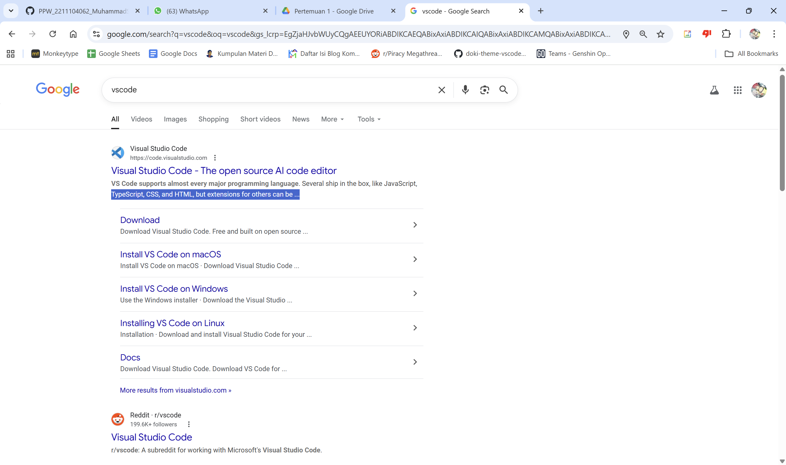
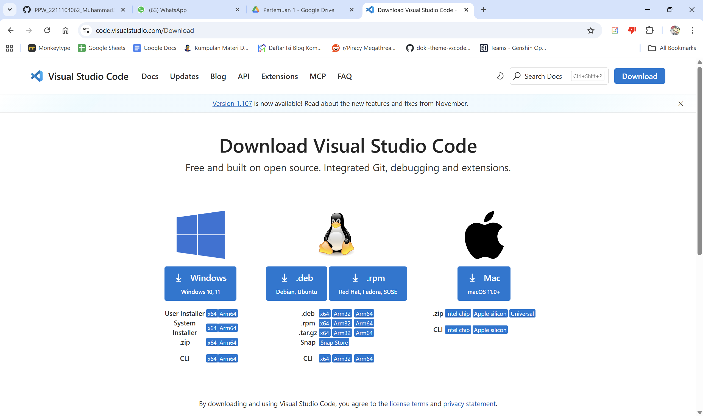
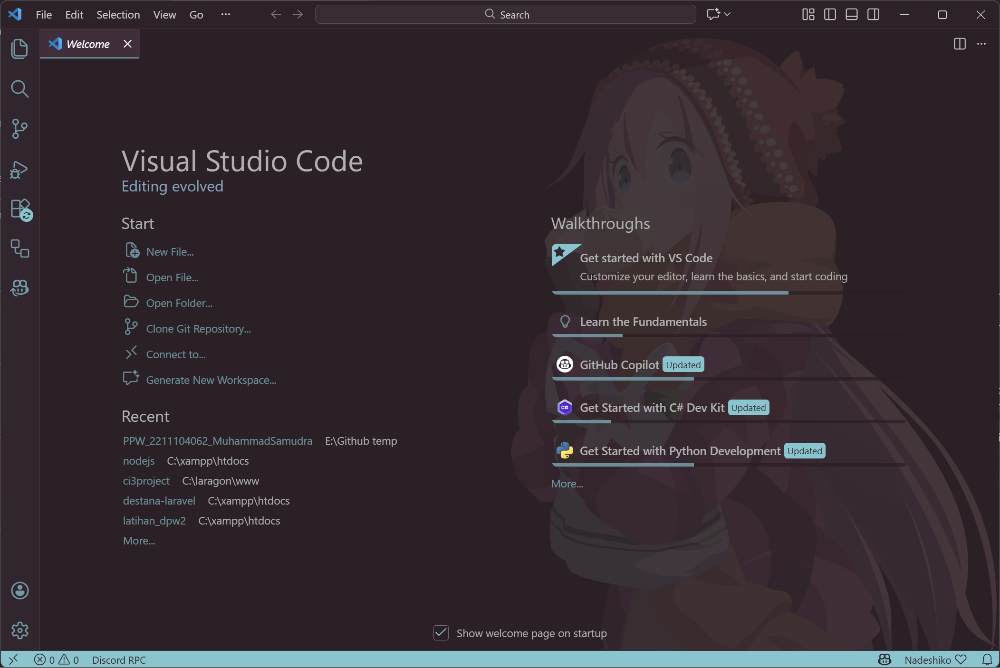
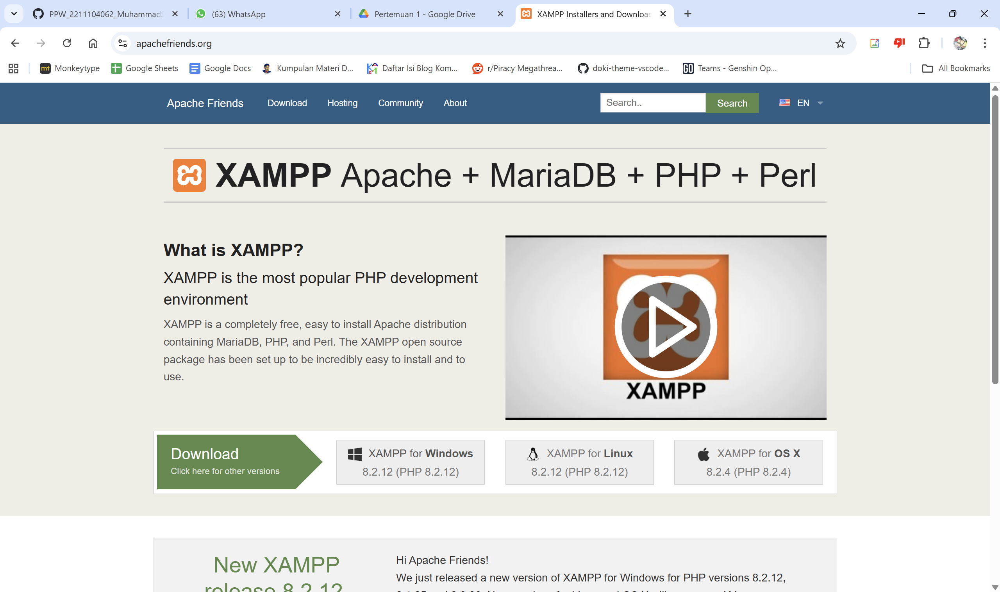
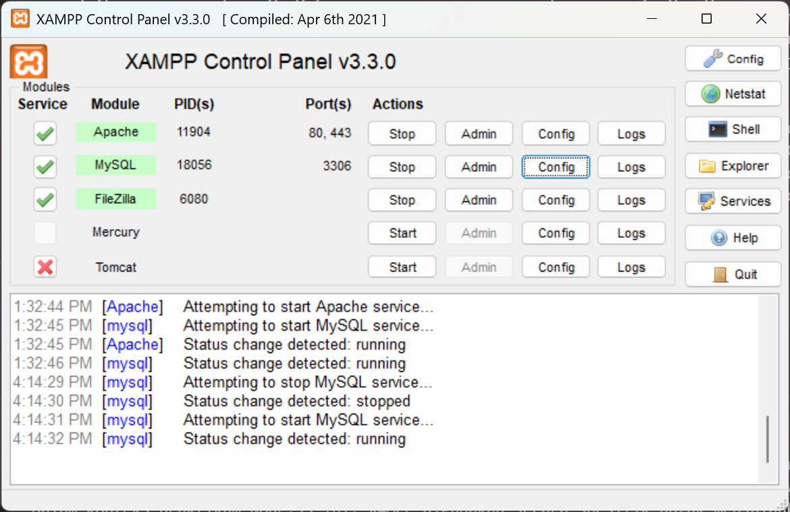

**LAPORAN PRAKTIKUM**  
**PERANCANGAN DAN PEMROGRAMAN WEB**  

  
 
**PENGENALAN DAN INSTALASI**

  

  

Oleh:  
**Muhammad Samudra**  
**2211104062**

   

**PROGRAM STUDI S1 REKAYASA PERANGKAT LUNAK**  
**DIREKTORAT KAMPUS PURWOKERTO**  
**UNIVERSITAS TELKOM**

  

**2025**

---

# Pengenalan HTML
HTML (HyperText Markup Language) HTML adalah bahasa markup standar yang digunakan untuk membuat struktur dan menyusun kerangka sebuah halaman web. HTML berfungsi untuk mendefinisikan elemen-elemen di dalam halaman, seperti judul, paragraf, gambar, tautan, dan form, dengan menggunakan sistem tag (seperti <html>, <body>, hingga 
). Dalam praktikum ini, HTML berperan sebagai antarmuka atau bagian front-end yang memungkinkan pengguna berinteraksi dengan aplikasi Node.js melalui browser.

# Instalasi Visual Studio Code
Visual Studio Code (VS Code) adalah perangkat lunak penyunting kode (code editor) buatan Microsoft yang bersifat gratis dan sangat populer di kalangan pengembang karena ringan serta memiliki fitur yang lengkap. VS Code mendukung berbagai bahasa pemrograman dan dilengkapi dengan terminal terintegrasi, fitur IntelliSense untuk pelengkap kode otomatis, serta ekosistem ekstensi yang luas. Dalam proyek ini, VS Code digunakan sebagai lingkungan pengembangan utama untuk menulis kode JavaScript (Node.js), mengelola file proyek, dan menjalankan terminal untuk mengeksekusi server. 
Cara installnya adalah sebagai berikut:
1. Cari 'vscode' di search engine, atau buka https://code.visualstudio.com/

2. Klik tombol download di pojok kanan atas, lalu pilih OS yang digunakan

3. Buka executeable, klik next hingga program mulai menginstall
4. Buka VScode

# Instalasi XAMPP
XAMPP adalah paket perangkat lunak gratis dan sumber terbuka yang menyediakan lingkungan server lokal untuk keperluan pengembangan aplikasi web. Nama XAMPP merupakan akronim dari Cross-Platform (X), Apache (server web), MariaDB/MySQL (database), PHP, dan Perl. Dalam konteks praktikum Node.js ini, XAMPP digunakan secara spesifik untuk menjalankan layanan database MySQL, sehingga aplikasi Node.js dapat menyimpan dan mengelola data mahasiswa secara permanen melalui dashboard phpMyAdmin yang disediakan.
Cara instalasinya:
1. Pergi ke https://www.apachefriends.org/ , lalu klik download dengan OS yang kamu miliki

2. Jalankan executeable dan lakukan sesuai arahan dari program
3. Jalankan XAMPP

