<div align="center">

**LAPORAN PRAKTIKUM**  
**PERANCANGAN DAN PEMROGRAMAN WEB**  

<br><br>

**MODUL 11**  
**Laravel : Introduction**

<br><br>


<br><br>

Oleh:  
**Muhammad Samudra**  
**2211104062**

<br><br><br>

**PROGRAM STUDI S1 REKAYASA PERANGKAT LUNAK**  
**DIREKTORAT KAMPUS PURWOKERTO**  
**UNIVERSITAS TELKOM**

<br><br>

**2025**

</div>

---
# Guided
## Instalasi Laravel
1. Install XAMPP, download dan install Composer
2. Buka cmd pada folder htdocs XAMPP, kemudian ketik `composer create-project --prefer-dist laravel/laravel Latihan`
3. Buat github token jika diminta, buat yang untuk akses repo publik
4. Jika berhasil instalasi tetapi belum muncul 'Application key set successfully', ketik `Application key set successfully`
5. Lalu ketik `php artisan serve` untuk menjalankan server bawaan PHP.
6. Akses http://127.0.0.1:8000/ di web, atau address lain yang ditampilkan cmd
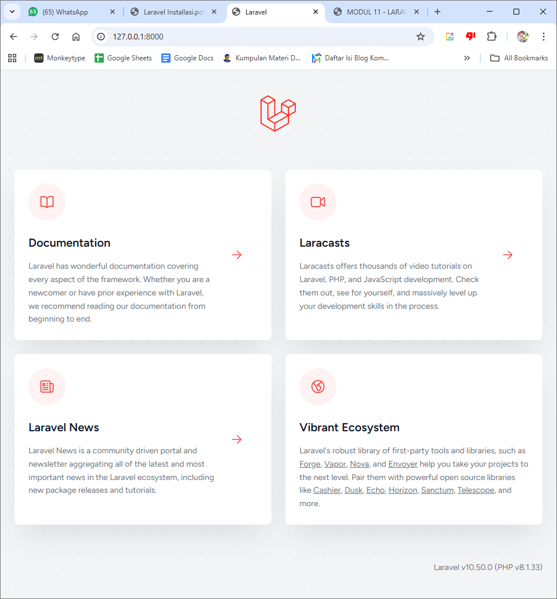

## Routing
Routing adalah mekanisme yang menentukan URL mana ditangani oleh kode apa di aplikasi Laravel.
Saat user mengakses sebuah URL, route mengarahkan request tersebut ke controller, fungsi, atau view yang sesuai. Route di atur di routes/web.php
### 1. Route bawaan Laravel
Laravel menyediakan 1 route bawaan yang mengatur ketika url kosongan, mengarahkan ke view welcome.blade.php seperti gambar tadi.
```
Route::get('/', function () {
    return view('welcome');
});
```
di route, tidak perlu ditulis .blade.php hanya namanya saja

### 2. Membuat route
Caranya adalah menulis get ke arah url yang ingin diatur, lalu return keluaran yang ingin ditampilkan di url tersebut. Di sini kita ingin menampilkan 'Halaman Beranda' ketika url mengarah ke '.../beranda'
```
Route::get('/beranda', function () {
    return 'Halaman Beranda';
});
```
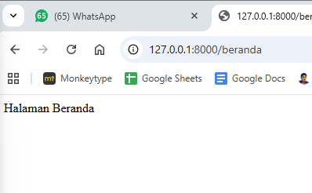

### 3. Route Parameter
Jika ingin membuat url dengan sebuah parameter untuk menjadi segmen, bisa menggunakan kurung kurawal
```
Route::get('/kendaraan/{jenis}', function ($jenis) {
    return "Tampilkan data kendaraan dengan jenis $jenis";
});
```
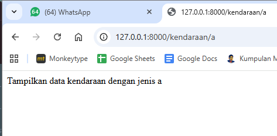
Di sini parameter $jenis adalah a yang berada di url

### 4. Route Parameter Opsional
Jika menggunakan dua parameter, jika salah satu tidak terpenuhi maka akan terjadi error 404. Agar hal ini tidak terjadi bisa menggunakan parameter opsional, menambahkan tanda `?` di akhir parameter. Jika menggunakan ini maka harus menambahkan nilai default pada parameter.
```
Route::get('/kendaraan/{jenis?}/{merek?}',
    function ($a = 'motor',$b = 'honda') {
    return "Cek harga kendaraan $a $b";
});
```
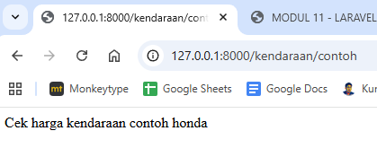
Di sini parameter {jenis} adalah 'contoh', dan parameter {merek} terisi dengan parameter default.

### 5. Route parameter dengan regular expression
Jika parameter tidak dibatasi, bisa terisi dengan value tidak wajar. Misalnya 'id' yang seharusnya hanya numerik bisa diiisi 'abc'. Walaupun 'id=abc' tidak ada, tetap dijalankan program dan menjalankan koneksi di database, dan lain-lain. untuk menghentikan ini bisa menggunakan `->where()`
```
Route::get('/product/{id}', function ($id) {
    return "Tampilkan product dengan id = $id";
}) ->where('id', '[0-9]+');
```
ini hasil tanpa batasan, route akan tetap dijalankan:
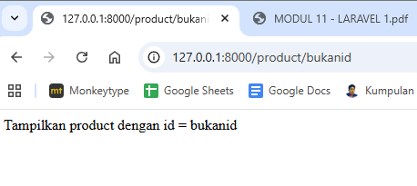

sementara ini dengan batasan, route dilempar ke 404:
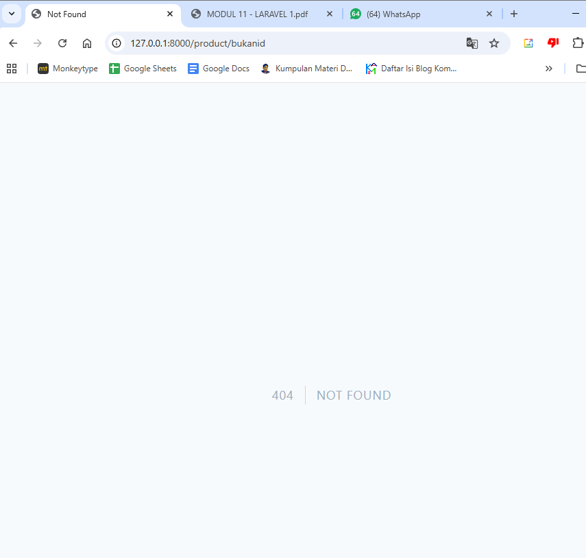

### 6. Route Redirect
Route redirect bisa digunakan agar halaman bisa diakses dari alamat lain
```
Route::get('/hubungi-kami', function () {
    return '<h1>Hubungi Kami</h1>';
});
Route::redirect('/contact-us', '/hubungi-kami');
```
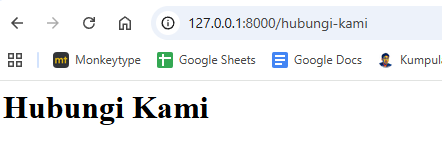
di sini saya mengetik http://127.0.0.1:8000/contact-us tetapi karena ter redirect sehingga diarahkan ke /hubungi-kami

### 7. Route Group
Kita juga bisa mengelompokkan route dengan group. Misalnya group rute admin:
```
Route::prefix('/admin')->group(function() {
    Route::get('/dashboard', function() {
        return 'Tampilkan dashboard aplikasi';
    });
    Route::get('/datapegawai', function() {
        return 'Tampilkan data pegawai';
    });
    Route::get('/datamahasiswa', function() {
        return 'Tampilkan data mahasiswa';
    });
});
```
Ini memberi akses kepada tiga alamat yaitu:
localhost:8000/admin/dashboard
localhost:8000/admin/datapegawai
localhost:8000/admin/datamahasiswa
dengan kata lain memberi awalan '/admin' pada ketiga route di dalam group.
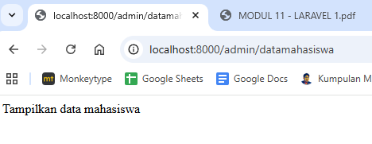

### 8. Route Fallback
Route fallback adalah route yang dijalankan jika tidak ditemukan route untuk sebuah alamat url. Laravel memberi tampilan halaman 404 default seperti yang terlihat di bagian regular expression di atas, tetapi kita bisa menimpanya sesuai kebutuhan menggunakan fallback()
```
Route::fallback(function () {
    return "Maaf, alamat tidak ditemukan";
});
```
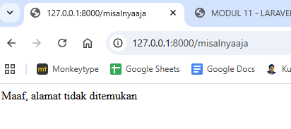

### 9. Route Prioriy
Jika memiliki route yang sama, prioritas tergantung pada apakah route menggunakan parameter atau tidak. Jika tidak menggunakan parameter, route terakhir yang akan dijalankan.

```
Route::get('/baju/1', function () {
    return "Baju ke-1";
});
Route::get('/baju/1', function () {
    return "Baju ke-1 lagi";
});
Route::get('/baju/1', function () {
    return "Baju ke-1 lagi lagii";
});
```
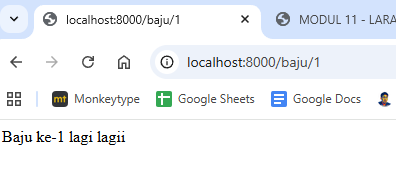
sementara jika menggunakan parameter, rute pertama lah yang akan dijalankan
```
Route::get('/celana/{a}', function ($a) {
    return "Celana ke-$a";
});
Route::get('/celana/{b}', function ($b) {
    return "Celana ke-$b lagi";
});
Route::get('/celana/{c}', function ($c) {
    return "Celana ke-$c lagi lagi";
});
```
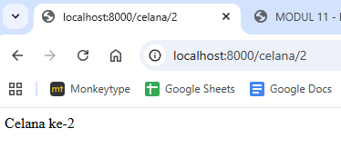

## View
View adalah komponen MVC yang menangani tampilan. Di dalam viewlah kode HTML,
CSS dan juga JavaScript berada. Lokasinya berada di dalam resources/views. Di laravel menggunakan template engine `blade`, sehingga file diakhiri dengan .blade.php.
Untuk membuat review, diawali dengan membuat route yang mengarah ke sebuah view. Di route tidak usah ditulis .blade.php
```
Route::get('/mahasiswa', function () { 
    return view('mahasiswa');
});
```
mahasiswa.blade.php:
```
<!DOCTYPE html>
<html>
    <head>
        <title>Belajar Laravel</title>
    </head>
    <body>
        <h2>Data Mahasiswa di Universitas</h2>
        <ol>
            <li>Mahasiswa 1</li>
            <li>Mahasiswa 2</li>
            <li>Mahasiswa 3</li>
            <li>Mahasiswa 4</li>
        </ol>
    </body>
</html>
```
ini tampilan localhost:8000/mahasiswa
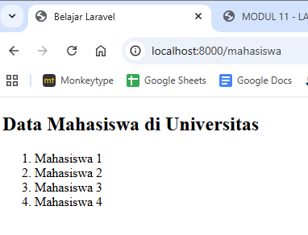

Di folder view, bisa dibuat folder lebih lanjut agar struktur lebih rapih. Untuk memanggilnya hanya tambahkan nama folder di route:
```
Route::get('/umahasiswa', function () { 
    return view('universitas.mahasiswa');
});
```

Lalu kita bisa mengirim data dari route untuk ditampilkan secara dinamis oleh view dengan
du acara:
1. Menulis data sebagai argument kedua dari function view().
Cara pertama untuk mengirim data dari route ke view adalah dengan menulis data
tersebut sebagai argumen kedua pada saat pemanggilan function view().
```
Route::get('/mahasiswa', function () {
    $arrMhs = [
    "mhs1" => "Abdul hafidz",
    "mhs2" => "Aufar Bintang",
    "mhs3" => "Muhammad Nur Hamada",
    "mhs4" => "Hastin Ajeng"
    ];
    return view('mahasiswa', $arrMhs);
});
```
Di sini argument kedua adalah $arrMhs di dalam view() setelah 'mahasiswa'. $arrMhs adalah array yang berisi data. jangan lupa di view panggil variabel-variabel yang ada di array data ini:
```
            <li>Mahasiswa 1</li>
            <li>Mahasiswa 2</li>
            <li>Mahasiswa 3</li>
            <li>Mahasiswa 4</li>
```
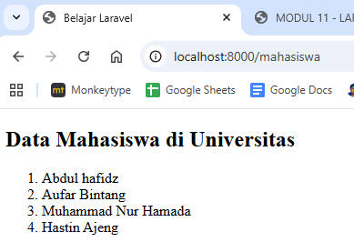

2. Menggunakan method with().
Cara kedua yang bisa dipakai untuk mengirim data dari route ke view adalah
menggunakan method with().
```
Route::get('/mahasiswa', function () {
    $arrMhs = ["Abdul hafidz","Aufar Bintang",
               "Muhammad Nur Hamada","Hastin Ajeng"];
    return view('mahasiswa')->with('mahasiswa', $arrMhs);
});
```
Jika menggunakan cara ini, pemanggilannya adalah `mahasiswa[0]`, dst. 'mahasiswa' dari keyword yang didefinisikan di dalam with(). Bisa juga menggunakan loop foreach.

Untuk menyimpan file external seperti css, javascript, dan gambar, diletakan di folder public/assets.

## Blade Template Engine
### Menampilkan Data
Kegunaan paling dasar dari blade adalah untuk mempermudah proses menampilkan data di
dalam view. Biasanya untuk menampilkan variabel di dalam view kita menggunakan perintah
berikut:
`<?php echo $produk; ?>`
Dengan blade, bisa ditulis menjadi:
`{{ $produk }}`

Berikut ini penggunaan blade directive
- Sintaks Blade untuk echo data: {{ $xxx }}.
- If/Else versi Blade: @if, @else.
- Loop Blade: @foreach, @for, @while.
- Komentar Blade: {{-- ... --}}.
- Layouting dengan Blade: @extends, @yield, @include.

**Blade directive** = perintah, sintaks, atau tanda khusus yang disediakan Blade untuk mempermudah penulisan
view di Laravel.
- @extends = halaman ini numpang layout mana
- @yield = titik tempat konten halaman turunan diberikan
- @include = sisipkan komponen lain (navbar, footer, card, dsb.)

Contoh menampilkan data:
di route:
```
Route::get('/produk', function () {
    $arrProduk = [
    "prod1" => "Televisi",
    "prod2" => "Kipas Angin",
    "prod3" => "Radio"
    ];
    return view('produk', $arrProduk);
});
```
Lalu di view produk.blade.php:
```
<!DOCTYPE html>
<html lang="en">
<head>
<title>Data Produk</title>
</head>
<body>
    Produk 1 : {{ $prod1 }}
    <br>
    Produk 2 : {{ $prod2 }}
    <br>
    Produk 2 : {{ $prod3 }}
</body>
</html>
```
Sehingga tidak perlu 
`Produk 1 : <?php echo $prod1; ?>` dst

Lalu untuk kondisi if else:
```
<?php
    if (($nilai >= 0) and ($nilai < 50)){
        echo "Tidak lulus";
    } else if (($nilai >= 50) and ($nilai <= 100)) {
        echo "Lulus";
    } else {
        echo "Tidak Teridentifikasi";
    }
?>
```
Menjadi
```
@if (($nilai >= 0) and ($nilai < 50))
    Tidak lulus
@elseif (($nilai >= 50) and ($nilai <= 100))
    Lulus
@else
    Tidak Teridentifikasi
@endif
```
tidak perlu lagi pembuka dan penutup php <?php ?>, kurung kurawal untuk aksi kondisi, dan juga `echo` setiap akan mengeprint karena di line selain if else masih html.

### Merancang Layout
Untuk merancang layout agar mengurangi perulangan pada header, sidebar, footer, dll, bisa menggunakan fungsi template Blade.
Pada contoh ini, terdapat master.blade.php yang menjadi master layout, dan produk.blade.php yang berisi produk-produk yang akan ditampilkan.

master.blade.php:
```php
<!DOCTYPE html>
<html lang="en">
<head>
<title>@yield('title')</title>
</head>
<body>
    @yield('content')
</body>
</html>
```
produk.blade.php:
```php
@extends('master')
@section('title','Data Produk')

@section('content')
    Produk 1 : {{ $prod1 }}
    <br>
    Produk 2 : {{ $prod2 }}
    <br>
    Produk 3 : {{ $prod3 }}
@endsection
```
Cara kerjanya adalah `produk` memanggil `master`, lalu mengisi section-sectionnya. Section yang mengandung 'title' diisi 'Data Produk', dan section yang berisi 'content' diisi isi produk.
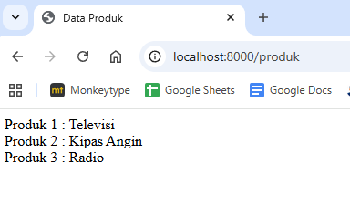
di sini terlihat title terisi 'Data Produk' dan konten juga terisi produk-produk.

## Controllers
Controller dalam MVC (Model–View–Controller) berfungsi sebagai penghubung antara Model dan View, yaitu menerima input atau permintaan dari pengguna (misalnya lewat URL atau form), memprosesnya dengan memanggil logika bisnis dan pengolahan data pada Model, lalu menentukan View mana yang harus ditampilkan beserta data yang dikirimkan ke View tersebut, sehingga alur aplikasi menjadi terstruktur dan tanggung jawab tiap komponen terpisah dengan jelas.
### Cara Mengakses Controller
Letak Controller di laravel ada di App\Http\Controllers. Formatnya adalah
`Route::get('<url>',[App\Http\Controllers\Nama_Controller::class,'nama_method']);`

### Membuat Controller Secara Manual
Buat controller dengan pendeklarasian namespace sesuai letak file, lalu buat class dan isi dengan method-method.
app\Http\Controllers\PageController.php
```
<?php

namespace App\Http\Controllers;

class PageController extends Controller
{
    public function index()
    {
    return "Halaman Home";
    }
    public function tampil()
    {
    return "Data Mahasiswa";
    }
}
```

Lalu panggil di route
```
Route::get('/awal', [App\Http\Controllers\PageController::class,'index']);
Route::get('/tampilmhs',[App\Http\Controllers\PageController::class,'tampil']);
```
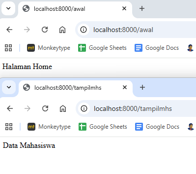

Kita juga bisa memindahkan namespace di bagian atas di route sehingga dapat mempersingkat pemanggilan:

```
use App\Http\Controllers\PageController;

Route::get('/awal', [PageController::class,'index']);
Route::get('/tampilmhs',[PageController::class,'tampil']);
```

### Mengakses View dari Controller
Kita juga bisa memanngil view dari controller, sehingga tidak memanggil langsung dari route. Caranya adalah seperti ketika memanggil lewat route tetapi diletakkan di Controller:

```
<?php

namespace App\Http\Controllers;

class PageController extends Controller
{
    public function index()
    {
    return view('welcome');
    }
    public function tampil()
    {
    $arrMahasiswa = ["Kholifahdina","Rahmat Taufik","Nita Fitrotunimah","Defrin Anggun Saputri"];
    return view('mahasiswa')->with('mahasiswa', $arrMahasiswa);
    }
}
```
mahasiswa.blade.php menggunakan yang sebelumnya
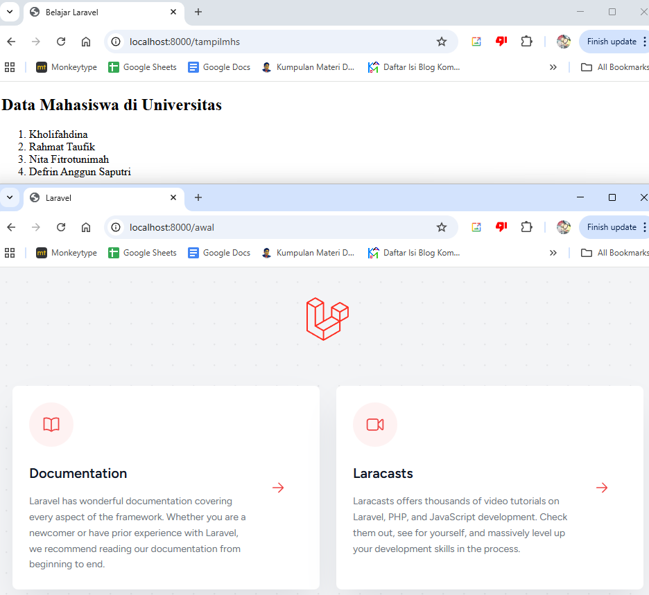

# UNGUIDED
## 1. Router
``` php
use Illuminate\Support\Facades\Route;

use App\Http\Controllers\DestanaController;
use App\Http\Controllers\RelawanController;
use App\Http\Controllers\BencanaController;

// ================== DESTANA ==================
Route::get('/destana/{id?}', function ($id = null) {
    return app(DestanaController::class)->index($id);
})->name('destana.index');

Route::get('/destana/create', [DestanaController::class, 'create'])->name('destana.create');
Route::post('/destana', [DestanaController::class, 'store'])->name('destana.store');
Route::get('/destana/{id}/edit', [DestanaController::class, 'edit'])->name('destana.edit');
Route::put('/destana/{id}', [DestanaController::class, 'update'])->name('destana.update');
Route::delete('/destana/{id}', [DestanaController::class, 'destroy'])->name('destana.destroy');


// ================== RELAWAN ==================
Route::get('/relawan/{id?}', function ($id = null) {
    return app(RelawanController::class)->index($id);
})->name('relawan.index');

Route::get('/relawan/create', [RelawanController::class, 'create'])->name('relawan.create');
Route::post('/relawan', [RelawanController::class, 'store'])->name('relawan.store');
Route::get('/relawan/{id}/edit', [RelawanController::class, 'edit'])->name('relawan.edit');
Route::put('/relawan/{id}', [RelawanController::class, 'update'])->name('relawan.update');
Route::delete('/relawan/{id}', [RelawanController::class, 'destroy'])->name('relawan.destroy');


// ================== BENCANA ==================
Route::get('/bencana/{id?}', function ($id = null) {
    return app(BencanaController::class)->index($id);
})->name('bencana.index');

Route::get('/bencana/create', [BencanaController::class, 'create'])->name('bencana.create');
Route::post('/bencana', [BencanaController::class, 'store'])->name('bencana.store');
Route::get('/bencana/{id}/edit', [BencanaController::class, 'edit'])->name('bencana.edit');
Route::put('/bencana/{id}', [BencanaController::class, 'update'])->name('bencana.update');
Route::delete('/bencana/{id}', [BencanaController::class, 'destroy'])->name('bencana.destroy');
```
Di proyek saya ada tiga menu utama: Destana, Relawan, dan Bencana. Pertama ada halaman utama yang menggunakan parameter optional untuk menampilkan semua data, dan parameter optional digunakan untuk melihat detail dari item spesifik tersebut, yang secara default null jika ingin melihat semua item. Terdapat 1 per menu sehingga ada 3 route dengan optional parameter.
Lalu route halaman form create tidak menggunakan parameter karena item belum memiliki id, begitu juga route untuk menyimpan item baru ke database. ada 2 per menu sehingga total ada 6 route tanpa parameter.
Terakhir Untuk mengedit, update database per id, dan menghapus, terdapat route dengan parameter (tidak optional). Ada 3 route tersebut per menu sehingga total terdapat 9 route dengan parameter.

## 2. View
Pertama buat route yang mengarah ke view
```
Route::get('/ug2', function (){
    return view('unguided2');
});
```
Lalu isi viewnya dengan pemanggilan gambar, css, dan js:
```
<!DOCTYPE html>
<html lang="en">
<head>
    <title>Unguided 2</title>
    <!-- css -->
    <link rel="stylesheet" href="{{ asset('assets/css/style.css') }}">
</head>
<body>
    <h2>Contoh Gambar</h2>
    

    <h2>JavaScript</h2>
    <button onclick="tampilPesan()">Klik Saya</button>
    <script src="{{ asset('assets/js/script.js') }}"></script>
</body>
</html>
```
Pemanggilan css:
`<link rel="stylesheet" href="{{ asset('assets/css/style.css') }}">`
Pemanggilan gambar:
``
Pemanggilan Javascript:
`<script src="{{ asset('assets/js/script.js') }}"></script>`

Di laravel, folder assets ditaruh di app\public, css dan script js ditaruh di folder \css dan \js masing-masing.
style.css:
```
body {
    background-color: #6c01aa;
    font-family: Arial, sans-serif;
}

img {
    width: 800px;
}
```

script.js:
```
function tampilPesan() {
    alert("JavaScript dari folder assets berhasil dijalankan!");
}
```
Berikut tampilan halaman setelah tombol ditekan:
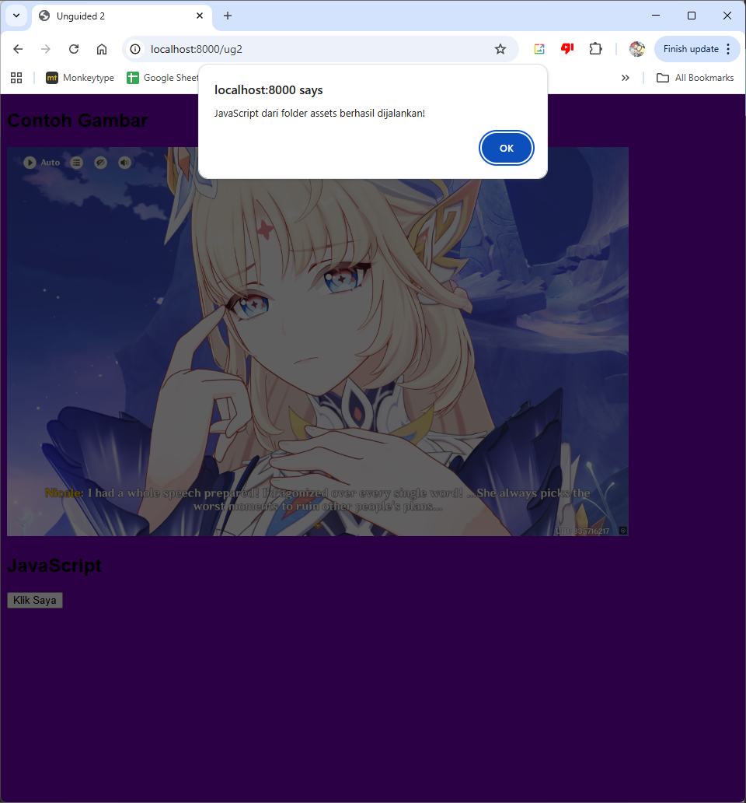

## 3. Blade Template Engine
Pertama kita bungkus dulu `$nilai` menjadi `['nilai' => $nilai]` saat dikirimkan ke view karena jika tidak maka laravel akan membuat variabel `$0`, `$1`, dst sementara di PHP nama variabel tidak boleh diawali dengan angka. Route yang sudah diperbaiki adalah:
```
Route::get('/mahasiswa', function () {
    $nilai = [80,64,30,76,95];
    return view('mahasiswa',['nilai' => $nilai]);
});
```

Lalu sesuai route tersebut, buat file mahasiswa.blade.php dan lakukan sesuai soal:
```
<!DOCTYPE html>
<html>
<head>
    <title>Perulangan Blade</title>
</head>
<body>

    <h2>1. Perulangan For (1 s.d 10)</h2>
    @for ($i = 1; $i <= 10; $i++)
        {{ $i }}<br>
    @endfor

    <hr>

    <h2>2. Perulangan While (1 s.d 10)</h2>
    @php
        $i = 1;
    @endphp

    @while ($i <= 10)
        {{ $i }}<br>
        @php $i++; @endphp
    @endwhile

    <hr>

    <h2>3. Perulangan Foreach (Nilai Mahasiswa)</h2>
    @foreach ($nilai as $n)
        Nilai: {{ $n }}<br>
    @endforeach

</body>
</html>
```
Perulangan for menggunakan @for-@endfor. Perulangan while membutuhkan sebuah variabel dahulu sehingga dideklarasikan variabel `$i` di dalam @php-@endphp, lalu menggunakan @while-@endwhile untuk perulangannya. Terakhir perulangan foreach menggunakan @foreach-@endforeach.
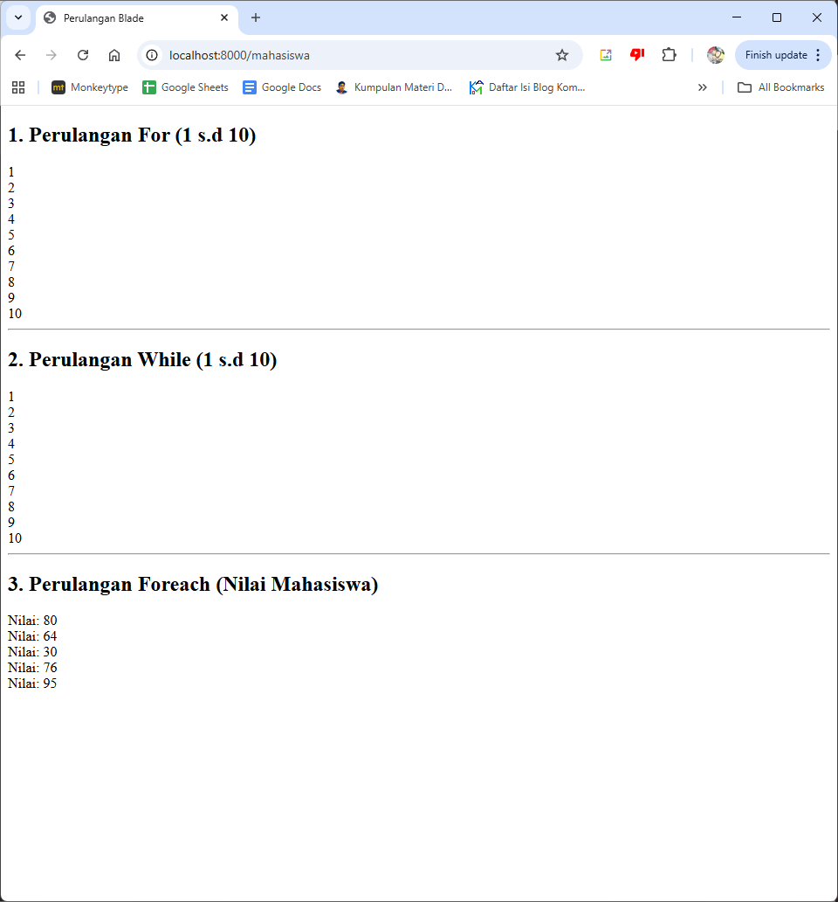

## 4. Controller
Pertama buat route yang mengarah ke sebuah controller, misalnya Unguided4.php:
` Route::get('/ug4', [App\Http\Controllers\Unguided4::class,'index']);`
Lalu buat Controllernya, dengan namespace lokasi foldernya, class nama filenya, dan method index/sesuai yang ada di route:
```
<?php

namespace App\Http\Controllers;

class Unguided4 extends Controller
{
    public function index()
    {
    return view('unguided2');
    }
}
```
View yang saya gunakan adalah view tadi untuk unguided soal 2, tetapi bisa dilihat lewat url pemanggilan kali ini berdasarkan controller
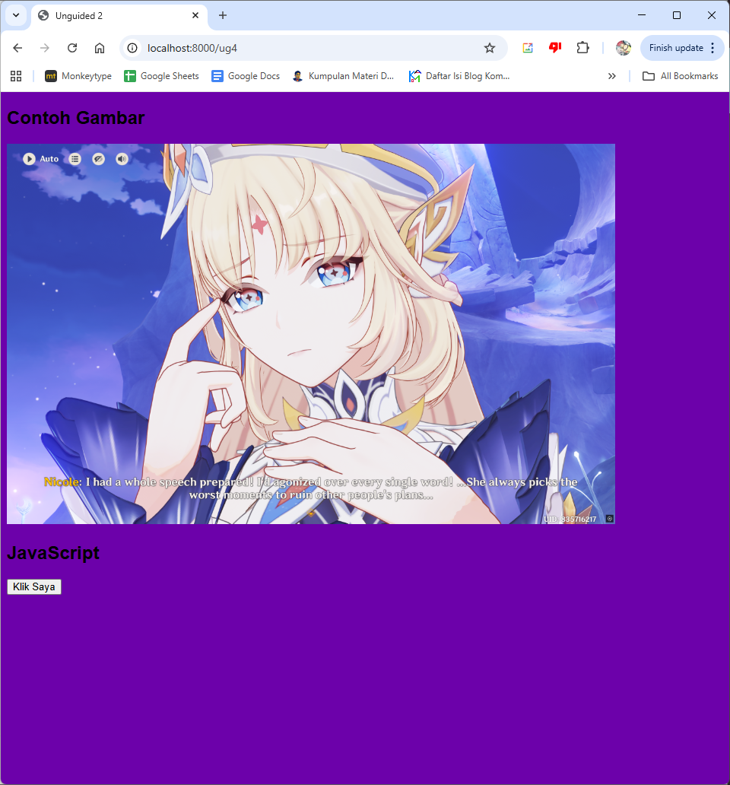