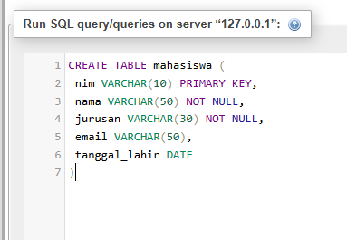
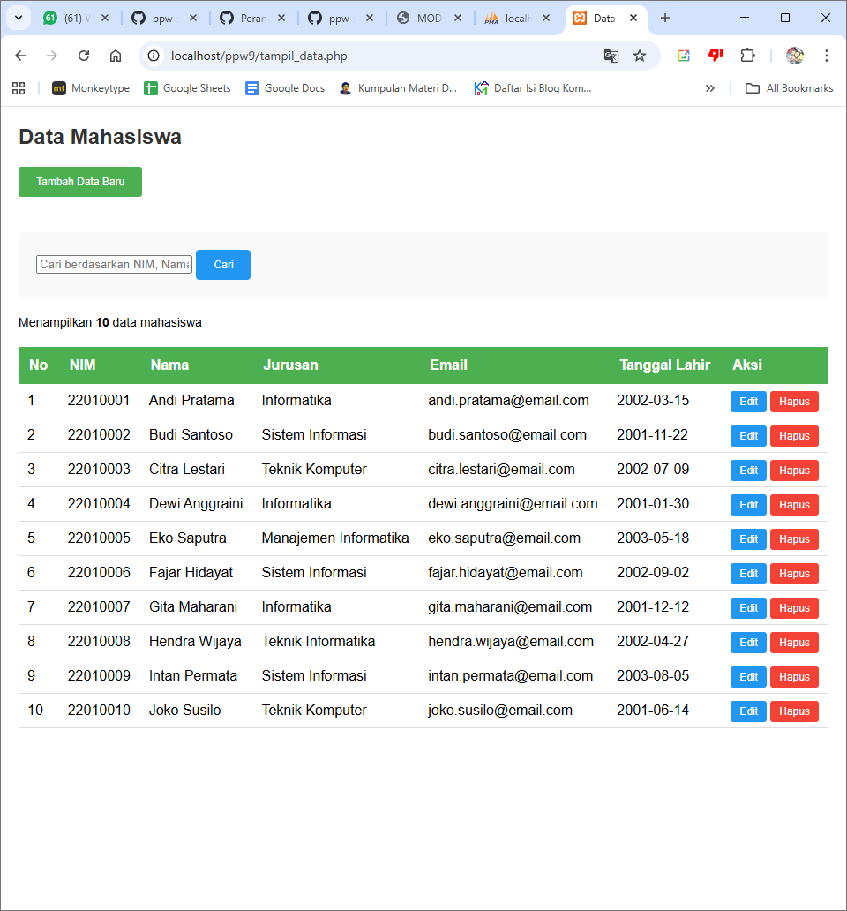
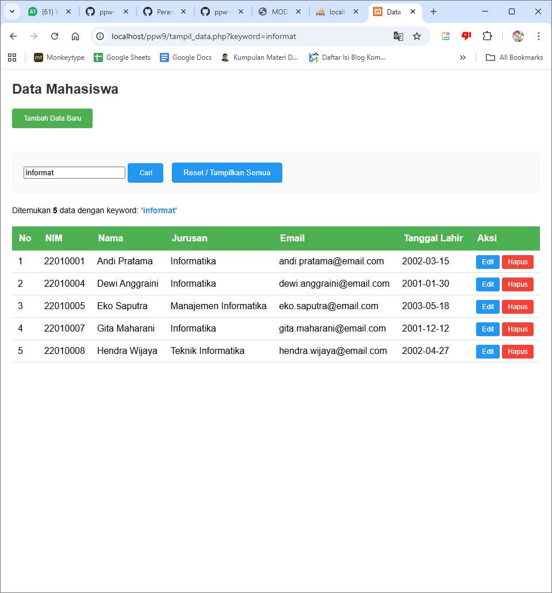
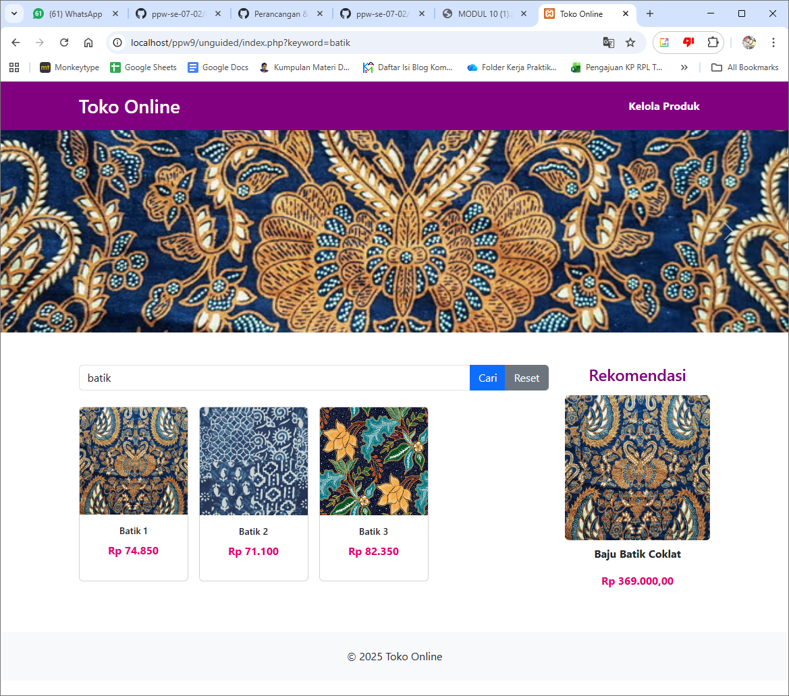
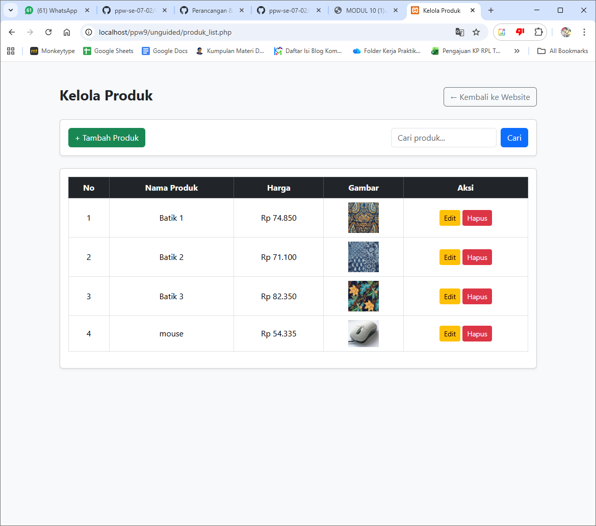
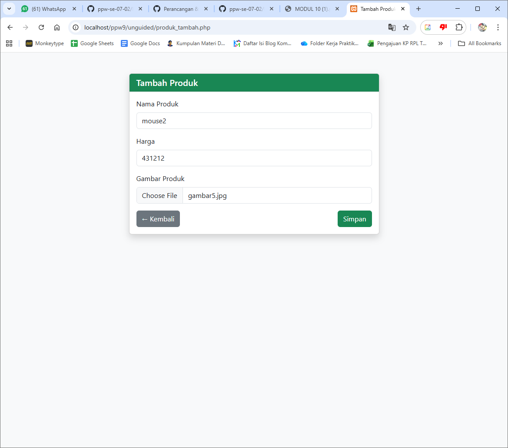
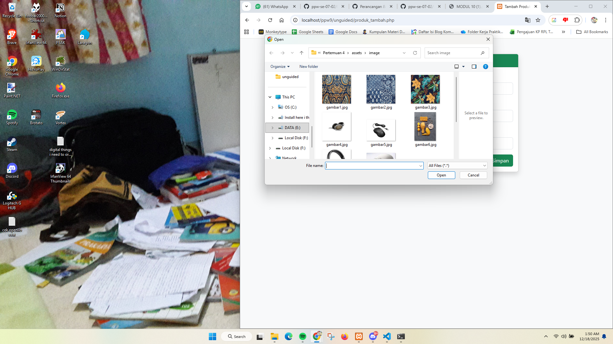
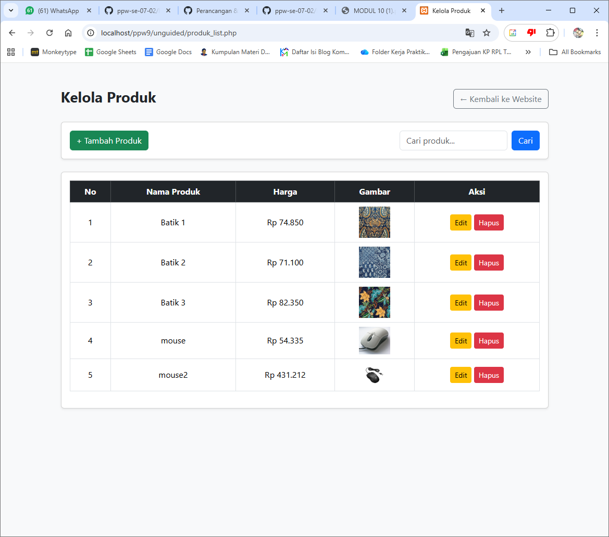
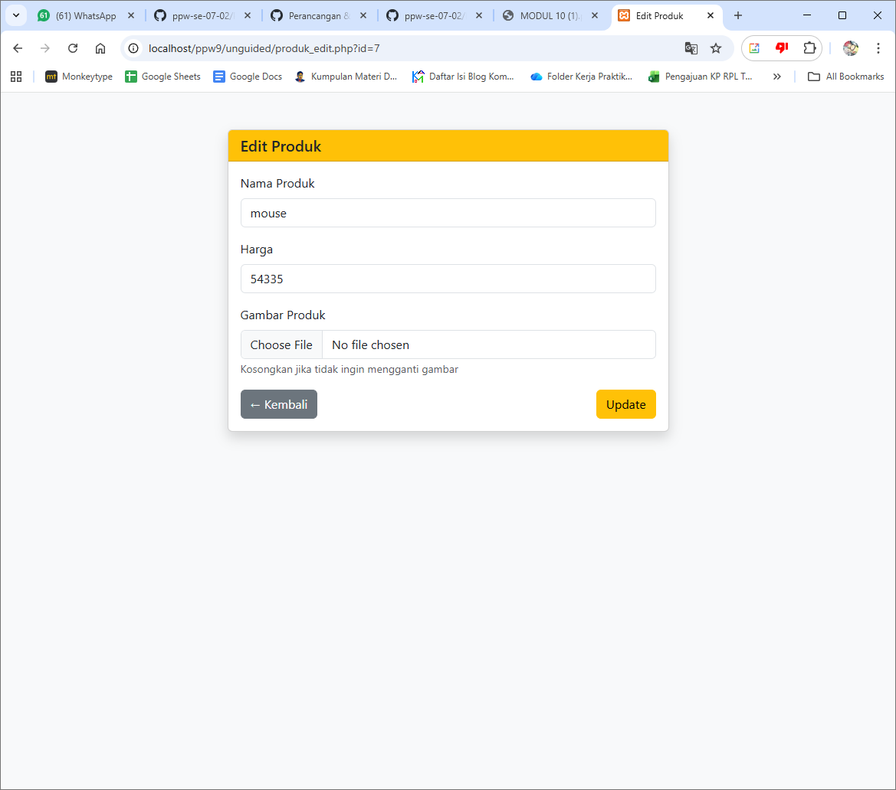
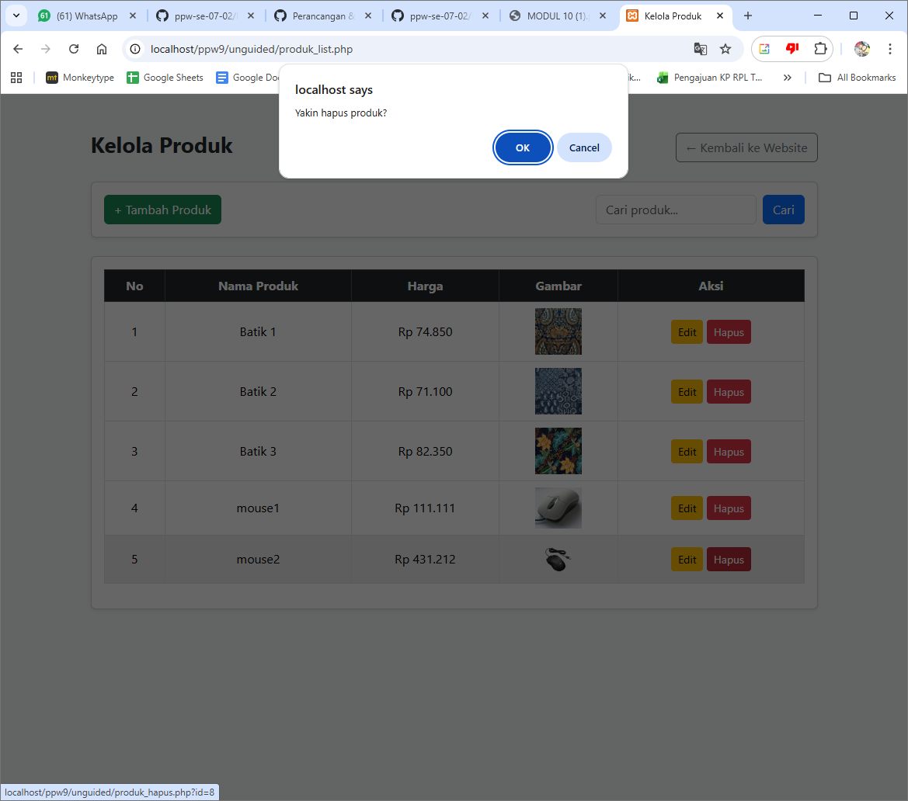

<div align="center">

**LAPORAN PRAKTIKUM**  
**PERANCANGAN DAN PEMROGRAMAN WEB**  

<br><br>

**MODUL 10**  
**PHP & MYSQL**

<br><br>


<br><br>

Oleh:  
**Muhammad Samudra**  
**2211104062**

<br><br><br>

**PROGRAM STUDI S1 REKAYASA PERANGKAT LUNAK**  
**DIREKTORAT KAMPUS PURWOKERTO**  
**UNIVERSITAS TELKOM**

<br><br>

**2025**

</div>

---

# Guided
## Persiapan Database dengan phpMyAdmin
1. Jalankan XAMPP
2. Buka http://localhost/phpmyadmin di browser
3. Klik new pada bagian databases, isi nama database, lalu klik 'Create Database'
4. Buat tabel dengan mengeklik database yang baru dibuat, lalu klik tab 'SQL' dan jalankan querry sesuai modul
```sql
CREATE TABLE mahasiswa (
 nim VARCHAR(10) PRIMARY KEY,
 nama VARCHAR(50) NOT NULL,
 jurusan VARCHAR(30) NOT NULL,
 email VARCHAR(50),
 tanggal_lahir DATE
)
```


## Koneksi PHP dengan MySql
Buat file koneksi.php yang berisi:
- konfigurasi database: host, username dan password MySQL, dan nama database
- masukkan fungsi mysqli_connect($host, $username, $password, $database) untuk membuat koneksi dengan database
- balut fungsi tersebut ke dalam sebuah variabel agar mudah dipakai di program
- buat juga pengecekan apakah koneksi sukses dan jika tidak, hentikan proses dengan fungsi die('pesan error')
- set charset UTF-8 untuk mendukung karakter Indonesia
```php
<?php
// Fungsi: Membuat koneksi ke database MySQL
// Konfigurasi database
$host = "localhost"; // Server database
$username = "root"; // Username MySQL (default XAMPP)
$password = ""; // Password MySQL (default XAMPP kosong)
$database = "ppw9_akademik"; // Nama database
// Membuat koneksi
$conn = mysqli_connect($host, $username, $password, $database);
// Cek koneksi
if (!$conn) {
 die("Koneksi gagal: " . mysqli_connect_error());
}
// Set charset UTF-8 untuk mendukung karakter Indonesia
mysqli_set_charset($conn, "utf8");
?>
```

### Operasi CRUD dengan PHP dan MySQL
#### CREATE
- File form_tambah.php menghandle html atau antarmuka halaman form tambah. Data yang diisi user dikirim menggunakan metode POST
```
<!DOCTYPE html>
<html>
<head>
 <title>Tambah Data Mahasiswa</title>
 <style>
 body {
 font-family: Arial, sans-serif;
 max-width: 500px;
 margin: 50px auto;
 padding: 20px;
 }
.form-group {
 margin-bottom: 15px;
 }
 label {
 display: block;
 margin-bottom: 5px;
 font-weight: bold;
 }
 input, select {
 width: 100%;
 padding: 8px;
 border: 1px solid #ddd;
 border-radius: 4px;
 box-sizing: border-box;
 }
 button {
 background-color: #4CAF50;
 color: white;
 padding: 10px 20px;
 border: none;
 border-radius: 4px;
 cursor: pointer;
 }
 button:hover {
 background-color: #45a049;
 }
 </style>
</head>
<body>
 <h2> Tambah Data Mahasiswa</h2>

 <form method="POST" action="proses_tambah.php">
 <div class="form-group">
 <label>NIM:</label>
 <input type="text" name="nim" required maxlength="10"
 placeholder="Contoh: 2024001">
 </div>

 <div class="form-group">
 <label>Nama:</label>
 <input type="text" name="nama" required maxlength="50"
 placeholder="Masukkan nama lengkap">
 </div>

 <div class="form-group">
 <label>Jurusan:</label>
 <select name="jurusan" required>
 <option value="">-- Pilih Jurusan --</option>
 <option value="Teknik Informatika">Teknik Informatika</option>
 <option value="Sistem Informasi">Sistem Informasi</option>
 <option value="Teknologi Informasi">Teknologi Informasi</option>
 <option value="Ilmu Komputer">Ilmu Komputer</option>
 </select>
 </div>

 <div class="form-group">
 <label>Email:</label>
 <input type="email" name="email" maxlength="50"
 placeholder="contoh@email.com">
 </div>

 <div class="form-group">
 <label>Tanggal Lahir:</label>
 <input type="date" name="tanggal_lahir">
 </div>

 <button type="submit">Simpan Data</button>
 <a href="tampil_data.php">
 <button type="button">Lihat Data</button>
 </a>
 </form>
</body>
</html>
```
- File proses_tambah.php menghandle query sql untuk memasukkan data dari POST lalu menjalankan querry INSERT, dengan beberapa pengecekan validasi
```
<?php
// File: proses_tambah.php
// Fungsi: Memproses data dari form dan menyimpan ke database
include "koneksi.php";
// Cek apakah form sudah di-submit
if ($_SERVER["REQUEST_METHOD"] == "POST") {

 // Ambil data dari form
 $nim = $_POST['nim'];
 $nama = $_POST['nama'];
 $jurusan = $_POST['jurusan'];
 $email = $_POST['email'];
 $tanggal_lahir = $_POST['tanggal_lahir'];

 // Validasi: Cek apakah NIM sudah ada
 $cek_nim = mysqli_query($conn, "SELECT nim FROM mahasiswa WHERE nim='$nim'");

 if (mysqli_num_rows($cek_nim) > 0) {
 // NIM sudah ada
 echo "<script>
 alert(' NIM sudah terdaftar! Gunakan NIM lain.');
 window.location.href='form_tambah.php';
 </script>";
 } else {
 // Query INSERT untuk menambah data
 $query = "INSERT INTO mahasiswa (nim, nama, jurusan, email, tanggal_lahir)
 VALUES ('$nim', '$nama', '$jurusan', '$email', '$tanggal_lahir')";

 // Eksekusi query
 if (mysqli_query($conn, $query)) {
 echo "<script>
 alert(' Data berhasil ditambahkan!');
 window.location.href='tampil_data.php';
 </script>";
 } else {
 echo "<script>
 alert(' Gagal menambahkan data: " . mysqli_error($conn) . "');
 window.location.href='form_tambah.php';
 </script>";
 }
 }
}
// Tutup koneksi
mysqli_close($conn);
?>
```
#### READ
- File tampil_data.php berisi html untuk menampilkan data yang ada di database dalam bentuk tabel. Data diambil dari database menggunakan query SELECT, lalu ditampilkan menggunakan perulangan `while`. Di tampilan sini juga tombol untuk tambah (CREATE), edit (UPDATE), dan hapus (DELETE).
```
<?php
// File: tampil_data.php
// Fungsi: Menampilkan semua data mahasiswa dengan fitur pencarian
include "koneksi.php";
include "proses_cari.php";
?>
<!DOCTYPE html>
<html>
<head>
 <title>Data Mahasiswa</title>
 <style>
 body {
 font-family: Arial, sans-serif;
 margin: 20px;
 }
 h2 {
 color: #333;
 }
 .search-box {
 margin: 20px 0;
 padding: 20px;
 background-color: #f9f9f9;
 border-radius: 5px;
 }
 search-box input {
 padding: 10px;
 width: 300px;
 border: 1px solid #ddd;
 border-radius: 4px;
 }
 .search-box button {
 padding: 10px 20px;
 background-color: #2196F3;
 color: white;
 border: none;
 border-radius: 4px;
 cursor: pointer;
 margin-right: 10px;
 }
 .search-box button:hover {
 background-color: #0b7dda;
 }
 table {
 width: 100%;
 border-collapse: collapse;
 margin-top: 20px;
 }
 th {
 background-color: #4CAF50;
 color: white;
 padding: 12px;
 text-align: left;
 }
 td {
 padding: 10px;
 border-bottom: 1px solid #ddd;
 }
 tr:hover {
 background-color: #f5f5f5;
 }
 .btn {
 padding: 5px 10px;
 text-decoration: none;
 border-radius: 3px;
 color: white;
 font-size: 12px;
 }
 .btn-edit {
 background-color: #2196F3;
 }
 .btn-delete {
 background-color: #f44336;
 }
 .btn-add {
 background-color: #4CAF50;
 padding: 10px 20px;
 margin-bottom: 20px;
 display: inline-block;
 }
 .info-text {
 margin: 10px 0;
 font-size: 14px;
 }
 .keyword-highlight {
 color: #2196F3;
 font-weight: bold;
 }
 </style>
 </head>
<body>
 <h2>Data Mahasiswa</h2>
 <a href="form_tambah.php" class="btn btn-add">Tambah Data Baru</a>
 <div class="search-box">
 <form method="GET" action="">
 <input type="text" name="keyword"
 placeholder="Cari berdasarkan NIM, Nama, atau Jurusan..."
 value="<?php echo isset($_GET['keyword']) ?
htmlspecialchars($_GET['keyword']) : ''; ?>">
 <button class="btn btn-search" type="submit">Cari</button>
 <?php if (isset($_GET['keyword']) && $_GET['keyword'] != ''): ?>
 <a href="tampil_data.php">
 <button type="button">Reset / Tampilkan Semua</button>
 </a>
 <?php endif; ?>
 </form>
 </div>
 <?php
 // Cek apakah ada keyword pencarian
 if (isset($_GET['keyword']) && $_GET['keyword'] != '') {
 $keyword = $_GET['keyword'];
 // Panggil fungsi pencarian dari fungsi_cari.php
 $result = cariMahasiswa($conn, $keyword);
 $jumlah = hitungHasilCari($result);
 echo "<p class='info-text'>Ditemukan <strong>$jumlah</strong> data dengan keyword:
 <span class='keyword-highlight'>'" . htmlspecialchars($keyword) . "'</span></p>";
 } else {
 // Query untuk menampilkan semua data
 $query = "SELECT * FROM mahasiswa ORDER BY nim ASC";
 $result = mysqli_query($conn, $query);
 $jumlah = mysqli_num_rows($result);
 echo "<p class='info-text'>Menampilkan <strong>$jumlah</strong> data mahasiswa</p>";
 }
 ?>
 <table>
 <thead>
 <tr>
 <th>No</th>
 <th>NIM</th>
 <th>Nama</th>
 <th>Jurusan</th>
 <th>Email</th>
 <th>Tanggal Lahir</th>
 <th>Aksi</th>
 </tr>
 </thead>
 <tbody>
 <?php
 // Cek apakah ada data
 if (mysqli_num_rows($result) > 0) {
 $no = 1;
 // Loop untuk menampilkan setiap baris data
 while ($row = mysqli_fetch_assoc($result)) {
 echo "<tr>";
 echo "<td>" . $no++ . "</td>";
 echo "<td>" . htmlspecialchars($row['nim']) . "</td>";
 echo "<td>" . htmlspecialchars($row['nama']) . "</td>";
 echo "<td>" . htmlspecialchars($row['jurusan']) . "</td>";
 echo "<td>" . htmlspecialchars($row['email']) . "</td>";
 echo "<td>" . htmlspecialchars($row['tanggal_lahir']) . "</td>";
 echo "<td>
 <a href='form_edit.php?nim=" . urlencode($row['nim']) . "'
 class='btn btn-edit'>Edit</a>
 <a href='proses_hapus.php?nim=" . urlencode($row['nim']) . "'
 class='btn btn-delete'
 onclick=\"return confirm('Yakin ingin menghapus data ini?')\">
 Hapus</a>
 </td>";
 echo "</tr>";
 }
 } else {
 if (isset($_GET['keyword']) && $_GET['keyword'] != '') {
 echo "<tr><td colspan='7' style='text-align:center; color: red;'>
 Data tidak ditemukan dengan keyword tersebut!</td></tr>";
 } else {
 echo "<tr><td colspan='7' style='text-align:center'>
 Tidak ada data</td></tr>";
 }
 }
 mysqli_close($conn);
 ?>
 </tbody>
 </table>
</body>
</html>
```
#### UPDATE
- File form_edit.php berisi html untuk antarmuka halaman form edit. Data lama diambil dengan mengambil nim dari url dengan GET untuk mengambil nim data yang akan di edit, lalu dicari di database dengan SELECT.
```
<?php
// File: form_edit.php
// Fungsi: Menampilkan form edit dengan data yang sudah ada
include "koneksi.php";
// Ambil NIM dari URL
$nim = $_GET['nim'];
// Query untuk mengambil data mahasiswa berdasarkan NIM
$query = "SELECT * FROM mahasiswa WHERE nim='$nim'";
$result = mysqli_query($conn, $query);
$data = mysqli_fetch_assoc($result);
// Jika data tidak ditemukan
if (!$data) {
 echo "<script>
 alert('Data tidak ditemukan!');
 window.location.href='tampil_data.php';
 </script>";
 exit;
}
?>
<!DOCTYPE html>
<html>
<head>
 <title>Edit Data Mahasiswa</title>
 <style>
 body {
 font-family: Arial, sans-serif;
 max-width: 500px;
 margin: 50px auto;
 padding: 20px;
 }
 .form-group {
 margin-bottom: 15px;
 }
 label {
 display: block;
 margin-bottom: 5px;
 font-weight: bold;
 }
 input, select {
 width: 100%;
 padding: 8px;
 border: 1px solid #ddd;
 border-radius: 4px;
 box-sizing: border-box;
 }
 button {
 padding: 10px 20px;
 border: none;
 border-radius: 4px;
 cursor: pointer;
 margin-right: 10px;
 }
 .btn-update {
 background-color: #2196F3;
 color: white;
 }
 .btn-cancel {
 background-color: #999;
 color: white;
 }
 </style>
</head>
<body>
 <h2>Edit Data Mahasiswa</h2>

 <form method="POST" action="proses_edit.php">
 <!-- NIM tidak bisa diubah, jadi dibuat readonly -->
 <div class="form-group">
 <label>NIM:</label>
 <input type="text" name="nim" value="<?php echo $data['nim']; ?>"
 readonly style="background-color: #f0f0f0;">
 </div>

 <div class="form-group">
 <label>Nama:</label>
 <input type="text" name="nama" value="<?php echo $data['nama']; ?>"
 required maxlength="50">
 </div>
 <div class="form-group">
 <label>Jurusan:</label>
 <select name="jurusan" required>
 <option value="Teknik Informatika"
 <?php if($data['jurusan']=='Teknik Informatika') echo 'selected'; ?>>
 Teknik Informatika</option>
 <option value="Sistem Informasi"
 <?php if($data['jurusan']=='Sistem Informasi') echo 'selected'; ?>>
 Sistem Informasi</option>
 <option value="Teknologi Informasi"
 <?php if($data['jurusan']=='Teknologi Informasi') echo 'selected'; ?>>
 Teknologi Informasi</option>
 <option value="Ilmu Komputer"
 <?php if($data['jurusan']=='Ilmu Komputer') echo 'selected'; ?>>
 Ilmu Komputer</option>
 </select>
 </div>

 <div class="form-group">
 <label>Email:</label>
 <input type="email" name="email" value="<?php echo $data['email']; ?>"
 maxlength="50">
 </div>

 <div class="form-group">
 <label>Tanggal Lahir:</label>
 <input type="date" name="tanggal_lahir"
 value="<?php echo $data['tanggal_lahir']; ?>">
 </div>

 <button type="submit" class="btn-update">Update Data</button>
 <a href="tampil_data.php">
 <button type="button" class="btn-cancel">Batal</button>
 </a>
 </form>
</body>
</html>
<?php
mysqli_close($conn);
?>

```
- File proses_edit berisi query untuk memasukkan data baru ke database. Data di update dengan query UPDATE
```
<?php
// File: proses_edit.php
// Fungsi: Memproses update data mahasiswa
include "koneksi.php";
if ($_SERVER["REQUEST_METHOD"] == "POST") {

 // Ambil data dari form
 $nim = $_POST['nim'];
 $nama = $_POST['nama'];
 $jurusan = $_POST['jurusan'];
 $email = $_POST['email'];
 $tanggal_lahir = $_POST['tanggal_lahir'];

 // Query UPDATE untuk mengubah data
 $query = "UPDATE mahasiswa SET
 nama='$nama',
 jurusan='$jurusan',
 email='$email',
 tanggal_lahir='$tanggal_lahir'
 WHERE nim='$nim'";

 // Eksekusi query
 if (mysqli_query($conn, $query)) {
 echo "<script>
 alert(' Data berhasil diupdate!');
 window.location.href='tampil_data.php';
 </script>";
 } else {
 echo "<script>
 alert(' Gagal mengupdate data: " . mysqli_error($conn) . "');
 window.location.href='form_edit.php?nim=$nim';
 </script>";
 }
}
mysqli_close($conn);
?>

```
#### DELETE
- File proses_hapus.php berisi querry untuk menghapus data yang dipilih berdasarkan nim. nim dari url diambil lalu dipakai untuk mencocokkan/mencari dengan data di database. Lalu dihapus dengan query DELETE dengan dicocokkan menggunakan WHERE.
```
<?php
// File: proses_hapus.php
// Fungsi: Menghapus data mahasiswa dari database
include "koneksi.php";
// Ambil NIM dari URL
$nim = $_GET['nim'];
// Query DELETE untuk menghapus data
$query = "DELETE FROM mahasiswa WHERE nim='$nim'";
// Eksekusi query
if (mysqli_query($conn, $query)) {
 echo "<script>
 alert(' Data berhasil dihapus!');
 window.location.href='tampil_data.php';
 </script>";
} else {
 echo "<script>
 alert(' Gagal menghapus data: " . mysqli_error($conn) . "');
 window.location.href='tampil_data.php';
 </script>";
}
mysqli_close($conn);
?>

```

### Fitur Pencarian Data
Terdapat file proses_cari.php yang berisi query. Isinya adalah fungsi cariMahasiswa() yang tugasnya menerima kata kunci pencarian dari user yang diambil dari url web. Keyword bisa sampai di url karena di tampil_data.php terdapat method GET. Lalu dari keyword tersebut dibersihkan dengan mysqli_real_escape_string() supaya aman dari karakter aneh dan serangan SQL Injection. Terakhir menjalankan query SELECT dengan LIKE di kolom NIM, nama, dan jurusan, sehingga data akan muncul walaupun keyword hanya sebagian kata, dan hanya data yang cocok yang ditampilkan.
```
<?php
// File: proses_cari.php
// Fungsi: Logika pencarian data mahasiswa
function cariMahasiswa($conn, $keyword)
{
 // Escape keyword untuk keamanan
 $keyword = mysqli_real_escape_string($conn, $keyword);
 // Query dengan LIKE untuk pencarian
 $query = "SELECT * FROM mahasiswa
 WHERE nim LIKE '%$keyword%'
 OR nama LIKE '%$keyword%'
 OR jurusan LIKE '%$keyword%'
 ORDER BY nim ASC";
 $result = mysqli_query($conn, $query);
 return $result;
}
function hitungHasilCari($result)
{
 return mysqli_num_rows($result);
}

```

## Hasil tampilan

Tampilan setelah mencari dengan keyword


# UNGUIDED

## Koneksi
- koneksi.php
Menghubungkan aplikasi PHP dengan database MySQL. Berisi nama host dan informasi database untuk menghubungkan.

## Halaman User
- index.php
Merupakan frontend dari halaman utama website yang ditampilkan kepada pengguna. Halaman ini menampilkan daftar produk dengan mengambil langsung dari database dengan cara menggunakan fungsi mysqli_query(), lalu tabel dibuat dengan loop menggunakan php. Ditambahkan juga form untuk fitur search, dan melakukan seleksi ketika user mengisi keyword di search form. Selain itu file diimpor dari tugas bootstrap.

## Halaman Admin
- produk_list.php
Halaman admin untuk mengelola daat produk. Di sini ditampilkan seluruh produk dan juga tombol untuk menambah, mengedit, dan menghapus listing produk.
- produk_tambah.php
Berisi form untuk menambahkan produk baru ke dalam database. Menyimpan data ke POST lalu diproses di produk_proses_tambah.php. Menggunakan `enctype="multipart/form-data"` untuk mengupload gambar.
- produk_proses_tambah.php
Memproses data dari produk_tambah.php untuk menambahkannya ke database menggunakan query INSERT. Bagian gambar hanya namanya yang dimasukkan database, dan file gambarnya dipindah ke folder assets menggunakan `move_uploaded_file()`
- produk_edit.php
Berisi form untuk mengedit listing produk di database berdasarkan id. Menyimpan data ke POST lalu diproses di edit.php. Menggunakan `enctype="multipart/form-data"` untuk mengupload gambar.
- produk_proses_edit.php
Memproses data dari produk_edit.php untuk mengedit data di database berdasarkan id menggunakan query UPDATE. Bagian gambar hanya namanya yang dimasukkan database, dan file gambarnya dipindah ke folder assets menggunakan `move_uploaded_file()`
- produk_hapus.php
File produk_hapus.php digunakan untuk menghapus data produk dari database berdasarkan id. File ini dipanggil melalui tombol hapus di halaman admin dan biasanya disertai konfirmasi agar data tidak terhapus secara tidak sengaja.

## Gambar Hasil
Halaman utama


Hasil searching 'mouse'


Halaman Administrasi/Kelola Produk


Halaman form Tambah


Gambar upload gambar


Halaman kelola produk setelah ditambah listing produk


Halaman awal edit produk 'mouse'


Halaman edit produk sebelum mengeklik update


Halaman kelola produk setelah edit produk 'mouse' menjadi 'mouse1'


Halaman setelah mengeklik hapus pada produk 'mouse2', ada warning untuk konfirmasi


Halaman setelah menghapus 'mouse2'


Halaman utama setelah mengupdate kelola produk


