<div align="center">

**LAPORAN PRAKTIKUM**  
**PERANCANGAN DAN PEMROGRAMAN WEB**  

<br><br>

**MODUL 12**  
**Laravel 2**

<br><br>


<br><br>

Oleh:  
**Muhammad Samudra**  
**2211104062**

<br><br><br>

**PROGRAM STUDI S1 REKAYASA PERANGKAT LUNAK**  
**DIREKTORAT KAMPUS PURWOKERTO**  
**UNIVERSITAS TELKOM**

<br><br>

**2025**

</div>

---
# Guided
## Migration
Migration dalam Laravel adalah fitur untuk mengelola struktur database menggunakan kode PHP, sehingga pembuatan, perubahan, dan penghapusan tabel atau kolom dapat dilakukan secara terkontrol dan konsisten. Migration berfungsi seperti version control untuk database, di mana setiap perubahan struktur disimpan dalam file migration yang memiliki dua metode utama: up() untuk menerapkan perubahan dan down() untuk membatalkannya (rollback). Dengan migration, developer tidak perlu mengubah database secara manual di phpMyAdmin, dapat menjalankan ulang struktur database di lingkungan lain, serta dengan mudah mengembalikan database ke kondisi sebelumnya jika terjadi kesalahan.
### Konfigurasi File
Di folder projek laravel, edit bagian .env dan config\database.php sesuai dengan nama database yang akan ditargetkan, di sini `db_latihan_dpw2`
.env:
```
DB_CONNECTION=mysql
DB_HOST=127.0.0.1
DB_PORT=3306
DB_DATABASE=db_latihan_dpw2
DB_USERNAME=root
DB_PASSWORD=
```
config\database.php:
```
'mysql' => [
            'driver' => 'mysql',
            'url' => env('DATABASE_URL'),
            'host' => env('DB_HOST', '127.0.0.1'),
            'port' => env('DB_PORT', '3306'),
            'database' => env('DB_DATABASE', 'db_latihan_dpw2'),
            'username' => env('DB_USERNAME', 'root'),
            'password' => env('DB_PASSWORD', ''),
            'unix_socket' => env('DB_SOCKET', ''),
            'charset' => 'utf8mb4',
            'collation' => 'utf8mb4_unicode_ci',
            'prefix' => '',
            'prefix_indexes' => true,
            'strict' => true,
            'engine' => null,
            'options' => extension_loaded('pdo_mysql') ? array_filter([
                PDO::MYSQL_ATTR_SSL_CA => env('MYSQL_ATTR_SSL_CA'),
            ]) : [],
        ],
```

### File migration bawaan laravel:
Di laravel sudah terdapat  beberapa file migration bawaan. File ini
berada di folder database\migrations. Ke empat file ini akan membuat tabel ke dalam database. Untuk menjalankannya, jalankan `php artisan migrate` di cmd di folder laravel. Gunakan php dari xampp jika php.ini di sistem belum di configurasi:
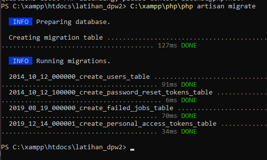
Hasilnya adalah 4 tabel baru yang ada di database yang sebelumnya kosong, di tambah tabel khusus 'migrations' untuk mengatur dan log migration-migration:
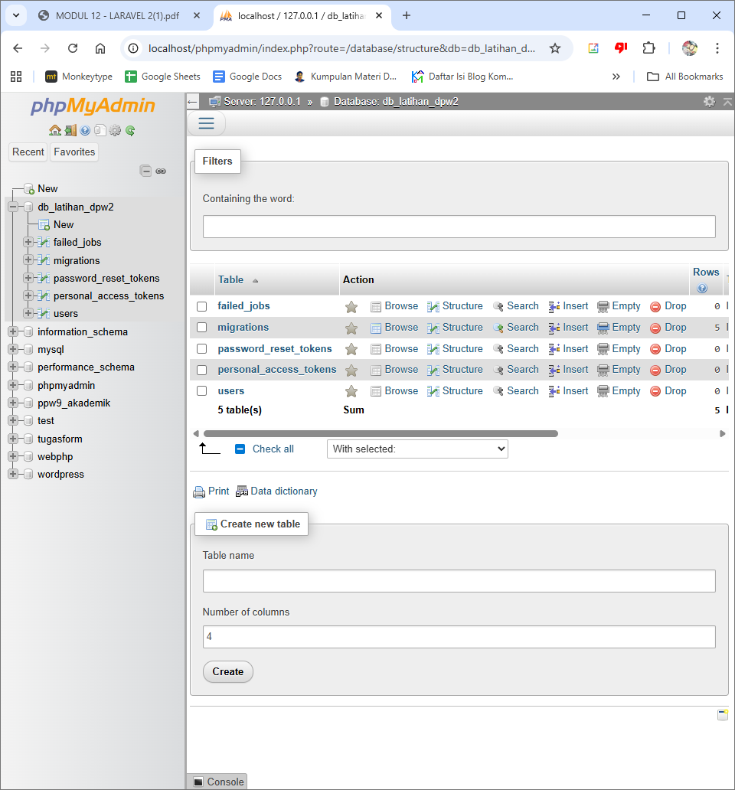


### Membuat Migration
Kita bisa membuat file migration dengan teks editor dengan menjalankan perintah php artisan dengan format `php artisan make:migration <nama_migration> --create=<nama_tabel>`. nama_migration lebih baik diisi dengan `<nama_proses>_<nama_tabel(s)>_table`. Sebagai contoh kita akan membuat file migration tabel mahasiswas dengan perintah `php artisan make:migration create_mahasiswas_table --create=mahasiswas`
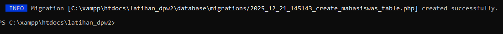
File migration tersebut tersimpan di `database\migrations` sesuai print di cmd. Isi file tersebut sesuai modul:
```
<?php
Use Illuminate\Database\Migrations\Migration;
use Illuminate\Database\Schema\Blueprint;
use Illuminate\Support\Facades\Schema;

class CreateMahasiswasTable extends Migration
{
    
    public function up(){
    Schema::create('mahasiswas', function (Blueprint $table) {
                $table->id();
                $table->char('nim',8);
                $table->string('nama');
                $table->string('tempat_lahir');
                $table->date('tanggal_lahir');
                $table->string('fakultas');
                $table->string('jurusan');
                $table->decimal('ipk',3,2);
                $table->timestamps();
        });
    }
        public function down(){
        Schema::dropIfExists('mahasiswas');
    }
}
```
lalu jalankan kembali `php artisan migrate`
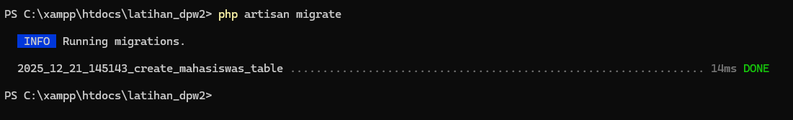
Hasilnya ada tabel baru migrate 'mahasiswas' yang tertulis di file migration baru
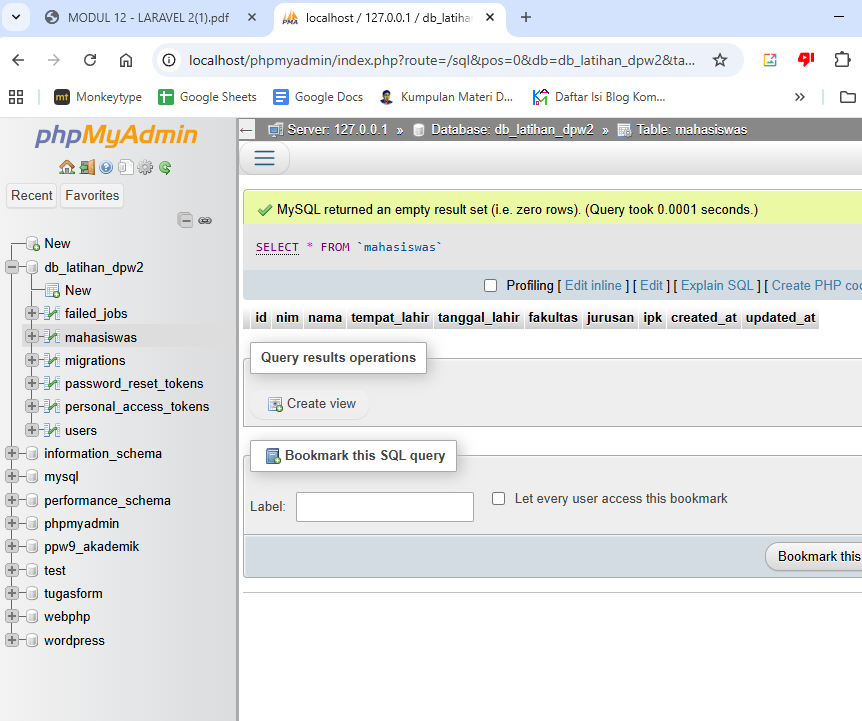
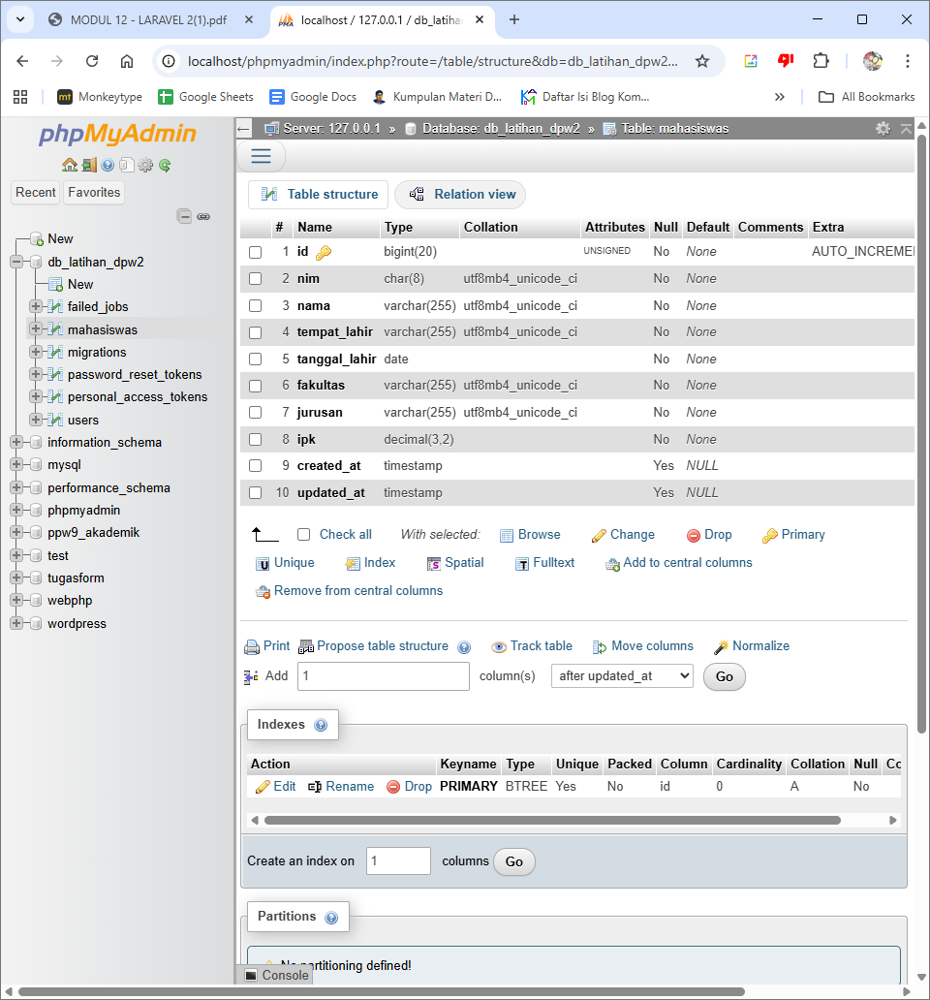

Jika ingin mengubah tabel yang sudah di migrate menggunakan file migration, bisa dengan cara mengubah file migration itu lalu rollaback dahulu, kemudian migrate kembali. Contohnya di sini kita mengubah kolom nim dan ip sehingga nim unique dan ip secara default berisi 1.00:
```
Schema::create('mahasiswas', function (Blueprint $table) {
                $table->id();
                $table->char('nim',8)->unique();
                $table->string('nama');
                $table->string('tempat_lahir');
                $table->date('tanggal_lahir');
                $table->string('fakultas');
                $table->string('jurusan');
                $table->decimal('ipk',3,2)->default(1.00);
                $table->timestamps();
        });
```
Lalu kita rollback dan migrate kembali:
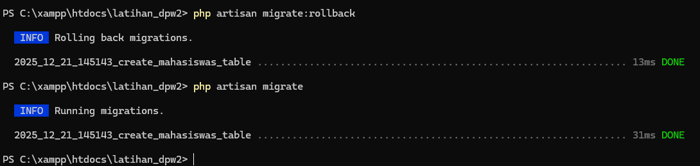
Hasilnya tabel mahasiswas memiliki properti sesuai file baru
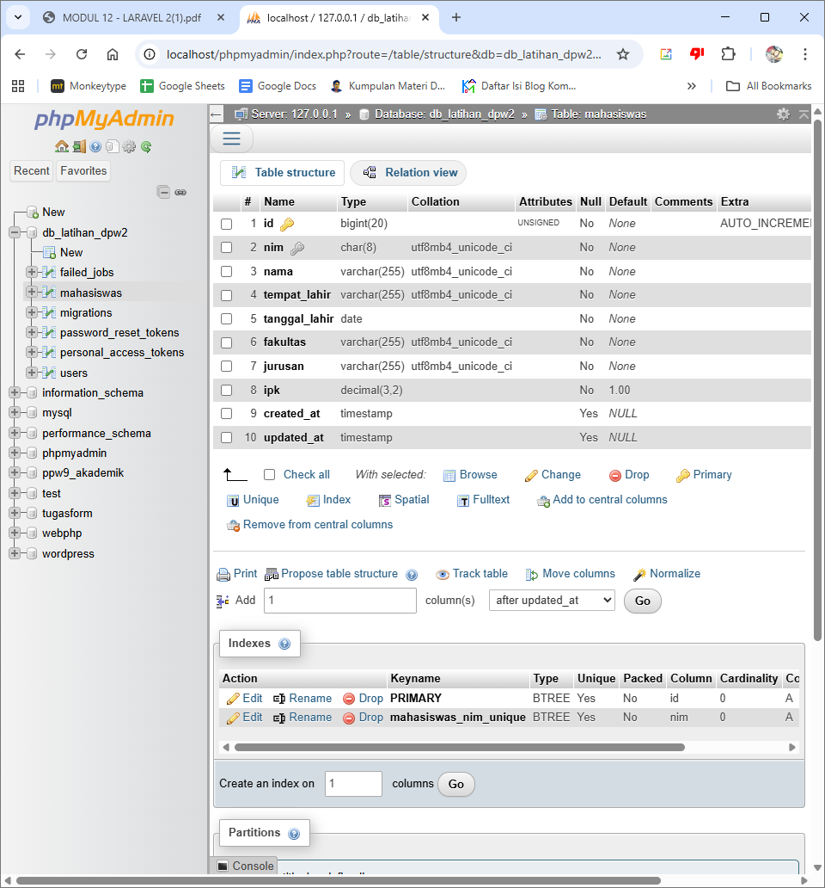
Perhatikan di bagian baawh di bagian indexes, mahasiswas_nim memiliki properti unique, dan kolom ipk memiliki nilai default 1.00.

### Alter Table migration
Kita juga bisa menggunakan migration untuk memodifikasi struktur tabel (alter), tidak hanya membuat dan menghapus tabel. 
Agar bisa melakukan modifikasi tabel ke dalam migration, Laravel butuh sebuah library tambahan bernama Doctrine DBAL. Untuk menginstallnya, jalankan perintah  `composer require doctrine/dbal` di folder laravel.
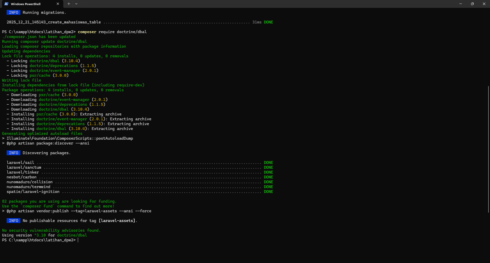
Untuk mencobanya, buat file migration baru kali ini dengan nama alter_mahasiswas_table dengan perintah `php artisan make:migration alter_mahasiswas_table --table=mahasiswas`, kemudian buka file migration tersebut dan isi sebagai berikut:
```
<?php
Use Illuminate\Database\Migrations\Migration;
use Illuminate\Database\Schema\Blueprint;
use Illuminate\Support\Facades\Schema;

class AlterMahasiswasTable extends Migration
{

    public function up(){
        Schema::table('mahasiswas', function (Blueprint $table) {
        $table->renameColumn('nama','nama_lengkap');
        $table->text('alamat')->after('tanggal_lahir');
        $table->dropColumn('ipk');
        });
    }

    public function down(){
        Schema::table('mahasiswas', function (Blueprint $table) {
        $table->renameColumn('nama_lengkap','nama');
        $table->dropColumn('alamat');
        $table->decimal('ipk',3,2)->default(1.00);
        });
    }
}
```
Di dalam method up() saya membuat 3 buah perintah modifikasi:
- Method `$table->renameColumn('nama','nama_lengkap')` dipakai untuk mengubah nama kolom 'nama' menjadi 'nama_lengkap'.
- Method `$table->text('alamat')->after('tanggal_lahir')` dipakai untuk menambah kolom 'alamat' dengan tipe data TEXT, yang posisinya ditempatkan setelah kolom 'tanggal_lahir'.
- Method `$table->dropColumn('ipk')` dipakai untuk menghapus kolom 'ipk'. 

Ketiga perubahan di method up() ini harus kita balik di method down():
- Method `$table->renameColumn('nama_lengkap','nama')` dipakai untuk mengubah kembali nama kolom dari 'nama_lengkap' menjadi 'nama'.
- Method `$table->dropColumn('alamat')` dipakai untuk menghapus kolom 'alamat'.
- Method `$table->decimal('ipk',3,2)->default(1.00)` dipakai untuk membuat
kembali kolom 'ipk' dengan tipe data DECIMAL(3,2) dan nilai default
1.00.

Kode program di dalam method up() dan down() harus berpasangan agar proses rollback bisa berlangsung dengan baik.
Jalankan kembali migration perubahan ini dengan perintah `php artisan migrate`

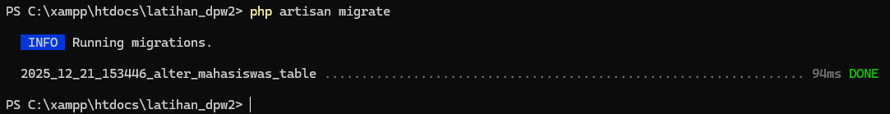

Hasil perubahan tabel, 'nama' menjadi 'nama_lengkap', terdapat kolom 'alamat', dan tidak ada kolom 'ipk'
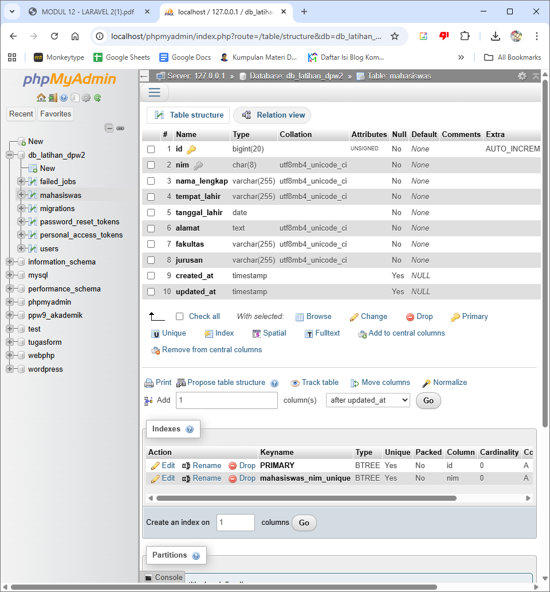

## DB Facade , Query Builder, Eloquent ORM
**Model** pada laravel merupakan representasi dari tabel database. Dengan menggunakan model, pengembang dapat melakukan operasi-operasi database seperti membuat, membaca, mengupdate, dan menghapus atau istilah lainya CRUD (Create, Read, Update, Delete) data dengan sangat mudah dan efisien.

Beberapa alasan mengapa model pada laravel dianggap penting:
1. Keamanan Data: Dengan menggunakan Model, pengembang dapat menghindari serangan SQL Injection dan Cross-Site Scripting (XSS) karena Laravel secara otomatis melindungi aplikasi dari serangan-serangan tersebut.
2. Kode yang Bersih dan Rapi: Penggunaan Model membuat kode program menjadi lebih bersih dan rapi. Model memungkinkan pengembang untuk mengorganisir logika bisnis
aplikasi dengan baik, memisahkan logika database dari logika aplikasi.
3. Kemudahan Pengembangan: Model mempercepat proses pengembangan dengan menyediakan berbagai fitur yang sudah siap pakai. Pengembang tidak perlu menulis query SQL yang kompleks secara manual, ini menghemat waktu dan usaha pengembang.

### Penjelasan Singkat
**Raw query merupakan** cara paling dasar dan 'paling tradisional' di dalam Laravel, terutama jika dibandingkan dengan query builder dan eloquent ORM. Raw query juga sangat familiar karena sudah biasa kita pakai ketika membuat aplikasi PHP tanpa framework. Selain itu untuk query yang kompleks, kadang hanya bisa dijalankan dengan raw query.
Raw SQL atau perintah query mentah atau disebut sebagai raw (mentah), karena querylangsung ditulis sebagaimana yang biasa diinput ke dalam mysqli extension atau PDO. Query yangdimaksud adalah perintah SQL seperti`‘SELECT * FROM mahasiswas'`, `'INSERT INTO mahasiswas...'`, `'UPDATE mahasiswasSET...'`, dst.

**Eloquent ORM** (Object-Relational Mapping) yang memungkinkan pengembang untuk berinteraksi dengan database menggunakan objek dan metode-metode yang intuitif yang membuat pengembangan aplikasi menjadi lebih cepat dan efisien.
Eloquent ORM adalah cara pengaksesan database dimana setiap baris tabel dianggap sebagai sebuah object. Kata ORM sendiri merupakan singkatan dari Object-relational mapping, yakni sebuah teknik programming untuk mengkonversi data ke dalam bentuk object. Sebagaimana yang sudah kita pahami, database terdiri dari kumpulan tabel yang saling terhubung.
Di dalam setiap tabel, data disimpan dalam bentuk baris dan kolom. ORM dipakai untuk mengubah baris dan kolom ini menjadi sebuah object. Nantinya, setiap kolom akan menjadi property dari object tersebut.

**Query Builder** digunakan untuk membuat query SQL dengan lebih fleksibel dan aman. Pengembang dapat dengan mudah membuat query kompleks menggunakan metode-metode yang disediakan oleh Query Builder.
Query builder adalah interface khusus yang disediakan Laravel untuk mengakses database. Berbeda dengan raw query dimana kita menulis langsung perintah query SQL, di dalam query builder perintah SQL ini diakses menggunakan method. Artinya, kita tidak menulis langsung perintah SQL, tapi hanya memanggil method-method saja.

### Input Data menggunakan raw SQL Querries
Sebelum menginput data, kita butuh controller dan route nya. pertama buat controller 'MahasiswaController.php', lalu isi seperti berikut:
```
<?php

namespace App\Http\Controllers;

use Illuminate\Http\Request;
use Illuminate\Support\Facades\DB;

class MahasiswaController extends Controller
{
    public function index()
    {
        return "Index untuk mahasiswa";
    }

    public function insertSql()
    {
        $result1 = DB::insert("
            INSERT INTO mahasiswas
                (nim, nama_lengkap, tempat_lahir, tanggal_lahir, alamat, fakultas, jurusan)
            VALUES
                (
                    '20104065',
                    'Muhammad Nur Hamada',
                    'Bandung',
                    '2002-02-02',
                    'Jl. Contoh No. 123',
                    'Fakultas Informatika',
                    'Software Engineering'
                )
        ");

        dump($result1);
    }
}
```
Lalu buat route untuk memanggil controllernya:
`Route::get('/insert-data1', [MahasiswaController::class,'insertSql']);`
Akses alamat localhost:8000/insert-data1, jika berhasil maka akan ada tampilan seperti ini: 
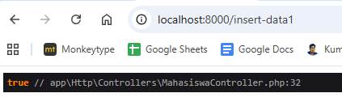
Bisa dilihat di phpmyadmin, data sudah dimasukkan
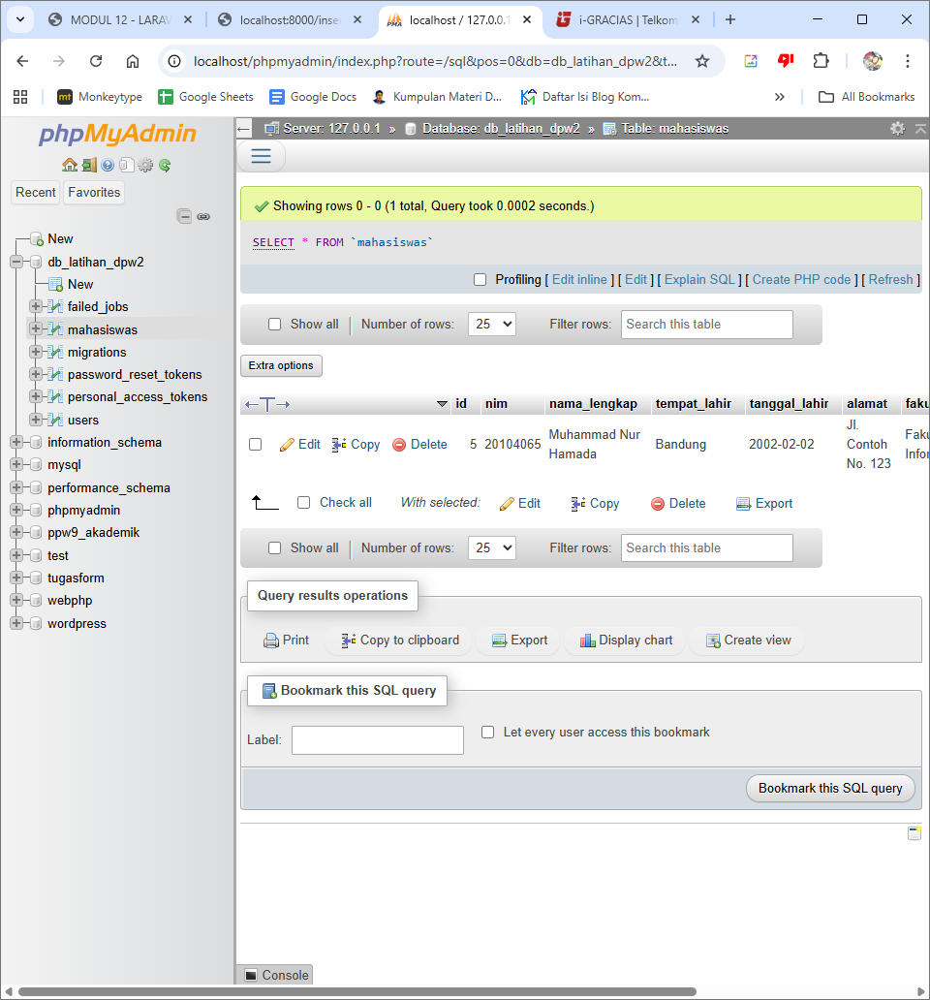

### Input Data menggunakan Querry Builder
Untuk menggunakan querry builder, kita akan menggunakan route dan controller yang sama. Pada MahasiswaController.php, tambahkan fungsi ini:
```
public function insertQB()
    {
        $result2 = DB::table('mahasiswas')->insert([
            'nim'           => '20104070',
            'nama_lengkap'  => 'Aulia Putri Ramadhani',
            'tempat_lahir'  => 'Surabaya',
            'tanggal_lahir' => '2003-05-14',
            'alamat'        => 'Jl. Mawar No. 10',
            'fakultas'      => 'Fakultas Teknik',
            'jurusan'       => 'Teknik Informatika',
        ]);

        dump($result2);
    }
```
Tambahkan route untuk memanggil fungsi tersebut:
`Route::get('/insert-data2', [MahasiswaController::class,'insertQB']);`
Akses alamat localhost:8000/insert-data2, di web akan terdapat return yang mirip dan data masuk di database

### Input data menggunakan Eloquent ORM
Untuk Eloquent ORM, selain controller dan route kita juga butuh model. Buat model dengan perintah `php artisan make:model Mahasiswa`. Modifikasi isi \app\Models\Mahasiswa.php seperti berikut:
```
<?php

namespace App\Models;

use Illuminate\Database\Eloquent\Model;

class Mahasiswa extends Model
{
    protected $table = 'mahasiswas';

    protected $fillable = [
        'nim',
        'nama_lengkap',
        'tempat_lahir',
        'tanggal_lahir',
        'alamat',
        'fakultas',
        'jurusan',
    ];
}
```
Eloquent ORM menggunakan model sebagai representasi tabel database. Properti $table digunakan untuk menentukan nama tabel yang direpresentasikan, sedangkan $fillable berfungsi untuk membatasi kolom yang dapat diisi melalui mekanisme mass assignment guna meningkatkan keamanan data.
Buat function baru di MahasiswaController.php:
```
use App\Models\Mahasiswa;

class MahasiswaController extends Controller
{

...

    public function insertEloquent()
    {
        $mhs = Mahasiswa::create([
            'nim'           => '20104080',
            'nama_lengkap'  => 'Rizky Ananda',
            'tempat_lahir'  => 'Malang',
            'tanggal_lahir' => '2002-09-12',
            'alamat'        => 'Jl. Kenanga No. 7',
            'fakultas'      => 'Fakultas Informatika',
            'jurusan'       => 'Software Engineering',
        ]);

        dump($mhs);
    }
}
```
Buat route untuk memanggil function tersebut:
`Route::get('/insert-data3', [MahasiswaController::class,'insertEloquent']);`
Lalu akses alamat http://localhost:8000/insert-data3. Kali ini web akan menampilkan:
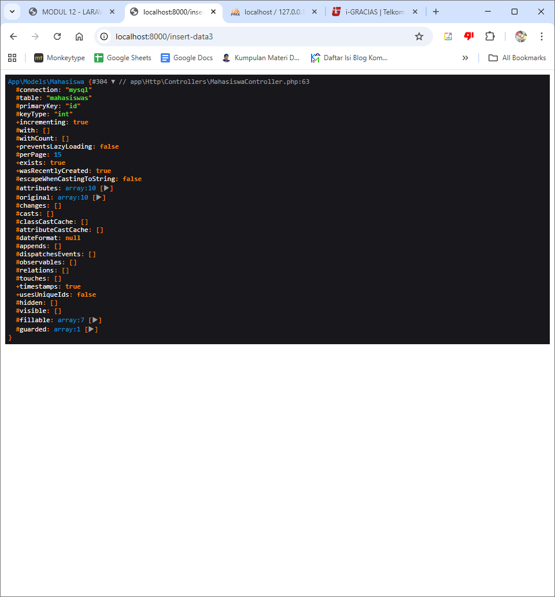
Berikut database yang telah diinsert menggunakan eloquent ORM dan querry builder sebelumhya:
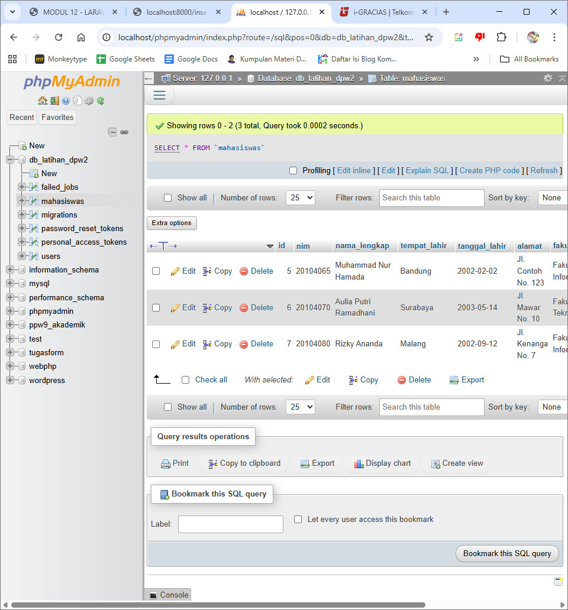

# Unguided
## 12.1 
Ini merupakan File migration untuk membuat tabel destana:
2025_12_24_145143_create_destana_table.php
```
// database/migrations/2025_12_24_145143_create_destana_table.php

use Illuminate\Database\Migrations\Migration;
use Illuminate\Database\Schema\Blueprint;
use Illuminate\Support\Facades\Schema;

return new class extends Migration {
    public function up() {
        Schema::create('destana', function (Blueprint $table) {
            $table->integer('id')->primary();
            $table->integer('id_kecamatan');
            $table->integer('id_desa');
            $table->string('tahun_pembentukan', 4);
            $table->integer('id_sumber_dana');
            $table->integer('id_kelas');
        });
    }

    public function down() {
        Schema::dropIfExists('destana');
    }
};
```
Function up() membuat tabel 'destana' dengan kolom: id, id_kecamatan, id_desa, tahun_pembentukan, id_sumber_dana, dan id_kelas. function down() berisi perintah untuk menghapus tabel ketika di rollback.

## 12.2
Di sini $request seperti $_POST dari laravel, asal datanya diinput oleh user di web.

1. Raw SQL Queries
```
use Illuminate\Support\Facades\DB;

public function insertRawSQL($request)
{
    $sql = "INSERT INTO destana (id_kecamatan, id_desa, tahun_pembentukan, id_sumber_dana, id_kelas) 
            VALUES (?, ?, ?, ?, ?)";
    
    return DB::insert($sql, [
        $request->id_kecamatan,
        $request->id_desa,
        $request->tahun_pembentukan,
        $request->id_sumber_dana,
        $request->id_kelas
    ]);
}
```
Raw sql queries menggunakan DB::insert, dan ditambah bindings untuk mencegah sql injection. Bindings diimplementasikan dengan `VALUES (?, ?, ?, ?, ?)";`

2. Query Builder
```
use Illuminate\Support\Facades\DB;

public function insertQueryBuilder($request)
{
    return DB::table('destana')->insert([
        'id_kecamatan'      => $request->id_kecamatan,
        'id_desa'           => $request->id_desa,
        'tahun_pembentukan' => $request->tahun_pembentukan,
        'id_sumber_dana'    => $request->id_sumber_dana,
        'id_kelas'          => $request->id_kelas,
    ]);
}
```
Implementasi Query Builder menggunakan DB::table. Tidak perlu menulis sintaks SQL secara manual dan bindings otomatis terintegrasi.

3. Eloquent ORM
Untuk menggunakan cara ini kita perlu membuat model terpisah:
app/Models/Destana.php:
```
namespace App\Models;

use Illuminate\Database\Eloquent\Model;

class Destana extends Model
{
    protected $table = 'destana';
    protected $fillable = ['id_kecamatan', 'id_desa', 'tahun_pembentukan', 'id_sumber_dana', 'id_kelas'];
    public $timestamps = false; // Karena di SQL aslinya tidak ada created_at/updated_at standar Laravel
}

```
Lalu di Controller tambahkan fungsi berikut:
```
public function insertEloquent($request)
{
    return Destana::create([
        'id_kecamatan'      => $request->id_kecamatan,
        'id_desa'           => $request->id_desa,
        'tahun_pembentukan' => $request->tahun_pembentukan,
        'id_sumber_dana'    => $request->id_sumber_dana,
        'id_kelas'          => $request->id_kelas,
    ]);
}
```
Eloquent ORM lebih terbaca dan ekspresif, dan tidak harus melakukan `join` panjang karena relasi antar tabel ditangani secara otomatis di belakang layar.


