<div align="center">

**LAPORAN PRAKTIKUM**  
**PERANCANGAN DAN PEMROGRAMAN WEB**  

<br><br>

**MODUL 13**  
**Node.js: Pengenalan**

<br><br>


<br><br>

Oleh:  
**Muhammad Samudra**  
**2211104062**

<br><br><br>

**PROGRAM STUDI S1 REKAYASA PERANGKAT LUNAK**  
**DIREKTORAT KAMPUS PURWOKERTO**  
**UNIVERSITAS TELKOM**

<br><br>

**2025**

</div>

---
# Guided
## Inisialisasi Proyek Node.js
1. Cek apakah node.js sudah terpasang dengan `node -v` dan `npm -v`
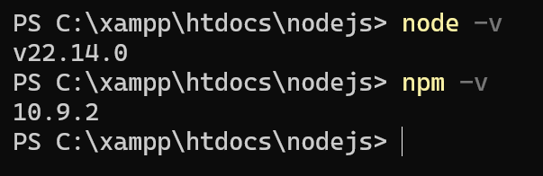

2. Buat folder bernama `restfulAPI`, masuk ke folder tersebut dan jalankan `npm init`, klik tombol enter hingga selesai
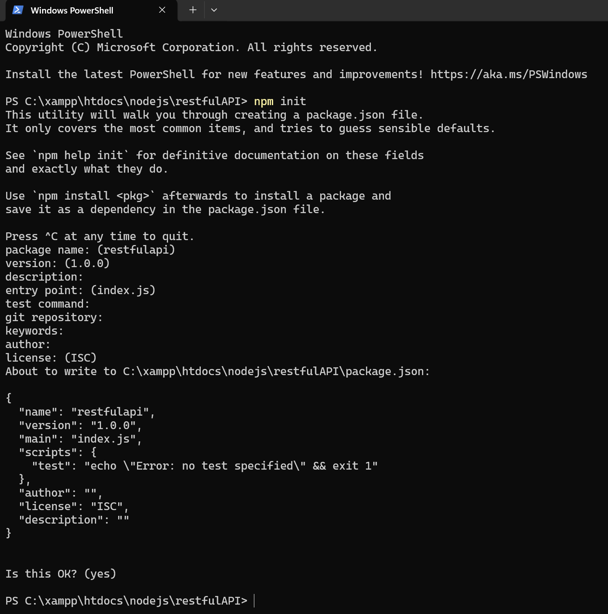
Setelah selesai akan ada sebuah file package.json

3. Instal dependency modul Express.js dengan mysql menggunakan peritah `npm install express mysql`. Setelah selesai maka akan ada folder 'node_module' dan juga file package-lock.json

## Konfigurasi Database
### Membuat Database dan tabel
Buat database dengan nama 'akademik' dengan sebuah tabel bernama 'mahasiswa' menggunakan querry:
```
CREATE DATABASE akademik;
USE akademik;
CREATE TABLE mahasiswa (
    id INT AUTO_INCREMENT PRIMARY KEY,
    nama VARCHAR(100) NOT NULL,
    nim VARCHAR(20) NOT NULL,
    jurusan VARCHAR(50) NOT NULL,
    email VARCHAR(100) NOT NULL
);

```
### Membuat File Koneksi Database (db.js)
File db.js digunakan untuk mengatur konfigurasi koneksi antara aplikasi Node.js dan databas MySQL. Di dalam file db.js, mahasiswa akan mengatur detail koneksi seperti host, user, password, dan nama database seperti pada kode berikut:
```
const mysql = require('mysql');
const connection = mysql.createConnection({
    host: 'localhost',
    user: 'root',
    password: '',
    database: 'akademik'
});
connection.connect(err => {
    if (err) {
        console.error('Koneksi database gagal:', err);
        return;
    }
    console.log('Database connected');
});

module.exports = connection;

```

## Restful API
RESTful API adalah standar arsitektur antarmuka pemrograman aplikasi yang menggunakan protokol HTTP untuk memungkinkan komunikasi dan pertukaran data antar sistem secara independen. Ia bekerja dengan prinsip stateless, di mana setiap permintaan dari klien harus berisi semua informasi yang diperlukan tanpa mengandalkan data dari sesi sebelumnya di server. Dalam praktiknya, RESTful API mengelola sumber daya (resources) menggunakan metode HTTP standar seperti GET untuk membaca, POST untuk membuat, PUT untuk memperbarui, dan DELETE untuk menghapus data, yang biasanya ditransmisikan dalam format JSON agar mudah dibaca oleh berbagai bahasa pemrograman.

### Implementasi CRUD
Berikut file crud.js yang berisi operasi create, read, update, delete
```
const connection = require("./db");

// Create
function createMahasiswa(nama, nim, jurusan, email, callback) {
  const query = "INSERT INTO mahasiswa (nama, nim, jurusan, email) VALUES (?, ?, ?, ?)";
  
  connection.query(query, [nama, nim, jurusan, email], (error, results) => {
    if (error) {
      return callback(error, null);
    }
    callback(null, results);
  });
}

// Read
function getAllMahasiswa(callback) {
  const query = "SELECT * FROM mahasiswa";
  
  connection.query(query, (error, results) => {
    if (error) {
      return callback(error, null);
    }
    callback(null, results);
  });
}

// Update
function updateMahasiswa(id, nama, nim, jurusan, email, callback) {
  const query = "UPDATE mahasiswa SET nama = ?, nim = ?, jurusan = ?, email = ? WHERE id = ?";
  
  connection.query(query, [nama, nim, jurusan, email, id], (error, results) => {
    if (error) {
      return callback(error, null);
    }
    if (results.affectedRows === 0) {
      return callback(new Error("No rows updated, ID may not exist"), null);
    }
    callback(null, results);
  });
}

// Delete
function deleteMahasiswa(id, callback) {
  const query = "DELETE FROM mahasiswa WHERE id = ?";
  
  connection.query(query, [id], (error, results) => {
    if (error) {
      return callback(error, null);
    }
    callback(null, results);
  });
}

module.exports = {
  getAllMahasiswa,
  createMahasiswa,
  updateMahasiswa,
  deleteMahasiswa,
};
```

### Pembuatan File Utama Aplikasi (app.js)
File ini akan menjadi pusat dari aplikasi Node.js yang mengatur semua route dan middleware menggunakan Express.js. Di dalam app.js, mahasiswa akan mendefinisikan route untuk operasi CRUD, mengintegrasikan logika dari crud.js, dan mengatur server untuk mendengarkan permintaan dari klien.
```
const express = require("express");
const dbOperations = require("./crud");
const app = express();
const port = 3000;

app.use(express.json());

// Endpoint untuk menambahkan data
app.post("/mahasiswaCreate", (req, res) => {
  const { nama, nim, jurusan, email } = req.body;
  dbOperations.createMahasiswa(nama, nim, jurusan, email, (error) => {
    if (error) {
      return res.status(500).send("Error creating");
    }
    res.status(201).send("Mahasiswa created");
  });
});

// Endpoint untuk mendapatkan semua data
app.get("/mahasiswaGet", (req, res) => {
  dbOperations.getAllMahasiswa((error, users) => {
    if (error) {
      return res.status(500).send("Error fetching users");
    }
    res.json(users);
  });
});

// Endpoint untuk memperbarui data
app.put("/mahasiswaUpdate/:id", (req, res) => {
  const { id } = req.params;
  const { nama, nim, jurusan, email } = req.body;
  dbOperations.updateMahasiswa(id, nama, nim, jurusan, email, (error) => {
    if (error) {
      return res.status(500).send("Error updating");
    }
    res.send("Mahasiswa updated");
  });
});

// Endpoint untuk menghapus data
app.delete("/mahasiswaDelete/:id", (req, res) => {
  const { id } = req.params;
  dbOperations.deleteMahasiswa(id, (error) => {
    if (error) {
      return res.status(500).send("Error deleting");
    }
    res.send("Mahasiswa deleted");
  });
});

// Jalankan server
app.listen(port, () => {
  console.log(`Server running on http://localhost:${port}`);
});
```

## Menjalankan API di proyek
Buka terminal yang mengarah ke folder restfulAPI, lalu jalankan perintah `node app.js`. Jika berhasil maka akan muncul 'Database Connected'. Selanjutya buka Postman untuk menguji operasi CRUD

### Create
Buat new request, lalu pilih 'POST'. Isi nama API sesuai dengan nama pada file app.js, yaitu `http://localhost:3000/mahasiswaCreate`. Pada tab body (di bawah form box nama API), pilih 'raw', lalu pilih tipe format JSON. Masukkan isian ini:
```
{
    "nama": "Muhammad Samudra",
    "nim": "2211104062",
    "jurusan": "S1 Rekayasa Perangkat Lunak",
    "email": "samud@gmail.com"
}
```
Lalu klik Send. Hasilnya di log ada pemberitahuan objek Mahasiswa sudah dibuat
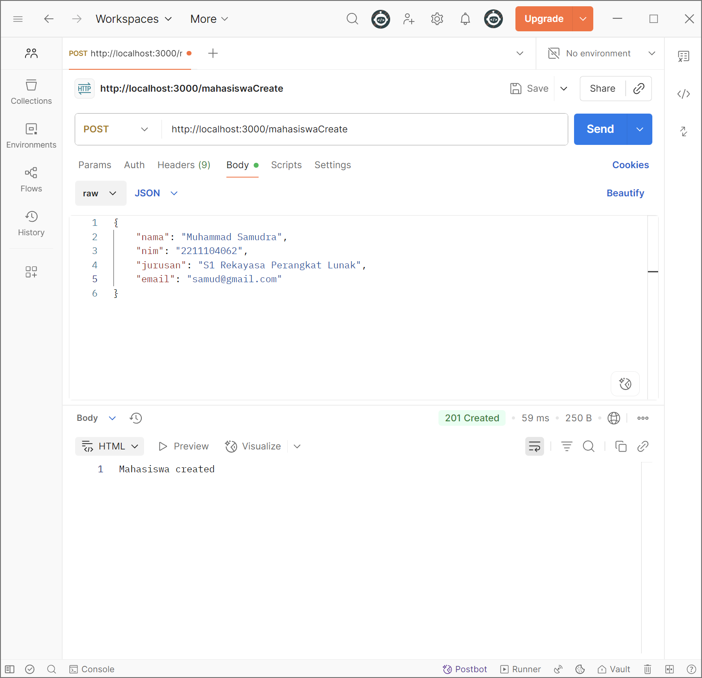

Di database bisa diconfirm mahasiswa dengan nama 'Muhammad Samudra' sudah dibuat dengan id 8
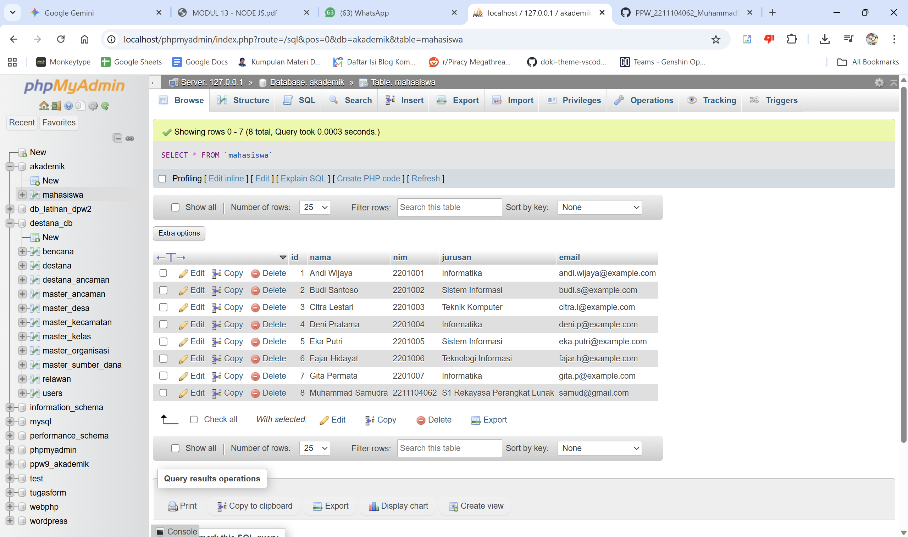

### Read
Untuk operasi Read, buat new request dengan tipe GET, masukkan nama api `http://localhost:3000/mahasiswaGet`. Setelah di send, log akan berisi data yang dibaca/diambil
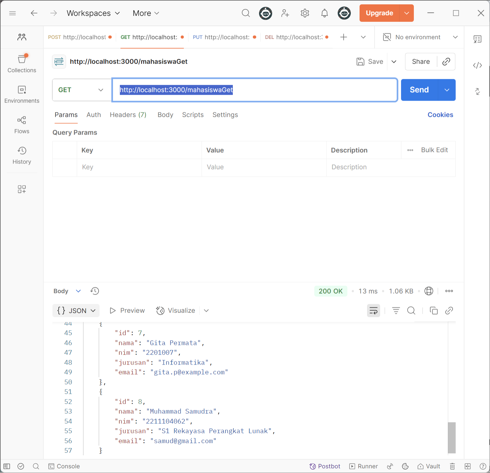

### Update
Untuk operasi Update/edit, buat new request dengan tipe PUT, dan masukkan nama API `http://localhost:3000/mahasiswaUpdate/7`, jangan lupa parameter berupa id untuk merujuk data mana yang ingin di edit. Lalu pilih 'Body', 'Raw', pilih format JSON, lalu isi dengan:
```
{
    "nama": "Alissya Galiia",
    "nim": "2021007",
    "jurusan": "S1 Rekayasa Perangkat Lunak",
    "email": "aliya@gmail.com"
}
```
Lalu tekan tombol Send. Hasilnya di log terconfirm mahasiswa telah di update
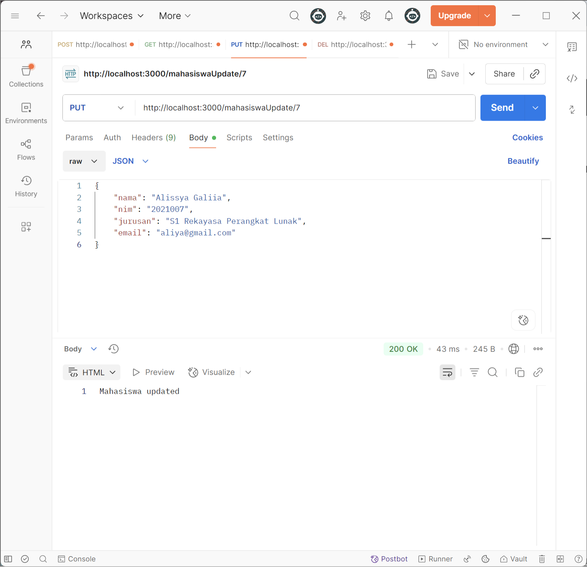
Dan di database bisa dilihat mahasiswa dengan id 7 telah berubah sesuai isian di postman
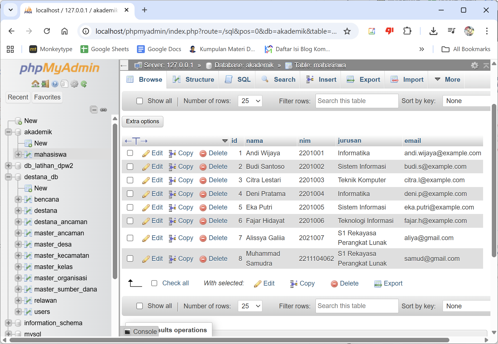

### Delete
Terakhir untuk operasi Delete, gunakan tipe DELETE, isi nama api dengan `http://localhost:3000/mahasiswaDelete/3` termasuk parameter id objek yang akan dihapus. Ketika di klik Send akan ada konfirmasi mahasiswa telah terhapus
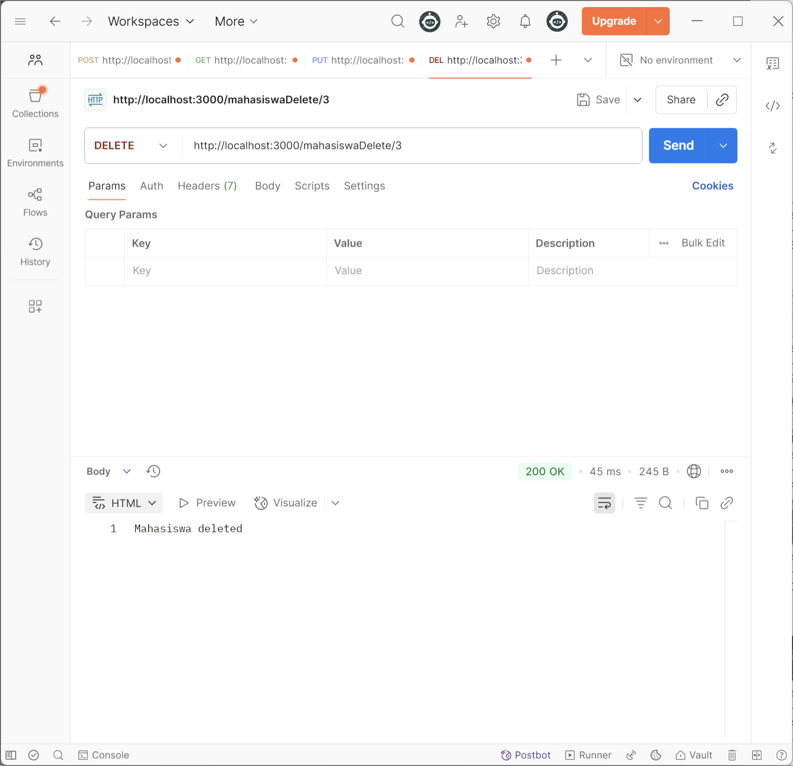
Dan di database bisa konfirmasi juga mahasiswa dengan id 3 sudah tidak ada
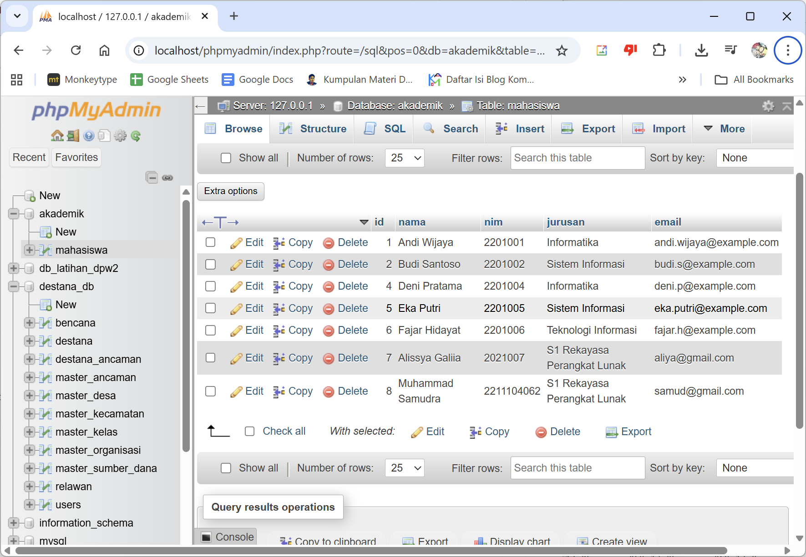


# Unguided
Untuk membuat aplikasi web, buatlah index.html di folder restfulAPI seperti berikut:
```
<!DOCTYPE html>
<html lang="en">
<head>
    <title>Data Mahasiswa</title>
</head>
<body>
    <h2>Form Tambah Mahasiswa</h2>
    <form id="mhsForm">
        <input type="text" id="nama" placeholder="Nama" required><br>
        <input type="text" id="nim" placeholder="NIM" required><br>
        <input type="text" id="jurusan" placeholder="Jurusan" required><br>
        <input type="email" id="email" placeholder="Email" required><br>
        <button type="submit">Simpan</button>
    </form>

    <h2>Daftar Mahasiswa</h2>
    <ul id="daftarMhs"></ul>

    <script>
        // Fungsi mengambil data (Read)
        function loadMahasiswa() {
            fetch('/mahasiswaGet')
                .then(res => res.json())
                .then(data => {
                    const list = document.getElementById('daftarMhs');
                    list.innerHTML = '';
                    data.forEach(mhs => {
                        list.innerHTML += `<li>${mhs.nama} - ${mhs.nim} (${mhs.jurusan})</li>`;
                    });
                });
        }

        // Fungsi menambah data (Create)
        document.getElementById('mhsForm').addEventListener('submit', (e) => {
            e.preventDefault();
            const data = {
                nama: document.getElementById('nama').value,
                nim: document.getElementById('nim').value,
                jurusan: document.getElementById('jurusan').value,
                email: document.getElementById('email').value
            };

            fetch('/mahasiswaCreate', {
                method: 'POST',
                headers: {'Content-Type': 'application/json'},
                body: JSON.stringify(data)
            }).then(() => {
                loadMahasiswa();
                e.target.reset();
            });
        });

        loadMahasiswa(); // Load data saat halaman dibuka
    </script>
</body>
</html>
```

Bagian form memfasilitasi user untuk menambahkan data:
```
<h2>Form Tambah Mahasiswa</h2>
    <form id="mhsForm">
        <input type="text" id="nama" placeholder="Nama" required><br>
        <input type="text" id="nim" placeholder="NIM" required><br>
        <input type="text" id="jurusan" placeholder="Jurusan" required><br>
        <input type="email" id="email" placeholder="Email" required><br>
        <button type="submit">Simpan</button>
    </form>
```
Lalu di bawahnya adalah script yang berfungsinya sebagai jembatan komunikasi antara pengguna (browser) dan server (Node.js).

Operasi Read/GET dihandle oleh bagian ini:
```
function loadMahasiswa() {
            fetch('/mahasiswaGet')
                .then(res => res.json())
                .then(data => {
                    const list = document.getElementById('daftarMhs');
                    list.innerHTML = '';
                    data.forEach(mhs => {
                        list.innerHTML += `<li>${mhs.nama} - ${mhs.nim} (${mhs.jurusan})</li>`;
                    });
                });
        }
```
- `fetch('/mahasiswaGet')`: Melakukan permintaan (request) ke server Node.js pada endpoint /mahasiswaGet. Karena tidak ada parameter tambahan, secara default ini menggunakan metode GET.
- `.then(res => res.json())`: Mengubah respon mentah dari server menjadi format JSON agar bisa diolah oleh JavaScript.
- `data.forEach(mhs => ...)`: Melakukan perulangan (looping) pada setiap data mahasiswa yang diterima dari database.
- `list.innerHTML += ...`: Memasukkan data mahasiswa (nama, nim, jurusan) ke dalam tag `<li>` di dalam HTML secara dinamis.

Tombol 'simpan' memiliki tipe 'submit' yang akan menjalankan bagian kode yang menghandle operasi Create/POST:
```
document.getElementById('mhsForm').addEventListener('submit', (e) => {
            e.preventDefault();
            const data = {
                nama: document.getElementById('nama').value,
                nim: document.getElementById('nim').value,
                jurusan: document.getElementById('jurusan').value,
                email: document.getElementById('email').value
            };

            fetch('/mahasiswaCreate', {
                method: 'POST',
                headers: {'Content-Type': 'application/json'},
                body: JSON.stringify(data)
            }).then(() => {
                loadMahasiswa();
                e.target.reset();
            });
        });
```

- `e.preventDefault()`: Mencegah browser melakukan refresh halaman secara otomatis saat tombol submit diklik. Ini penting agar aplikasi terasa lebih cepat (Single Page Application style).
- Objek `data`: Mengambil nilai-nilai yang diketik user di kotak input (nama, nim, dll) dan membungkusnya ke dalam satu objek JavaScript.
- `fetch('/mahasiswaCreate', { ... })`: Mengirim data ke server dengan konfigurasi khusus:
  - `method: 'POST'`: Memberitahu server bahwa kita ingin mengirim/menambah data baru.
  - `headers: {'Content-Type': 'application/json'}`: Memberitahu server bahwa data yang dikirim berformat JSON.
  - `body: JSON.stringify(data)`: Mengubah objek JavaScript menjadi string JSON sebelum dikirim melalui jaringan internet.

Terakhir ada `.then(() => { loadMahasiswa(); e.target.reset(); })`: Setelah proses simpan di server berhasil, script akan memanggil kembali fungsi `loadMahasiswa()` agar daftar di bawah langsung terupdate dengan data terbaru tanpa reload, kemudian mengosongkan isi form (reset).

Jangan lupa app.js ditambah bagian ini sebelum menjalankan server agar index.html dijalankan:
```
// biar bisa diakses
app.get("/", (req, res) => {
  res.sendFile(__dirname + "/index.html");
});
```

Tampilan sebelum klik tombol 'simpan:
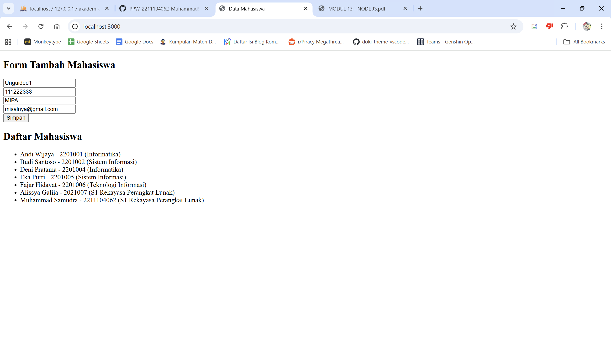

Tampilan setelah klik tombol 'simpan'
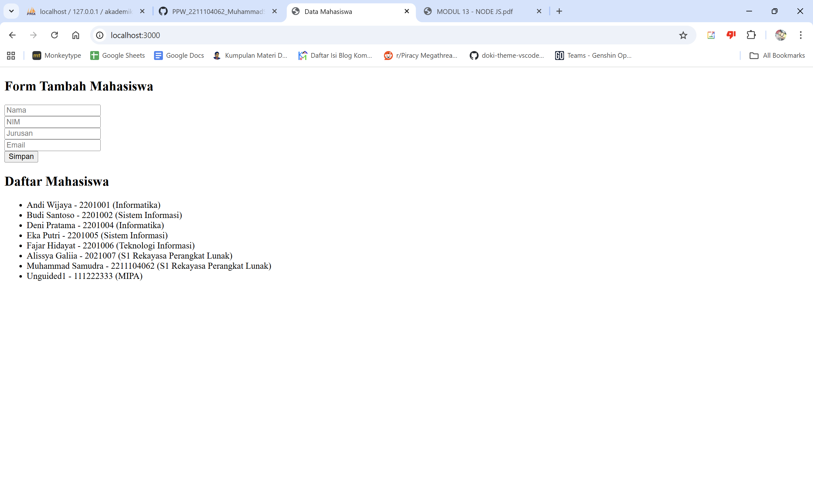

Cek database apakah data tersimpan
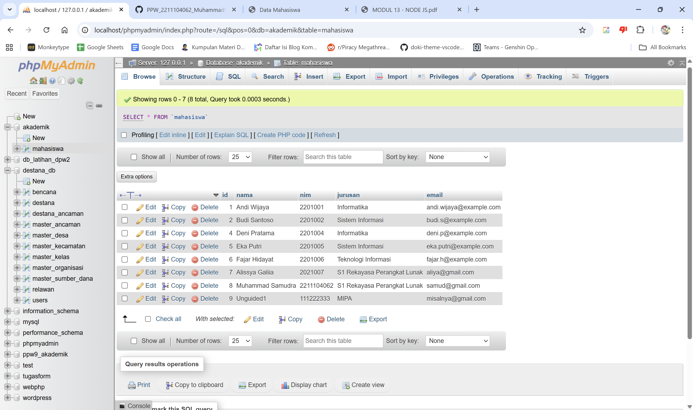


