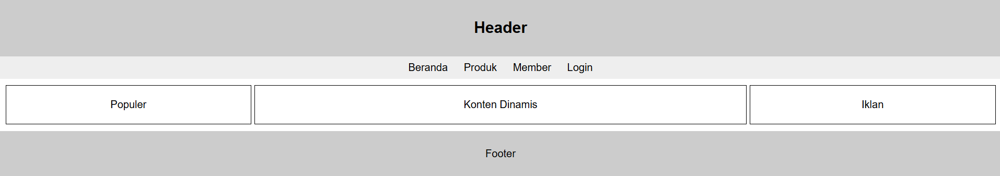
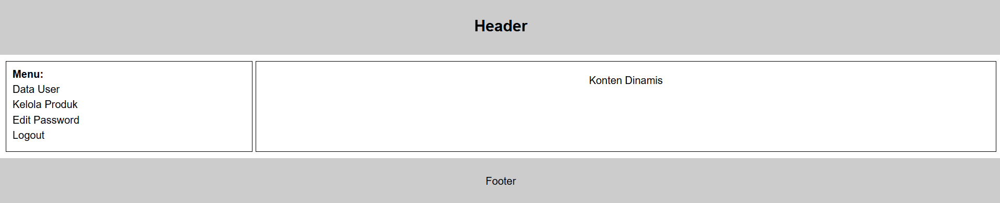

<div align="center">

**LAPORAN PRAKTIKUM**  
**PERANCANGAN DAN PEMROGRAMAN WEB**  

<br><br>

**MODUL 1**  
**HTML dan CSS**

<br><br>


<br><br>

Oleh:  
**Muhammad Samudra**  
**2211104062**

<br><br><br>

**PROGRAM STUDI S1 REKAYASA PERANGKAT LUNAK**  
**DIREKTORAT KAMPUS PURWOKERTO**  
**UNIVERSITAS TELKOM**

<br><br>

**2025**

</div>

---

Terdapat dua halaman yang dibuat, yaitu `profile.html` dan `administrator.html`. Kedua file ini memiliki struktur dasar HTML yang terdiri dari elemen `header`, `nav` atau menu, bagian konten utama, serta `footer`. CSS di sini menggunakan **Internal CSS** di mana letaknya ada di dalam file.html masing-masing, di dalam `style`.

Pada file `profile.html`, halaman dibagi menjadi tiga kolom menggunakan CSS Grid Layout dengan kelas .container. Masing-masing kolom berisi konten seperti “Populer”, “Konten Dinamis”, dan “Iklan”. Selain itu, terdapat elemen navigasi sederhana yang menggunakan tag `nav` berisi beberapa tautan (link) menuju halaman lain. CSS digunakan untuk mengatur jarak, warna latar, serta perataan teks agar tampilan lebih rapi.

```
<!DOCTYPE html>
<html lang="id">
<head>
  <meta charset="UTF-8">
  <title>Halaman Profile</title>
  <style>
    body {
      font-family: Arial, sans-serif;
      margin: 0;
      text-align: center;
    }
    header, footer {
      background: #ccc;
      padding: 10px;
    }
    nav {
      background: #eee;
      padding: 8px;
    }
    nav a {
      margin: 0 10px;
      text-decoration: none;
      color: black;
    }
    .container {
      display: grid;
      grid-template-columns: 1fr 2fr 1fr;
      gap: 5px;
      padding: 10px;
    }
    .box {
      border: 1px solid #000;
      padding: 20px;
    }
  </style>
</head>
<body>
  <header>
    <h2>Header</h2>
  </header>

  <nav>
    <a href="#">Beranda</a>
    <a href="#">Produk</a>
    <a href="#">Member</a>
    <a href="#">Login</a>
  </nav>

  <div class="container">
    <div class="box">Populer</div>
    <div class="box">Konten Dinamis</div>
    <div class="box">Iklan</div>
  </div>

  <footer>
    <p>Footer</p>
  </footer>
</body>
</html>

```



Sementara pada `administrator.html`, konsep tata letak yang digunakan juga memakai grid, namun dengan dua kolom utama: kolom kiri untuk menu dan kolom kanan untuk konten utama. Setiap bagian diberi batas menggunakan border agar struktur halaman terlihat jelas. Melalui latihan ini, kami memahami dasar pembuatan layout web serta penerapan gaya visual menggunakan CSS internal.

```
<!DOCTYPE html>
<html lang="id">
<head>
  <meta charset="UTF-8">
  <title>Halaman Administrator</title>
  <style>
    body {
      font-family: Arial, sans-serif;
      margin: 0;
      text-align: center;
    }
    header, footer {
      background: #ccc;
      padding: 10px;
    }
    .content {
      display: grid;
      grid-template-columns: 1fr 3fr;
      gap: 5px;
      padding: 10px;
    }
    .menu {
      border: 1px solid #000;
      text-align: left;
      padding: 10px;
    }
    .menu p {
      margin: 5px 0;
    }
    .main {
      border: 1px solid #000;
      padding: 20px;
    }
  </style>
</head>
<body>
  <header>
    <h2>Header</h2>
  </header>

  <div class="content">
    <div class="menu">
      <strong>Menu:</strong><br>
      <p>Data User</p>
      <p>Kelola Produk</p>
      <p>Edit Password</p>
      <p>Logout</p>
    </div>

    <div class="main">
      Konten Dinamis
    </div>
  </div>

  <footer>
    <p>Footer</p>
  </footer>
</body>
</html>

```

