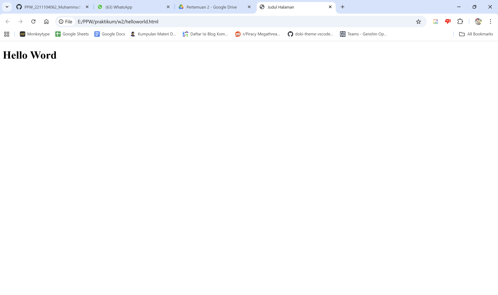
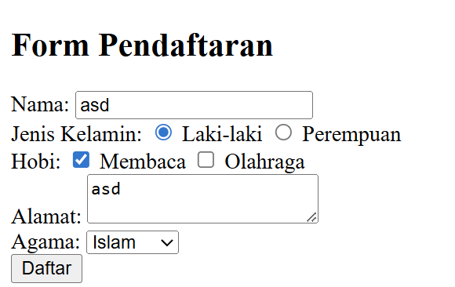
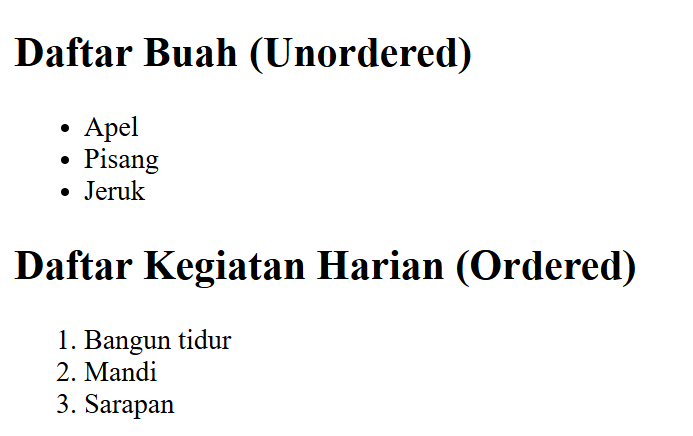
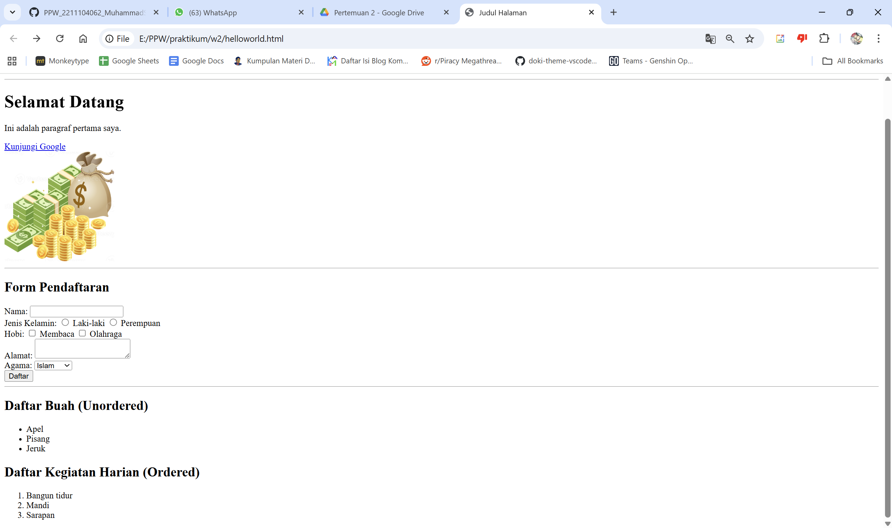
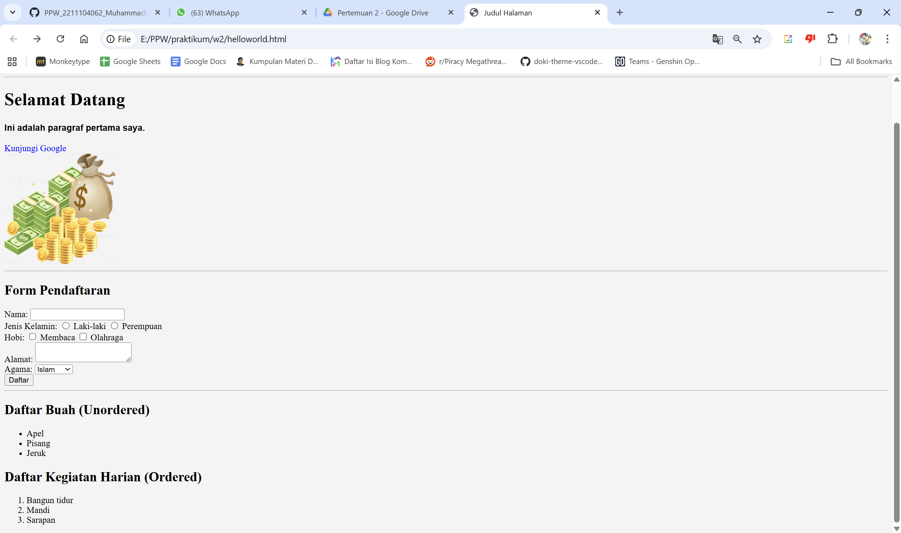

<div align="center">

**LAPORAN PRAKTIKUM**  
**PERANCANGAN DAN PEMROGRAMAN WEB**  

<br><br>

**MODUL 1**  
**HTML dan CSS**

<br><br>


<br><br>

Oleh:  
**Muhammad Samudra**  
**2211104062**

<br><br><br>

**PROGRAM STUDI S1 REKAYASA PERANGKAT LUNAK**  
**DIREKTORAT KAMPUS PURWOKERTO**  
**UNIVERSITAS TELKOM**

<br><br>

**2025**

</div>

---

# Guided

## Dasar Teori
HTML (HyperText Markup Language) adalah bahasa markup standar yang digunakan untuk membuat dan menyusun halaman web. HTML bekerja dengan menggunakan serangkaian tag (penanda) untuk menentukan elemen-elemen sepertiteks, gambar, tautan,tabel, formulir, dan struktur layout pada sebuah halaman web.
Contoh sederhana html `helloworld.html`:
```
<!DOCTYPE html>
<html lang="en">
<head>
  <meta charset="UTF-8">
  <meta name="viewport" content="width=device-width, initial-scale=1.0">
  <title>Judul Halaman</title>
</head>
<body>
  <h1>Hello Word</h1>
```



## Tag Html
Tag pada HTML adalah elemen dasar yang digunakan untuk membangun dan menyusun struktur halaman web. Setiap tag biasanya ditulis dalam tanda kurung sudut `< >` dan memiliki pasangan pembuka dan penutup.
Contoh penggunaan tag pada html:
```
<!-- Tag Html -->
    <h1>Selamat Datang</h1>
    <p>Ini adalah paragraf pertama saya.</p>
    <a href="https://www.google.com">Kunjungi Google</a>
    <br>
    

```
- tag `<h1>` adalah tag header 1, yang paling besar
- tag `<p>` adalah tag paragraf
- tag `<a>` membuat hyperlink dengan linknya di dalam href
- tag `<br>` membuat line break
- tag `` menampilkan gambar

## Form pada Html
Tag <form> pada HTML digunakan untuk membuat formulir input yang memungkinkan pengguna mengirimkan data ke server, seperti pada halaman login, pendaftaran, pencarian, atau pemesanan.
Berikut contoh form pendaftaran lengkap:
```
<form action="submit.php" method="post">
  <h2>Form Pendaftaran</h2>

  <label>Nama:</label>
  <input type="text" name="nama" required><br>

  <label>Jenis Kelamin:</label>
  <input type="radio" name="jk" value="Laki-laki"> Laki-laki
  <input type="radio" name="jk" value="Perempuan"> Perempuan<br>

  <label>Hobi:</label>
  <input type="checkbox" name="hobi" value="Membaca"> Membaca
  <input type="checkbox" name="hobi" value="Olahraga"> Olahraga<br>

  <label>Alamat:</label>
  <textarea name="alamat"></textarea><br>

  <label>Agama:</label>
  <select name="agama">
    <option>Islam</option>
    <option>Kristen</option>
    <option>Hindu</option>
    <option>Buddha</option>
  </select><br>

  <button type="submit">Daftar</button>
</form>
```

Penjelasan tentang tag yang digunakan:
- Tag `<form>` berfungsi sebagai wadah utama untuk mengirimkan data ke file tujuan yaitu submit.php menggunakan metode post.
- Tag `<h2>` digunakan untuk menampilkan judul formulir agar pengguna memahami tujuan dari form tersebut.
- Tag `<label>` memberikan deskripsi teks pada setiap elemen input untuk memudahkan pengguna dalam mengisi data.
- Tag `<input type="text">` digunakan untuk menerima masukan data berupa teks satu baris seperti nama lengkap pengguna.
- Tag `<input type="radio">` dengan nama yang sama digunakan agar pengguna hanya bisa memilih satu opsi dari pilihan yang tersedia.
- Tag `<input type="checkbox">` memungkinkan pengguna untuk memilih lebih dari satu opsi dari daftar pilihan yang diberikan.
- Tag `<textarea>` disediakan untuk menerima input teks yang panjang dan terdiri dari beberapa baris seperti alamat.
- Tag `<select>` dan `<option>` bekerja sama untuk menciptakan menu tarik turun berisi daftar pilihan yang dapat dipilih salah satunya.
- Tag `<br>` digunakan sebagai instruksi untuk berpindah baris agar tampilan elemen form tersusun secara vertikal.
- Tag `<button type="submit">` berfungsi sebagai pemicu untuk mengumpulkan seluruh data input dan mengirimkannya ke server.


## List pada HTML
Dalam HTML, list(daftar) digunakan untuk menampilkan item-item secara berurutan atau tidak berurutan. Ada dua jenis list utama yaitu:
1. Unordered List (`<ul>`) — Daftar Tidak Berurut (Bullet)
```
<h2>Daftar Buah</h2>
  <ul>
    <li>Apel</li>
    <li>Pisang</li>
    <li>Jeruk</li>
</ul>
```

2. Ordered List (`<ol>`) — Daftar Berurut (Angka / Huruf / Romawi)
```
<h2>Daftar Kegiatan Harian (Ordered)</h2>
        <ol type="1">
            <li>Bangun tidur</li>
            <li>Mandi</li>
            <li>Sarapan</li>
        </ol>
```
Di ordered list, kita bisa mengubah `type` menjadi (A, a, 1, i, I) dan urutannya akan menyesuaikan tipe yang kita isi.
Hasilnya:


## CSS
CSS (Cascading Style Sheets) adalah bahasa yang digunakan untuk mengatur tampilan dan gaya dari elemen-elemen HTML. Jika HTML berfungsi untuk menyusun struktur sebuah halaman web, maka CSS berfungsi untuk menghias halaman tersebut agar lebih menarik, rapi, dan nyaman dilihat.
Ada tiga jenis penulisan css, yaitu:
1. Inline CSS → ditulis langsung dalam elemen HTML menggunakan atribut style.
`<p style="color:red;">Teks ini berwarna merah</p>`
2. Internal CSS → ditulis dalam tag <style> di bagian <head>.
```
<style>
  h1 {
    color: green;
  }
</style>
```
3. External CSS → ditulis di file .css terpisah, lalu dihubungkan dengan `<link>`.
`<link rel="stylesheet" href="style.css">`

Kata cascading berarti “mengalir ke bawah”. Artinya jika ada beberapa aturan CSS yang berlaku pada elemen yang sama, browser akan memilih aturan berdasarkan prioritas:
1. Inline CSS (paling kuat)
2. Internal CSS
3. External CSS (paling lemah, tapi paling rapi untuk proyek besar)
Jadi, jika ada konflik gaya, aturan yang **lebih spesifik dan terakhir dibaca oleh sistem** akan dipakai.

Properti CSS yang Sering Digunakan
1. Teks
```
p {
  color: black;
  /* warna teks */
  font-family: Arial;
  /* jenis huruf */
  font-size: 16px;
  /* ukuran huruf */
  font-weight: bold;
  /* tebal */
  text-align: justify;
  /* rata kiri-kanan */
  line-height: 1.5;
  /* jarak antar baris */
}
```
2. Background
```
body {
  background-color: #f4f4f4;
  /* warna latar */
}
header {
  background-color: navy;
  /* latar belakang */
  color: white;
  /* warna teks */
}
```
3. Box Model
```
div {
  width: 300px;
  /* lebar */
  height: 150px;
  /* tinggi */
  margin: 20px;
  /* jarak luar */
  padding: 15px;
  /* jarak dalam */
  border: 2px solid black;
  /* garis tepi */
  border-radius: 8px;
  /* sudut melengkung */
}
```
4. Layout
```
nav ul li {
  display: inline-block;
  /* menu sejajar */
  margin-right: 15px;
  /* jarak antar menu */
}
```
5. Efek Hover (interaktif)
```a {
color: blue;
text-decoration: none;
/* hilangkan garis bawah */
}
a:hover {
color: red;
/* berubah saat diarahkan */
}
```

Tampilan sebelum menggunakan CSS


Tampilan setelah menggunakan CSS



# Unguided
Terdapat dua halaman yang dibuat, yaitu `profile.html` dan `administrator.html`. Kedua file ini memiliki struktur dasar HTML yang terdiri dari elemen `header`, `nav` atau menu, bagian konten utama, serta `footer`. CSS di sini menggunakan **Internal CSS** di mana letaknya ada di dalam file.html masing-masing, di dalam `style`.

Pada file `profile.html`, halaman dibagi menjadi tiga kolom menggunakan CSS Grid Layout dengan kelas .container. Masing-masing kolom berisi konten seperti “Populer”, “Konten Dinamis”, dan “Iklan”. Selain itu, terdapat elemen navigasi sederhana yang menggunakan tag `nav` berisi beberapa tautan (link) menuju halaman lain. CSS digunakan untuk mengatur jarak, warna latar, serta perataan teks agar tampilan lebih rapi.

```
<!DOCTYPE html>
<html lang="id">
<head>
  <meta charset="UTF-8">
  <title>Halaman Profile</title>
  <style>
    body {
      font-family: Arial, sans-serif;
      margin: 0;
      text-align: center;
    }
    header, footer {
      background: #ccc;
      padding: 10px;
    }
    nav {
      background: #eee;
      padding: 8px;
    }
    nav a {
      margin: 0 10px;
      text-decoration: none;
      color: black;
    }
    .container {
      display: grid;
      grid-template-columns: 1fr 2fr 1fr;
      gap: 5px;
      padding: 10px;
    }
    .box {
      border: 1px solid #000;
      padding: 20px;
    }
  </style>
</head>
<body>
  <header>
    <h2>Header</h2>
  </header>

  <nav>
    <a href="#">Beranda</a>
    <a href="#">Produk</a>
    <a href="#">Member</a>
    <a href="#">Login</a>
  </nav>

  <div class="container">
    <div class="box">Populer</div>
    <div class="box">Konten Dinamis</div>
    <div class="box">Iklan</div>
  </div>

  <footer>
    <p>Footer</p>
  </footer>
</body>
</html>

```


Sementara pada `administrator.html`, konsep tata letak yang digunakan juga memakai grid, namun dengan dua kolom utama: kolom kiri untuk menu dan kolom kanan untuk konten utama. Setiap bagian diberi batas menggunakan border agar struktur halaman terlihat jelas. Melalui latihan ini, kami memahami dasar pembuatan layout web serta penerapan gaya visual menggunakan CSS internal.

```
<!DOCTYPE html>
<html lang="id">
<head>
  <meta charset="UTF-8">
  <title>Halaman Administrator</title>
  <style>
    body {
      font-family: Arial, sans-serif;
      margin: 0;
      text-align: center;
    }
    header, footer {
      background: #ccc;
      padding: 10px;
    }
    .content {
      display: grid;
      grid-template-columns: 1fr 3fr;
      gap: 5px;
      padding: 10px;
    }
    .menu {
      border: 1px solid #000;
      text-align: left;
      padding: 10px;
    }
    .menu p {
      margin: 5px 0;
    }
    .main {
      border: 1px solid #000;
      padding: 20px;
    }
  </style>
</head>
<body>
  <header>
    <h2>Header</h2>
  </header>

  <div class="content">
    <div class="menu">
      <strong>Menu:</strong><br>
      <p>Data User</p>
      <p>Kelola Produk</p>
      <p>Edit Password</p>
      <p>Logout</p>
    </div>

    <div class="main">
      Konten Dinamis
    </div>
  </div>

  <footer>
    <p>Footer</p>
  </footer>
</body>
</html>

```

