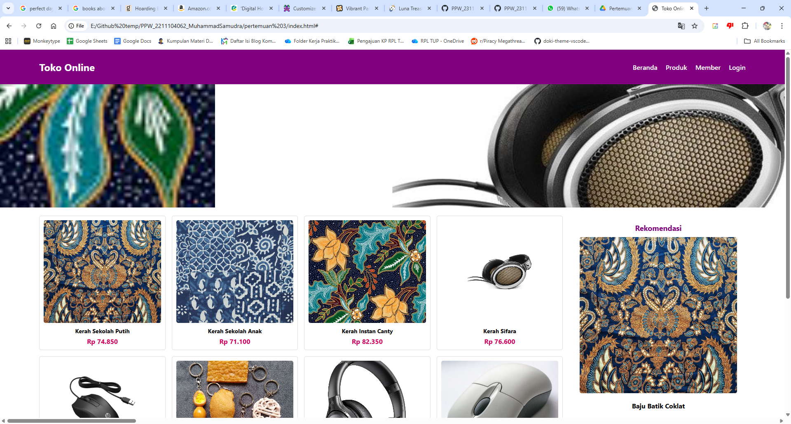
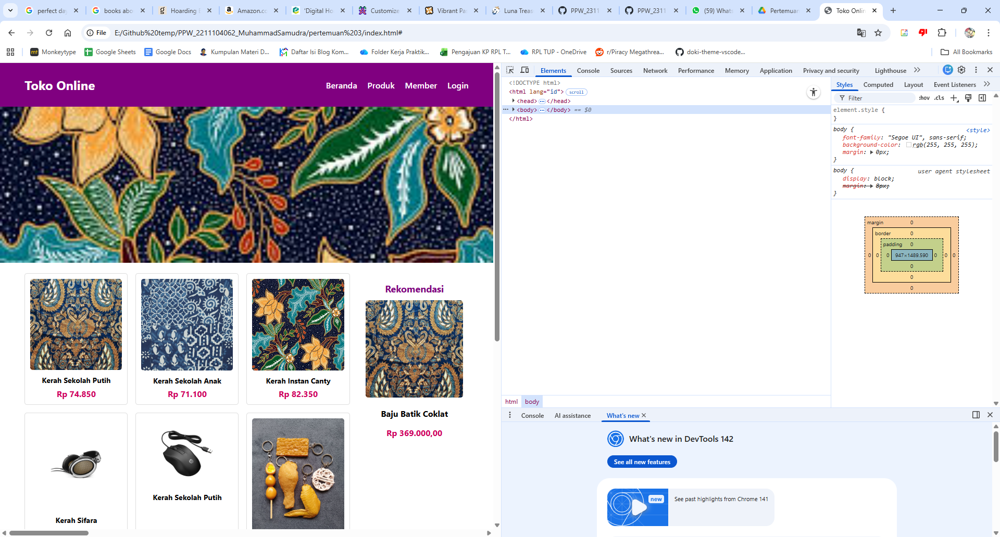
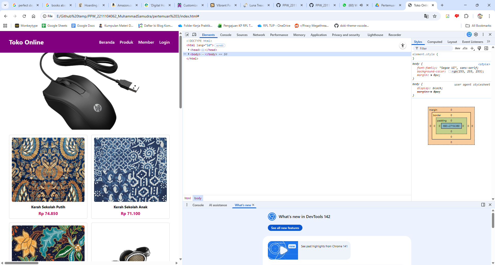
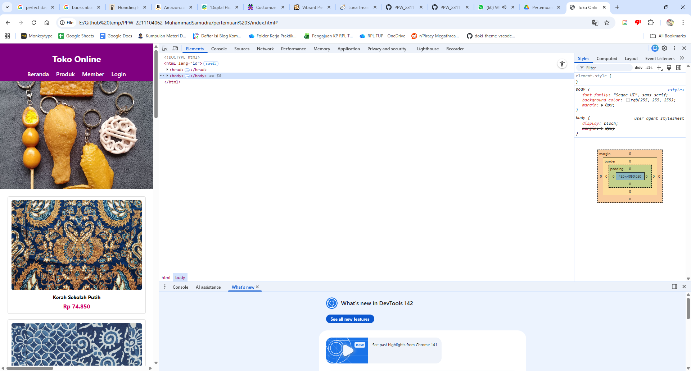
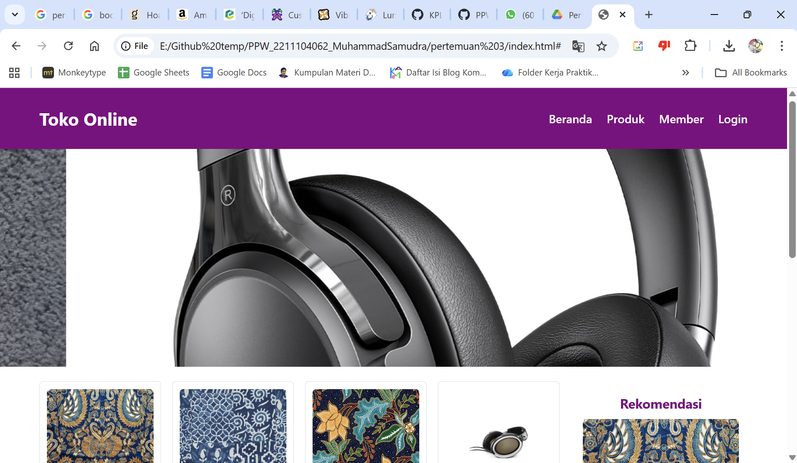

<div align="center">

**LAPORAN PRAKTIKUM**  
**PERANCANGAN DAN PEMROGRAMAN WEB**  

<br><br>

**MODUL 2**  
**CSS LANJUTAN**

<br><br>


<br><br>

Oleh:  
**Muhammad Samudra**  
**2211104062**

<br><br><br>

**PROGRAM STUDI S1 REKAYASA PERANGKAT LUNAK**  
**DIREKTORAT KAMPUS PURWOKERTO**  
**UNIVERSITAS TELKOM**

<br><br>

**2025**

</div>

---

# 1. Responsif
Menambahkan kode berikut pada style.css untuk mengatur responsif

```
@media (max-width: 992px) {
.produk {
    grid-template-columns: repeat(3, 1fr);
}
}

@media (max-width: 768px) {
.konten {
    flex-direction: column;
}
.produk {
    grid-template-columns: repeat(2, 1fr);
}
.sidebar {
    margin-left: 0;
}
}

@media (max-width: 480px) {
header .container {
    flex-direction: column;
    align-items: center;
}
nav ul {
    justify-content: center;
}
.produk {
    grid-template-columns: 1fr;
}
}
```

Secara default satu baris berisi 4 item (4 kolom). Jika device resolusi lebih kecil dari 992px, maka kolom hanya berisi 3 item. Lalu jika lebih kecil dari 768px, satu baris hanya diisi dua item dan sidebar dipindah. Lalu jika lebih kecil lagi, lebih kecil dari 480px maka setiap baris hanya berisi 1 item saja.

Berikut screenshot responsif, dari 4 kolom per baris hingga 1 kolom per baris:








# 2. Banner
Berikut bagian .css untuk mengatur banner slideshow:
```
.banner {
  position: relative;
  overflow: hidden;
  height: 300px;
  display: flex;
  width: 800%; /* 8 gambar * 100% */
  animation: slide 24s infinite ease-in-out; 
}

.banner img {
  width: 12.5%; /* 100%/8 */
  height: 100%;
  flex-shrink: 0;
  flex-grow: 0;
  object-fit: cover;
  display: block;
}

/* Animasi untuk 8 gambar */
@keyframes slide {
  0%, 11%    { transform: translateX(0%); }
  12.5%, 23.5%  { transform: translateX(-12.5%); }
  25%, 36%   { transform: translateX(-25%); }
  37.5%, 48.5%  { transform: translateX(-37.5%); }
  50%, 61%   { transform: translateX(-50%); }
  62.5%, 73.5%  { transform: translateX(-62.5%); }
  75%, 86%   { transform: translateX(-75%); }
  87.5%, 98.5%  { transform: translateX(-87.5%); }
  100%       { transform: translateX(0%); }
}
```
Banner slideshow dengan css3 tanpa javascript yang terpikirkan saya adalah membuat container `banner` selebar [banyak gambar]*100%, di sini 800% dari layar. Lalu gambar dibuat selebar 100%/8=12.5% **dari lebar container**, bukan layar. Lalu keyframe ibarat timestamp dari slideshow, dipisah menjadi 8 tambah 1 untuk mengembalikan slideshow ke gambar pertama. sementara transform: translateX untuk memindahkan bannernya, pindah selebar gambar yaitu -12.5% setiap step. Ini contoh screenshot banner sedang berganti gambar:
