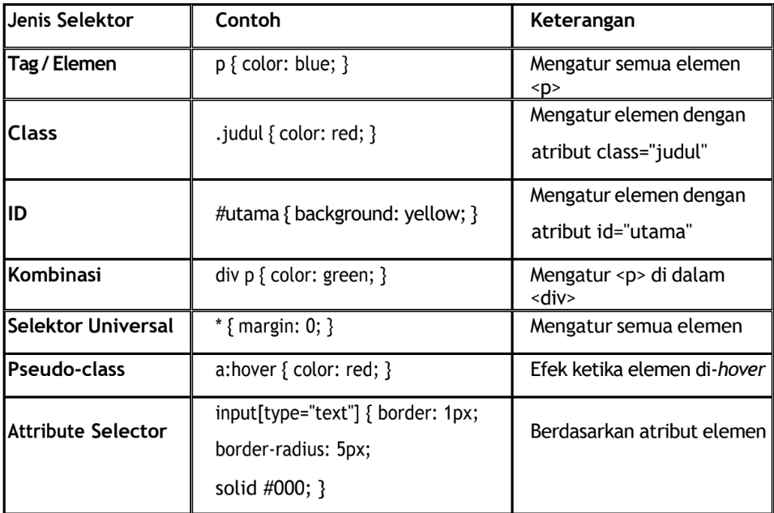
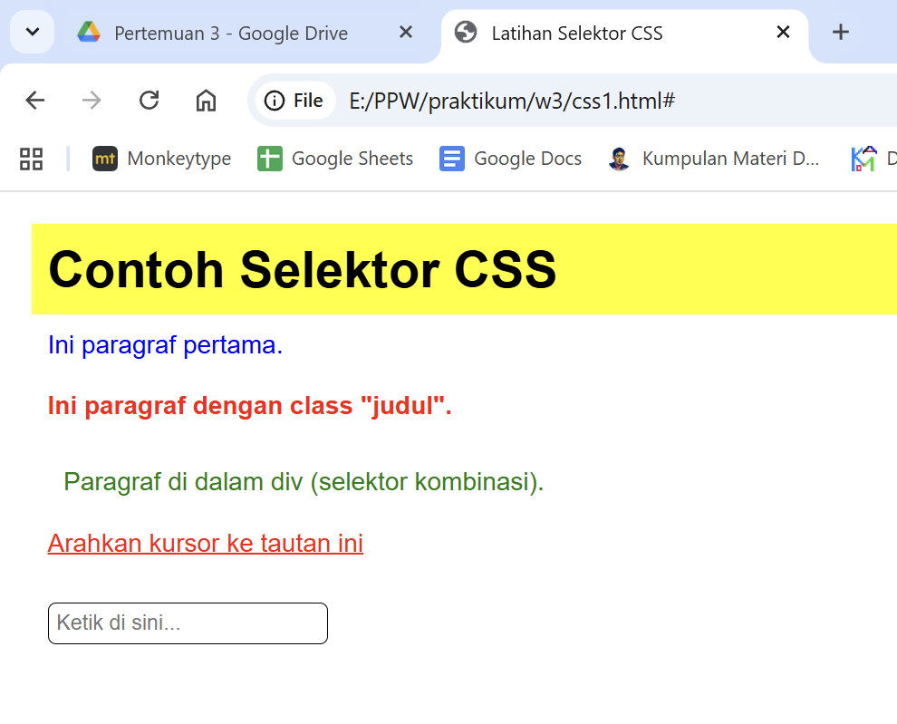
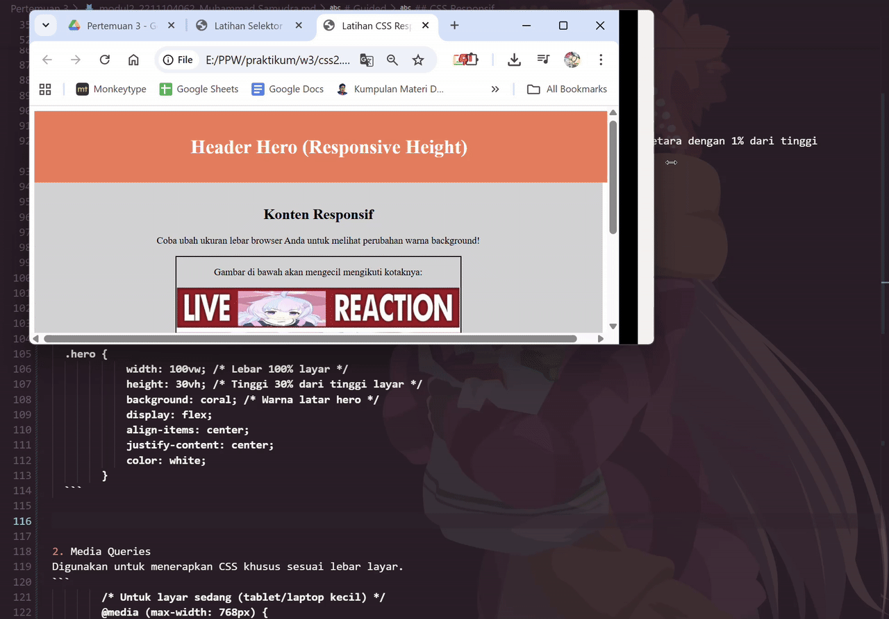

<div align="center">

**LAPORAN PRAKTIKUM**  
**PERANCANGAN DAN PEMROGRAMAN WEB**  

<br><br>

**MODUL 2**  
**CSS LANJUTAN**

<br><br>


<br><br>

Oleh:  
**Muhammad Samudra**  
**2211104062**

<br><br><br>

**PROGRAM STUDI S1 REKAYASA PERANGKAT LUNAK**  
**DIREKTORAT KAMPUS PURWOKERTO**  
**UNIVERSITAS TELKOM**

<br><br>

**2025**

</div>

---

# Guided
## Dasar Teori
CSS (Cascading Style Sheets) adalah bahasa yang digunakan untuk mengatur tampilan dan gaya dari elemen-elemen HTML. Jika HTML berfungsi untuk menyusun struktur sebuah halaman web, maka CSS berfungsi untuk menghias halaman tersebut agar lebih menarik, rapi, dan nyaman dilihat.
Ada tiga jenis penulisan css, yaitu:
1. Inline CSS → ditulis langsung dalam elemen HTML menggunakan atribut style.
`<p style="color:red;">Teks ini berwarna merah</p>`
2. Internal CSS → ditulis dalam tag <style> di bagian <head>.
```
<style>
  h1 {
    color: green;
  }
</style>
```
3. External CSS → ditulis di file .css terpisah, lalu dihubungkan dengan `<link>`.
`<link rel="stylesheet" href="style.css">`

## Selektor CSS
Selektor digunakan untuk memilih elemen HTML yang akan diberi gaya.
Beberapa jenis selektor yang umum digunakan:

```
<style>
        * {
            margin: 0;
            padding: 10px;
            font-family: Arial, sans-serif;
        }
        p {
            color: blue;
        }
        .judul {
            color: red;
            font-weight: bold;
        }
        #utama {
            background-color: yellow;
        }
        div p {
            color: green;
        }
        a:hover {
            color: red;
        }
        input[type="text"] {
            border: 1px solid #000;
            border-radius: 5px;
            padding: 5px;
        }
    </style>
```

Hasil:


## CSS Responsif
1. Layout Fleksibel (Flexible Layout)
Menggunakan persentase (%), vw/vh: vw (viewport width), vh (viewport height) adalah satuan yang setara dengan 1% dari tinggi viewport.
  - Dengan %
  ```
  .container {
            width: 100%; /* Menggunakan persentase */
            background: lightgray; /* Warna default */
            text-align: center;
            padding: 20px 0;
        }
  ```

  - Dengan vw dan vh
  ```
  .hero {
            width: 100vw; /* Lebar 100% layar */
            height: 30vh; /* Tinggi 30% dari tinggi layar */
            background: coral; /* Warna latar hero */
            display: flex;
            align-items: center;
            justify-content: center;
            color: white;
        }
  ```


2. Media Queries
Digunakan untuk menerapkan CSS khusus sesuai lebar layar.
```
        /* Untuk layar sedang (tablet/laptop kecil) */
        @media (max-width: 768px) {
            .container {
                background: lightblue; /* Berubah jadi biru muda */
            }
        }

        /* Untuk layar sangat kecil (HP mini) */
        @media (max-width: 480px) {
            .container {
                background: pink; /* Berubah jadi pink */
            }
        }
```

3. Gambar dan Elemen Fluid
Menggunakan `max-width: 100%;` agar gambar tidak melampaui ukuran kontainer.
```
img {
max-width: 100%;
height: auto;
}
```

Keterangan:
- max-width: 100% membuat gambar tidak lebih besar dari kontainer.
- height: auto menjaga rasio gambar tetap proporsional.

Hasilnya seperti ini:

Container, header hero, dan gambar memiliki rasio tetap, membesar dan mengecil mengikuti ukuran layar. Lalu perhatikan background konten responsif akan berganti warna jika ukuran mengecil sesuai media queries

# Unguided

## 1. Responsif
Menambahkan kode berikut pada style.css untuk mengatur responsif

```
@media (max-width: 992px) {
.produk {
    grid-template-columns: repeat(3, 1fr);
}
}

@media (max-width: 768px) {
.konten {
    flex-direction: column;
}
.produk {
    grid-template-columns: repeat(2, 1fr);
}
.sidebar {
    margin-left: 0;
}
}

@media (max-width: 480px) {
header .container {
    flex-direction: column;
    align-items: center;
}
nav ul {
    justify-content: center;
}
.produk {
    grid-template-columns: 1fr;
}
}
```

Secara default satu baris berisi 4 item (4 kolom). Jika device resolusi lebih kecil dari 992px, maka kolom hanya berisi 3 item. Lalu jika lebih kecil dari 768px, satu baris hanya diisi dua item dan sidebar dipindah. Lalu jika lebih kecil lagi, lebih kecil dari 480px maka setiap baris hanya berisi 1 item saja.

Berikut screenshot responsif, dari 4 kolom per baris hingga 1 kolom per baris:


## 2. Banner
Berikut bagian .css untuk mengatur banner slideshow:
```
.banner {
  position: relative;
  overflow: hidden;
  height: 300px;
  display: flex;
  width: 800%; /* 8 gambar * 100% */
  animation: slide 24s infinite ease-in-out; 
}

.banner img {
  width: 12.5%; /* 100%/8 */
  height: 100%;
  flex-shrink: 0;
  flex-grow: 0;
  object-fit: cover;
  display: block;
}

/* Animasi untuk 8 gambar */
@keyframes slide {
  0%, 11%    { transform: translateX(0%); }
  12.5%, 23.5%  { transform: translateX(-12.5%); }
  25%, 36%   { transform: translateX(-25%); }
  37.5%, 48.5%  { transform: translateX(-37.5%); }
  50%, 61%   { transform: translateX(-50%); }
  62.5%, 73.5%  { transform: translateX(-62.5%); }
  75%, 86%   { transform: translateX(-75%); }
  87.5%, 98.5%  { transform: translateX(-87.5%); }
  100%       { transform: translateX(0%); }
}
```
Banner slideshow dengan css3 tanpa javascript yang terpikirkan saya adalah membuat container `banner` selebar [banyak gambar]*100%, di sini 800% dari layar. Lalu gambar dibuat selebar 100%/8=12.5% **dari lebar container**, bukan layar. Lalu keyframe ibarat timestamp dari slideshow, dipisah menjadi 8 tambah 1 untuk mengembalikan slideshow ke gambar pertama. sementara transform: translateX untuk memindahkan bannernya, pindah selebar gambar yaitu -12.5% setiap step. Ini contoh screenshot banner sedang berganti gambar:
