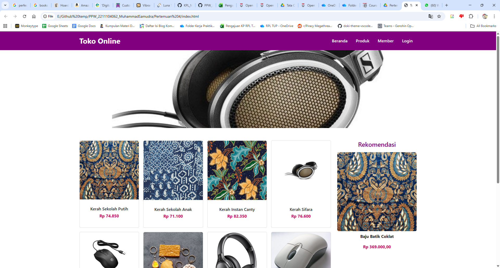
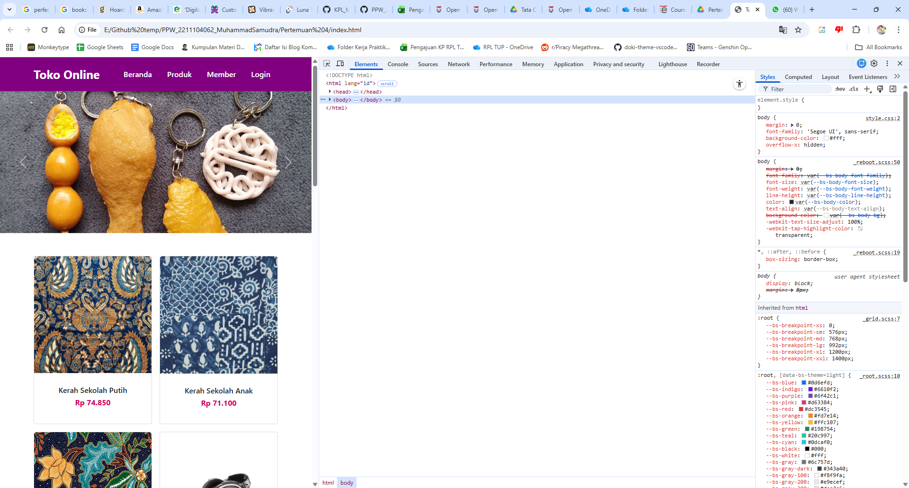

<div align="center">

**LAPORAN PRAKTIKUM**  
**PERANCANGAN DAN PEMROGRAMAN WEB**  

<br><br>

**MODUL 5**  
**BOOTSTRAP**

<br><br>


<br><br>

Oleh:  
**Muhammad Samudra**  
**2211104062**

<br><br><br>

**PROGRAM STUDI S1 REKAYASA PERANGKAT LUNAK**  
**DIREKTORAT KAMPUS PURWOKERTO**  
**UNIVERSITAS TELKOM**

<br><br>

**2025**

</div>

---

## Komponen Bootstrap yang Digunakan
#### a. Container
```
<div class="container my-5">
```

Mengatur lebar maksimal halaman otomatis berdasarkan ukuran layar.
my-5 memberi margin vertikal besar (spacing utility).

#### b. Grid System (responsif otomatis)
```
<div class="row row-cols-1 row-cols-sm-2 row-cols-md-3 row-cols-lg-4 g-3">
```
row → menandakan baris grid.
row-cols-* → menentukan jumlah kolom di setiap breakpoint:
1. kolom di layar kecil
2. di layar ≥576px
3. di layar ≥768px
4. di layar ≥992px

lalu g-3 → jarak antar elemen (gap).

Ini menggantikan CSS manual seperti:
```
.produk {
  display: grid;
  grid-template-columns: repeat(4, 1fr);
}
```
#### c. Card Component
```
<div class="card h-100">
  
  <div class="card-body">
    <h5 class="card-title">Nama Produk</h5>
    <p class="card-text text-danger fw-bold">Rp100.000</p>
  </div>
</div>
```
Bootstrap otomatis:
- Mengatur border radius, padding, dan shadow.
- Menjaga proporsi gambar agar tetap pas.
- h-100 memastikan tinggi card seragam per baris.

#### d. Carousel (Banner Slideshow)
```
<div id="bannerCarousel" class="carousel slide" data-bs-ride="carousel">
  <div class="carousel-inner">
    <div class="carousel-item active">
      
    </div>
    ...
  </div>
</div>
```

Bootstrap mengatur:
- Transisi otomatis antar gambar.
- Responsif penuh (.w-100 membuat gambar mengisi lebar container).
- Tanpa perlu @keyframes manual seperti sebelumnya.

#### e. Utilities

Bootstrap memiliki utility classes yang menggantikan sebagian besar CSS custom:
```
text-center, text-danger, fw-bold, my-5, p-3, rounded, shadow-sm, dsb.
```
Dengan ini tidak perlu lagi menulis CSS seperti:
```
.produk p { color: #d10060; font-weight: bold; }
```
karena cukup tulis di HTML:
```
<p class="text-danger fw-bold">Rp100.000</p>
```

## Screenshot Tampilan Web


