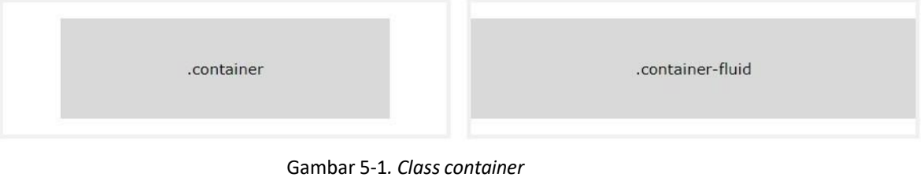
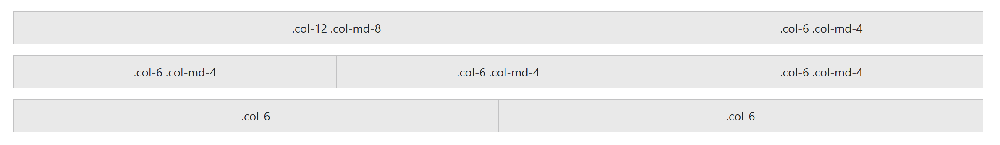
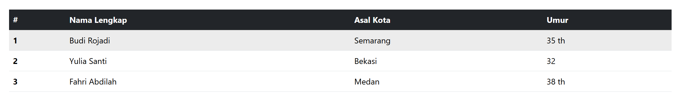
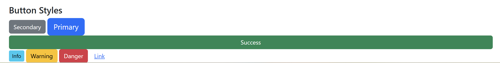
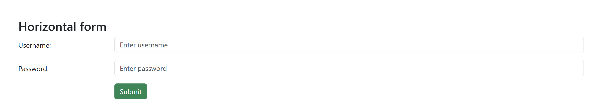

<div align="center">

**LAPORAN PRAKTIKUM**  
**PERANCANGAN DAN PEMROGRAMAN WEB**  

<br><br>

**MODUL 5**  
**BOOTSTRAP**

<br><br>


<br><br>

Oleh:  
**Muhammad Samudra**  
**2211104062**

<br><br><br>

**PROGRAM STUDI S1 REKAYASA PERANGKAT LUNAK**  
**DIREKTORAT KAMPUS PURWOKERTO**  
**UNIVERSITAS TELKOM**

<br><br>

**2025**

</div>

---

# Guided
## Pengenalan Bootstrap
Bootstrap merupakan sebuah front-end framework gratis untuk pengembangan antar muka web yang lebih cepat dan lebih mudah. Dikembangkan oleh Mark Otto dan Jacom Thornton di Twitter dan dirilis sebagai produk open source pada Agustus 2011 di GitHub. Bootstrap mencakup template desain berbasis HTML dan CSS untuk tipografi, form, button, navigasi, modal, image carousells dan masih banyak lagi, serta terdapat opsional plugin JavaScript. Selain itu, Bootstrap memiliki kemampuan untuk membuat desain responsif yang secara otomatis menyesuaikan diri agar terlihat baik di segala perangkat, mulai dari perangkat ponsel hingga desktop pc.

Di sini kita akan menggunakan CDN (Content Delivery Network) di https://getbootstrap.com/docs/5.3/getting-started/introduction/, sehingga kita tidak perlu mengunduh dan memasangnya pada laman website, hanya memanggil source dari Bootstrap. Cara ini membutuhkan koneksi internet untuk menghasilkan perubahan tampilan CSS.
```
<!DOCTYPE html>
<html lang="en">
<head>
    <meta charset="UTF-8">
    <meta name="viewport" content="width=device-width, initial-scale=1.0">
    <title>Latihan Bootstrap</title>

    <link href="https://cdn.jsdelivr.net/npm/bootstrap@5.3.3/dist/css/bootstrap.min.css" rel="stylesheet" integrity="sha384-QWTKZyjpPEjISv5WaRU9OFeRpok6YctnYmDr5pNlyT2bRjXh0JMhjY6hW+ALEwIH" crossorigin="anonymous">
</head>
<body>
    
    <div class="container">
        <h1>Halo, Dunia!</h1>
        <p>Ini adalah contoh penggunaan Bootstrap.</p>
    </div>

    <script src="https://cdn.jsdelivr.net/npm/bootstrap@5.3.3/dist/js/bootstrap.bundle.min.js" integrity="sha384-YvpcrYf0tY3lHB60NNkmXc5s9fDVZLESaAA55NDzOxhy9GkcIdslK1eN7N6jIeHz" crossorigin="anonymous"></script>
</body>
</html>
```

## Bootstrap Container
Bootstrap container adalah elemen paling dasar yang dibutuhkan dalam layouting menggunakan Bootstrap Grid. Container berbentuk class CSS yang sisipkan pada elemen HTML <div>. Dokumentasi: https://getbootstrap.com/docs/5.3/layout/containers/ Pada gambar 5-1 terdapat dua class container pada Bootstrap yang dapat dipilih yaitu:
a. Class.container menyediakan container yang responsive dengan lebar yang tetap.
b. Class .container-fluid menyediakan container dengan lebar yang penuh mencakup seluruh area
pandang.


## Bootstrap Grid
Sistem grid pada Bootstrap menggunakan rangkaian container, rows dan column untuk tata letak dan keselarasan elemen atau konten. Dibangun dengan flexbox dan sangat responsif terhadap perangkat yang digunakan untuk menampilkan laman web. Dokumentasi: https://getbootstrap.com/docs/5.3/layout/grid/ . 
Pertama diawali dengan `<div class=”container”>`. Kemudian buat sebuah baris sebelum mendeklarasikan sebuah kolom dengan menggunakan `<div class=”row”>`. Terakhir buat elemen div dengan mendefinisikan class `“col-*-#”`.
Contoh Penerapannya sebagai berikut:
```
<div class="container mt-5">
        <h2 class="mb-4">Implementasi Grid System</h2>

        <div class="row">
            <div class="col-12 col-md-8">.col-12 .col-md-8</div>
            <div class="col-6 col-md-4">.col-6 .col-md-4</div>
        </div>

        <div class="row">
            <div class="col-6 col-md-4">.col-6 .col-md-4</div>
            <div class="col-6 col-md-4">.col-6 .col-md-4</div>
            <div class="col-6 col-md-4">.col-6 .col-md-4</div>
        </div>

        <div class="row">
            <div class="col-6">.col-6</div>
            <div class="col-6">.col-6</div>
        </div>
    </div>
```


## Bootstrap Table
Tabel pada Bootstrap dipanggil dengan class .table secara default, Contoh penerapannya sebagai berikut:
```
<div class="container table-container">
        <h2 class="mb-4">Daftar Penduduk - Tabel Hover Style</h2>

        <div class="table-responsive">
            <table class="table table-hover">
                <thead class="table-dark">
                    <tr>
                        <th scope="col">#</th>
                        <th scope="col">Nama Lengkap</th>
                        <th scope="col">Asal Kota</th>
                        <th scope="col">Umur</th>
                    </tr>
                </thead>
                <tbody>
                    <tr>
                        <th scope="row">1</th>
                        <td>Budi Rojadi</td>
                        <td>Semarang</td>
                        <td>35 th</td>
                    </tr>
                    <tr>
                        <th scope="row">2</th>
                        <td>Yulia Santi</td>
                        <td>Bekasi</td>
                        <td>32</td>
                    </tr>
                    <tr>
                        <th scope="row">3</th>
                        <td>Fahri Abdilah</td>
                        <td>Medan</td>
                        <td>38 th</td>
                    </tr>
                </tbody>
            </table>
        </div>
    </div>
```
Bagian tabel pada kode tersebut menggunakan kelas Bootstrap `.table-hover` untuk memberikan efek visual berupa perubahan warna latar belakang baris secara otomatis saat kursor berada di atasnya, yang berfungsi mempermudah pembaca dalam menelusuri data. Selain itu, penggunaan pembungkus .table-responsive memastikan bahwa tabel tetap dapat diakses dengan baik di layar kecil melalui fitur geser horizontal, sehingga selaras dengan prinsip desain responsif yang bertujuan menyesuaikan tampilan halaman dengan ukuran perangkat pengguna seperti smartphone atau tablet.


## Bootstrap Image
Bootstrap dapat menangani desain gambar agar responsif pada setiap perangkat yang menampilkan laman web. Dengan menambahkan class .img-fluid pada elemen tag  pada HTML maka gambar yang didefinisikan pada laman web akan memiliki ukuran yang responsif menyesuaikan ukuran layar perangkat. Class tersebut mengatur ukuran gambar dengan menyesuaikan ukuran dari parent element sebagai wadah atau container elemen gambar. Terdapat class .thumbnail yang berguna menjadikan gambar menjadi berukuran kecil dan sedikit memiliki border disekitarnya dapat dilihat pada gambar 5-5. Dokumentasi: https://getbootstrap.com/docs/5.3/content/images/


## Bootstrap Button
Tampilan button pada elemen HTML dapat dirubah dengan menambahkan beberapa class untuk buttonoleh Bootstrap. Bootstrap membuat tampilan button menjadi lebih menarik dan memberikan userexperience yang baik. Dokumentasi: https://getbootstrap.com/docs/5.3/components/buttons/ Classyang digunakan secara default adalah .btn namun dengan disertai class lain seperti berikut untukmemberikan perubahan warna dan ukuran button:

```
<div class="container">
  <h4>Button Styles</h4>
  <button type="button" class="btn btn-secondary">Secondary</button>
  <button type="button" class="btn btn-primary btn-lg">Primary</button>
  <button type="button" class="btn btn-success w-100">Success</button>
  <button type="button" class="btn btn-info btn-sm">Info</button>
  <button type="button" class="btn btn-warning">Warning</button>
  <button type="button" class="btn btn-danger">Danger</button>
  <button type="button" class="btn btn-link">Link</button>
</div>
```


## Bootstrap Form
Bootstrap menyediakan perubahan elemen form pada HTML baik pada segi tata letak tampilan atau tampilan antarmuka elemen-elemen dalam form. Class .form-control digunakan untuk sebagian besar elemen input dalam tag <form> untuk memberikan styling yang konsisten. Dokumentasi: https://getbootstrap.com/docs/5.3/forms/ Ada beberapa cara untuk mengatur tata letak tampilan form di Bootstrap:
  1. Vertical Form (Default): Ini merupakan tampilan default saat tag form tidak didefinisikan class khusus. Setiap elemen form akan ditampilkan secara vertikal.
  2. Inline Form: Untuk membuat form inline di Bootstrap, Anda dapat menggunakan utility classes tertentu pada container form. Ini akan membuat elemen-elemen form berada dalam satu baris.
  3. Horizontal Form: Untuk membuat form horizontal di Bootstrap, Anda dapat menggunakan sistem grid Bootstrap. Gunakan class .row pada container dan .col-* untuk mengatur lebar kolom label dan input.

```
<div class="container mt-5">
    <h3>Horizontal form</h3>
    <form action="/action_page.php">
        <div class="row mb-3">
            <label for="uname" class="col-sm-2 col-form-label">Username:</label>
            <div class="col-sm-10">
                <input type="text" class="form-control" id="uname" placeholder="Enter username" name="uname">
            </div>
        </div>

        <div class="row mb-3">
            <label for="pwd" class="col-sm-2 col-form-label">Password:</label>
            <div class="col-sm-10">
                <input type="password" class="form-control" id="pwd" placeholder="Enter password" name="pwd">
            </div>
        </div>

        <div class="row">
            <div class="col-sm-10 offset-sm-2">
                <button type="submit" class="btn btn-success">Submit</button>
            </div>
        </div>
    </form>
</div>
```



# Unguided
## Komponen Bootstrap yang Digunakan
#### a. Container
```
<div class="container my-5">
```

Mengatur lebar maksimal halaman otomatis berdasarkan ukuran layar.
my-5 memberi margin vertikal besar (spacing utility).

#### b. Grid System (responsif otomatis)
```
<div class="row row-cols-1 row-cols-sm-2 row-cols-md-3 row-cols-lg-4 g-3">
```
row → menandakan baris grid.
row-cols-* → menentukan jumlah kolom di setiap breakpoint:
1. kolom di layar kecil
2. di layar ≥576px
3. di layar ≥768px
4. di layar ≥992px

lalu g-3 → jarak antar elemen (gap).

Ini menggantikan CSS manual seperti:
```
.produk {
  display: grid;
  grid-template-columns: repeat(4, 1fr);
}
```
#### c. Card Component
```
<div class="card h-100">
  
  <div class="card-body">
    <h5 class="card-title">Nama Produk</h5>
    <p class="card-text text-danger fw-bold">Rp100.000</p>
  </div>
</div>
```
Bootstrap otomatis:
- Mengatur border radius, padding, dan shadow.
- Menjaga proporsi gambar agar tetap pas.
- h-100 memastikan tinggi card seragam per baris.

#### d. Carousel (Banner Slideshow)
```
<div id="bannerCarousel" class="carousel slide" data-bs-ride="carousel">
  <div class="carousel-inner">
    <div class="carousel-item active">
      
    </div>
    ...
  </div>
</div>
```

Bootstrap mengatur:
- Transisi otomatis antar gambar.
- Responsif penuh (.w-100 membuat gambar mengisi lebar container).
- Tanpa perlu @keyframes manual seperti sebelumnya.

#### e. Utilities

Bootstrap memiliki utility classes yang menggantikan sebagian besar CSS custom:
```
text-center, text-danger, fw-bold, my-5, p-3, rounded, shadow-sm, dsb.
```
Dengan ini tidak perlu lagi menulis CSS seperti:
```
.produk p { color: #d10060; font-weight: bold; }
```
karena cukup tulis di HTML:
```
<p class="text-danger fw-bold">Rp100.000</p>
```

## Screenshot Tampilan Web


