<div align="center">

**LAPORAN PRAKTIKUM**  
**PERANCANGAN DAN PEMROGRAMAN WEB**  

<br><br>

**MODUL 6**  
**JAVASCRIPT DAN JQUERY**

<br><br>


<br><br>

Oleh:  
**Muhammad Samudra**  
**2211104062**

<br><br><br>

**PROGRAM STUDI S1 REKAYASA PERANGKAT LUNAK**  
**DIREKTORAT KAMPUS PURWOKERTO**  
**UNIVERSITAS TELKOM**

<br><br>

**2025**

</div>

---

# Guided

## Sintaks Umum pada Javascript (Tipe data dan variabel, Array, dan Pengendalian Struktur)

```
<!DOCTYPE html>
<html>
<head>
    <title>Praktikum 6.2 - Sintaks Umum</title>
</head>
<body>
    <h3>Output Tipe Data & Variabel:</h3>
    <div id="outputTipeData"></div>
    <hr>
    <h3>Output Array:</h3>
    <div id="array"></div>
    <div id="array2"></div>
    <hr>
    <h3>Output Percabangan & Perulangan:</h3>
    <div id="outputPercabangan"></div>
    <div id="whileLoop"></div>

    <script>
        // --- Variabel & Tipe Data ---
        var angka = 42;
        var teks = "Ahmad Ruslan";
        var benar = true;
        var salah = false;
        var kosong = null;
        var tidakDidefinisikan;
        var daftar = ["apel", "pisang", "mangga"];
        var tanggal = new Date();
        var pola = /[A-Z]/;
        var orang = { nama: "Ruslan", umur: 21 };

        var hasil = "<b>Number:</b> " + angka + "<br>" +
                    "<b>String:</b> " + teks + "<br>" +
                    "<b>Boolean 1:</b> " + benar + "<br>" +
                    "<b>Boolean 0:</b> " + salah + "<br>" +
                    "<b>Null:</b> " + kosong + "<br>" +
                    "<b>Undefined:</b> " + tidakDidefinisikan + "<br>" +
                    "<b>Array:</b> " + daftar.join(", ") + "<br>" +
                    "<b>Date:</b> " + tanggal + "<br>" +
                    "<b>RegExp:</b> " + pola + ", Test 'Sirsak': " + pola.test("Sirsak") + "<br>" +
                    "<b>Object:</b> nama = " + orang.nama + ", umur = " + orang.umur;
        
        document.getElementById("outputTipeData").innerHTML = hasil;

        // --- Array Method (Push/Pop) ---
        var data2 = ["pisang", "apel", "mangga"];
        var resArray = "Isi awal: " + data2 + "<br>Panjang: " + data2.length + "<br>";
        data2.push("durian");
        resArray += "Setelah push (durian): " + data2 + "<br>";
        var dihapus = data2.pop();
        resArray += "Elemen dihapus (pop): " + dihapus + "<br>Isi akhir: " + data2;
        document.getElementById("array2").innerHTML = resArray;

        // --- Percabangan (Strict Comparison ===) ---
        var pendidikan = "S2";
        var gelar;
        if (pendidikan === "S1") { gelar = "Sarjana"; }
        else if (pendidikan === "S2") { gelar = "Master"; }
        else { gelar = "Tidak diketahui"; }
        document.getElementById("outputPercabangan").innerHTML = "Pendidikan: " + pendidikan + ", Gelar: " + gelar;

        // --- Perulangan (While) ---
        var text1 = "";
        var i = 0;
        while (i < 3) {
            text1 += "Perulangan while ke-" + i + "<br>";
            i++;
        }
        document.getElementById("whileLoop").innerHTML = text1;
    </script>
</body>
</html>
```

1. Tipe Data Dasar
Setiap nilai dalam Javascript memiliki tipe data tertentu. Tipe data tersebut meliputi:
- `Number`: Digunakan untuk representasi bilangan.
- `String`: Digunakan untuk serangkaian karakter atau teks.
- `Boolean`: Memiliki dua nilai saja, yaitu `true` (benar) atau `false` (salah).
- `Lainnya`: Meliputi `Object`, `Function`, `Array`, `Date`, `RegExp`, `Null` (kosong), dan `Undefined` (tidak didefinisikan).

2. Variabel
- Variabel adalah tempat penyimpanan data sementara di dalam memori.
- Deklarasi variabel dilakukan dengan menggunakan kata kunci `var`.
- Nilai dalam variabel dapat diganti dengan nilai baru, bahkan dengan tipe data yang berbeda (dinamis).
- Perubahan tipe data yang drastis harus dilakukan secara hati-hati karena dapat memicu kesalahan (error) pada program.

3. Array
- Array merupakan tipe data khusus yang berfungsi menampung banyak data lainnya.
- Pembuatan array menggunakan simbol kurung siku `[]`.
- Elemen di dalam satu array tidak harus memiliki tipe data yang sama.
- Mendukung array dua dimensi (array di dalam array).
- Pengaksesan elemen menggunakan indeks yang dimulai dari angka 0.
- Dilengkapi dengan properti `length` untuk mengetahui jumlah elemen, serta method populer seperti `push()` dan `pop()`.

4. Pengendalian Struktur
Javascript menggunakan struktur kendali yang serupa dengan keluarga bahasa pemrograman C.
- Percabangan: Menggunakan perintah `if`, `else if`, dan `else`.
- Operator Perbandingan: Disarankan menggunakan `===` karena memastikan nilai dan tipe data yang dibandingkan benar-benar identik, sedangkan `==` dapat melakukan konversi tipe data otomatis.
- Perulangan: Menggunakan perintah `for`, `for-in`, `while`, dan `do-while` untuk menjalankan blok kode secara berulang.


Hasilnya:
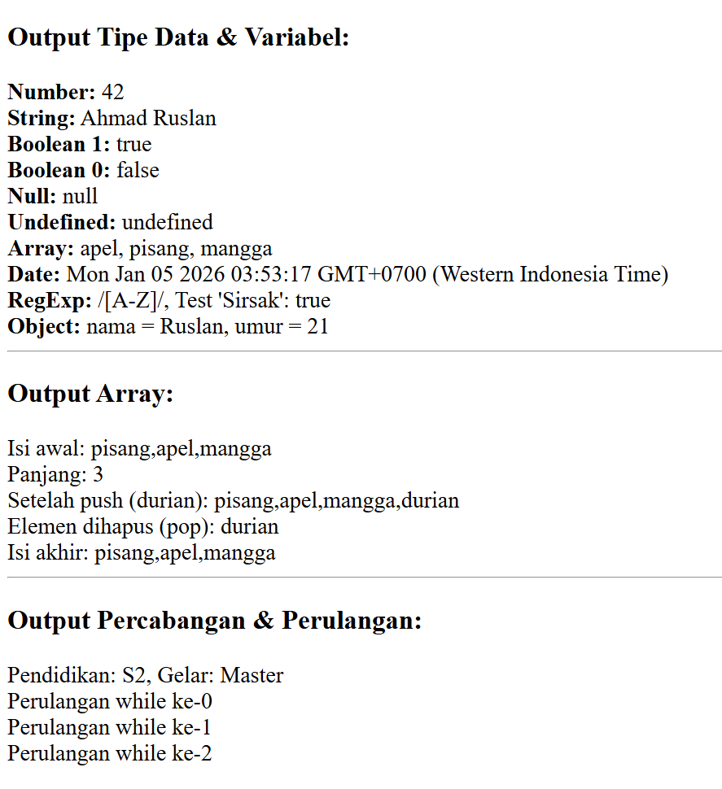

## Object Orientation
```
<!DOCTYPE html>
<html>
<head>
    <title>Praktikum 6.3 - Object Orientation</title>
</head>
<body>
    <div id="outputObject"></div>
    <hr>
    <div id="outputTruk"></div>

    <script>
        // --- Object Literal & Nested Object ---
        var mobil = {
            "warna-badan": "merah",
            "nomor-polisi": "BK1234AB",
            merk: "Toyota",
            tahun: 2020
        };

        var jadwal = {
            platform: 34,
            asal: { kode_kota: "MDN", nama_kota: "Medan" },
            tujuan: { kode_kota: "JKT", nama_kota: "Jakarta" }
        };

        // Modifikasi properti secara dinamis
        mobil.jumlahBan = 4;
        mobil["warna-badan"] = "biru";

        document.getElementById("outputObject").innerHTML = 
            "Warna Mobil: " + mobil["warna-badan"] + "<br>" +
            "Merk: " + mobil.merk + "<br>" +
            "Asal: " + jadwal.asal.nama_kota + "<br>" +
            "Jumlah Ban: " + mobil.jumlahBan;

        // --- Prototype & Inheritance ---
        var prototipeMobil = { nama: "Mobil", roda: 4 };
        var truk = Object.create(prototipeMobil);
        truk.muatan = "10 Ton";
        
        document.getElementById("outputTruk").innerHTML = 
            "Objek Truk mewarisi roda: " + truk.roda + "<br>" +
            "Muatan Truk: " + truk.muatan;
    </script>
</body>
</html>
```

1. Konsep Objek
- Javascript membagi tipe data menjadi dua kelompok utama: tipe data dasar (primitif) dan objek.
- Segala sesuatu yang bukan merupakan tipe data dasar (seperti angka, string, atau boolean) dianggap sebagai objek.
- Objek didefinisikan sebagai `mutable properties collection`, yaitu kumpulan properti yang nilainya dapat diubah-ubah.
- Beberapa elemen seperti `Array`, `Function`, dan `Regular Expression` juga dikategorikan sebagai objek dalam Javascript.

2. Pembuatan Object
- Objek dibuat menggunakan notasi `object literal`, yaitu sepasang kurung kurawal `{}` yang berisi daftar properti.
- Properti terdiri dari pasangan nama dan nilai. Nama properti harus berupa string, namun tanda petik hanya wajib jika nama tersebut mengandung karakter khusus atau merupakan kata kunci sistem.
- Properti di dalam objek dipisahkan menggunakan tanda koma.
- Javascript mendukung `nested object`, di mana sebuah objek dapat disimpan sebagai nilai di dalam properti objek lain.

3. Akses Nilai Property
- Menggunakan kurung siku `[]`: Nama properti ditulis sebagai string di dalam kurung siku. Ini berguna jika nama properti bersifat dinamis atau mengandung karakter ilegal (seperti spasi atau tanda hubung).
- Menggunakan tanda titik `.`: Cara yang paling umum dan mudah dibaca, namun hanya berlaku untuk nama properti yang legal (memenuhi aturan penamaan variabel).
- Jika mencoba mengakses properti yang tidak terdaftar, hasil yang dikembalikan adalah `undefined`.
- Objek bersifat dinamis, sehingga kita bisa menambah properti baru kapan saja dengan memberikan nilai langsung pada nama properti baru tersebut.

4. Prototype pada Javascript
- Pemrograman Berbasis Objek (PBO) di Javascript tidak menggunakan kelas (seperti Java), melainkan menggunakan konsep `prototype`.
- Objek baru dapat mewarisi properti dan metode dari objek lain secara langsung melalui sistem pewarisan.
- Fungsi `Object.create` digunakan untuk membuat objek baru yang menggunakan objek lain sebagai dasar atau prototipenya.

Hasilnya:
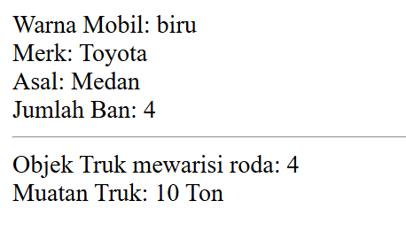

## Function
```
<!DOCTYPE html>
<html>
<head>
    <title>Praktikum 6.4 - Function</title>
</head>
<body>
    <div id="hasilTambah"></div>
    <div id="hasilKali"></div>

    <script>
        // --- Function Declaration ---
        function tambah(a, b) {
            return a + b;
        }

        // --- Function Expression (Anonymous/Lambda) ---
        var kali = function(a, b) {
            return a * b;
        };

        // Pemanggilan Bertingkat
        var hasil1 = tambah(3, 5);
        var hasil2 = tambah(tambah(3, 5), 2); // 8 + 2
        var hasil3 = tambah(tambah(2, 3), 4); // 5 + 4

        document.getElementById("hasilTambah").innerHTML = 
            "Hasil 3 + 5 = " + hasil1 + "<br>" +
            "Hasil (3+5) + 2 = " + hasil2 + "<br>" +
            "Hasil (2+3) + 4 = " + hasil3;

        document.getElementById("hasilKali").innerHTML = "Hasil kali (4, 5) = " + kali(4, 5);
    </script>
</body>
</html>
```

1. Definisi dan Karakteristik
- Fungsi adalah sekumpulan instruksi atau kode yang dibungkus dalam satu blok untuk melakukan tugas tertentu.
- Fungsi dapat menerima input (parameter) dan dapat mengembalikan output (nilai balik).
- Keuntungan menggunakan fungsi adalah kode menjadi lebih terorganisir, mudah dibaca, dan dapat digunakan berulang kali (reusable).

2. Deklarasi Fungsi (Function Declaration)
- Dibuat menggunakan kata kunci `function` diikuti dengan nama fungsi.
- Parameter diletakkan di dalam kurung `()` setelah nama fungsi.
- Isi atau perintah fungsi diletakkan di dalam kurung kurawal `{}`.
- Contoh pemanggilan: `namaFungsi(argumen1, argumen2);`.

3. Ekspresi Fungsi (Function Expression)
- Javascript memungkinkan pembuatan fungsi tanpa nama (anonymous function).
- Fungsi ini biasanya disimpan ke dalam sebuah variabel.
- Variabel tersebut kemudian bertindak sebagai nama fungsi saat akan dipanggil.

4. Nilai Balik (Return Value)
- Perintah `return` digunakan untuk mengirimkan hasil pemrosesan fungsi kembali ke pemanggilnya.
- Ketika perintah `return` dieksekusi, fungsi akan langsung berhenti berjalan.
- Jika sebuah fungsi tidak memiliki perintah `return`, maka fungsi tersebut secara otomatis mengembalikan nilai `undefined`.

Hasilnya:
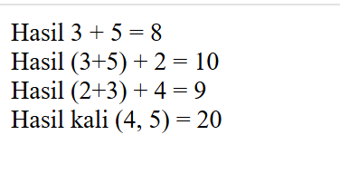

## Jquerry
```
<!DOCTYPE html>
<html>
<head>
    <title>Praktikum 6.5 - 6.7 jQuery</title>
    <script src="https://code.jquery.com/jquery-3.7.1.min.js"></script>
    <style>
        #box {
            background: #98bf21;
            height: 100px;
            width: 100px;
            position: relative; /* Penting untuk animasi posisi */
            margin-top: 10px;
        }
    </style>
</head>
<body>
    <h1>Latihan jQuery</h1>
    
    <p id="hasilArray"></p>
    <p id="outputMatematika"></p>
    <p id="hasilKelulusan"></p>

    <hr>
    
    <p class="teks-sembunyi">Jika tombol 'Hide' diklik, saya akan hilang.</p>
    <button id="hide">Hide Text</button>
    <button id="show">Show Text</button>
    
    <br><br>
    <button id="btnAnimate">Toggle Box Height</button>
    <div id="box"></div>

    <script>
        $(document).ready(function() {
            // 1. Manipulasi Array & Text (Bab 6.6)
            var hobi = ["Membaca", "Coding", "Musik"];
            $("#hasilArray").text("Hobi favorit: " + hobi[1]);

            // 2. Operasi Bilangan
            var a = 10, b = 5;
            $("#outputMatematika").text("Hasil 10 + 5 = " + (a + b));

            // 3. If-Else & Manipulasi CSS
            var nilai = 75;
            if (nilai >= 70) {
                $("#hasilKelulusan").text("Selamat, kamu lulus!").css("color", "green");
            } else {
                $("#hasilKelulusan").text("Maaf, kamu belum lulus.").css("color", "red");
            }

            // 4. Efek Hide/Show (Bab 6.7.1)
            $("#hide").click(function() {
                $(".teks-sembunyi").hide();
            });
            $("#show").click(function() {
                $(".teks-sembunyi").show();
            });

            // 5. Animasi (Bab 6.7.2)
            $("#btnAnimate").click(function() {
                $("#box").animate({
                    height: 'toggle'
                });
            });
        });
    </script>
</body>
</html>
```

1. Pengenalan dan Instalasi (Bab 6.5)
- jQuery adalah pustaka Javascript dengan slogan "Write less, do more" yang menyederhanakan manipulasi HTML, penanganan event, dan animasi.
- Instalasi dapat dilakukan melalui CDN (Content Delivery Network) dengan menyisipkan tag `<script>` yang merujuk ke URL library jQuery (misalnya dari code.jquery.com).
- Kode jQuery harus dibungkus dalam fungsi `$(document).ready(function(){ ... });` untuk memastikan kode hanya berjalan setelah dokumen HTML selesai dimuat.

2. Operasi, Variabel, dan Array pada jQuery (Bab 6.6)
- jQuery memudahkan manipulasi konten menggunakan method seperti `.text()` untuk mengubah teks atau `.append()` untuk menambah konten di dalam elemen.
- Penggunaan variabel dalam jQuery sama dengan Javascript murni (menggunakan `var`), yang dapat digunakan untuk menyimpan data hasil perhitungan atau input.
- Manipulasi Array dan logika matematika dapat langsung diintegrasikan dengan selector jQuery untuk menampilkan hasil dinamis ke dalam elemen HTML tertentu.
- Contoh penggunaan logika: menggunakan `if-else` untuk mengecek nilai variabel dan mengubah tampilan (seperti warna teks menggunakan `.css()`) berdasarkan kondisi tersebut.

3. Event dan Efek (Bab 6.7.1)
- jQuery menyediakan fungsi untuk menangani interaksi pengguna, seperti `.click()` yang dijalankan saat sebuah elemen diklik.
- Efek Dasar:
  - `.hide()`: Digunakan untuk menyembunyikan elemen HTML.
  - `.show()`: Digunakan untuk memunculkan kembali elemen yang tersembunyi.
- Penggunaan selector yang tepat (berdasarkan tag, id, atau class) sangat menentukan elemen mana yang akan terkena efek tersebut.

4. Efek Animasi (Bab 6.7.2)
- Method `.animate()` digunakan untuk membuat animasi kustom pada properti CSS.
- Salah satu parameter yang sering digunakan adalah `toggle`, misalnya `{ height: 'toggle' }`, yang akan mengubah ketinggian elemen secara bergantian (muncul/hilang) setiap kali dipicu.
- Animasi ini memberikan aspek visual yang interaktif pada dokumen HTML statis.

Hasilnya:
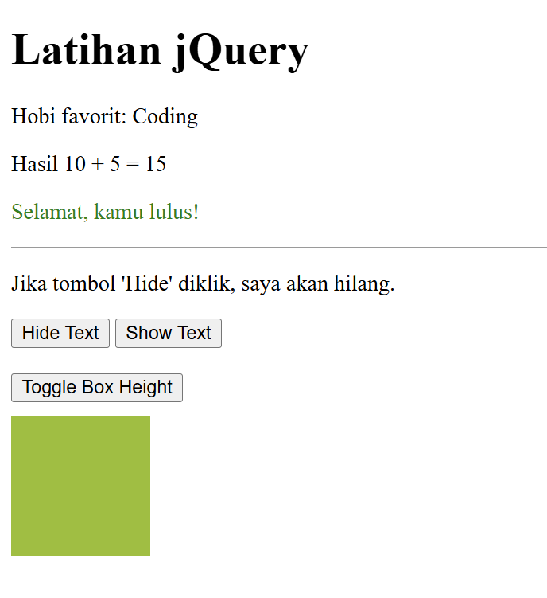

# Unguided

### Tugas 1
Di sini kita ditugaskan untuk menghitung total harga pembelian menggunakan javascript dengan disediakan harga satuan dan dan jumlah pembelian.
Pertama kita mendefinisikan objek barang, beserta propertinya. Lalu  buat loop untuk membuat tabel sesuai objek yang sudah didefinisikan. Untuk fungsi hasil total harga, pertama menambahkan variabel penampung total penjumlahan. Lalu membuat loop hingga semua objek barang habis, setiap perulangan kita menambahkan variabel total dengan harga*jumlah. Terakhir kita mengubah format menjadi IDR, dan menampilkannya setelah mengklik tombol di web. 
Lalu buat wadah di html sesuai id yang digunakan di javascript

#### html
```
<!-- TUGAS 1 - JavaScript -->
  <h2>Tugas 1: Hitung Total Harga Barang</h2>
  <p>Menghitung total harga pembelian beberapa barang menggunakan JavaScript.</p>

  <table id="tabelBarang">
    <tr>
      <th>Nama Barang</th>
      <th>Harga Satuan</th>
      <th>Jumlah</th>
    </tr>
  </table>

  <button id="hitung">Hitung Total Harga</button>

  <p id="hasil"></p>
```
#### js
```
// TUGAS 1 - JavaScript
// Menampilkan data dari objek barang dan menghitung total keseluruhan

// Data barang
const barang = [
  { nama: "Susu UHT", harga: 42000, jumlah: 10 },
  { nama: "Roti Tawar", harga: 30000, jumlah: 3 },
  { nama: "Mie Instan", harga: 20000, jumlah: 5 },
  { nama: "Sosis", harga: 51000, jumlah: 7 }
];

// Buat tabelnya
const tabel = document.getElementById("tabelBarang");
barang.forEach((b) => {
  const row = tabel.insertRow(-1); //tambah baris
  row.innerHTML = `
    <td>${b.nama}</td>
    <td>Rp ${b.harga.toLocaleString("id-ID")}</td>
    <td>${b.jumlah}</td>
  `;
});

// Fungsi hitung total
function hitungTotal() {
  let totalAkhir = 0;
  barang.forEach((b) => {
    totalAkhir += b.harga * b.jumlah;
  });
  // Tampilkan total di bawah tombol
  document.getElementById("hasil").innerHTML =
    `Total harga pembelian semua barang adalah: <b>Rp ${totalAkhir.toLocaleString("id-ID")}</b>`;
}

// Jalankan saat tombol diklik
document.getElementById("hitung").addEventListener("click", hitungTotal);
```
#### Screenshot hasil:
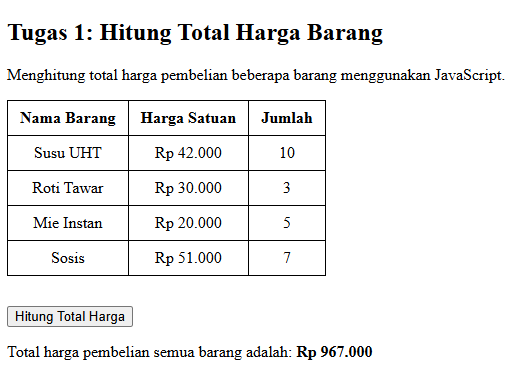

---

### Tugas 2
Pertama di html buat sebuah kontainer paragraf dan diberi id, misalnya "tugas2". Lalu di file .js buat script yang saat halaman selesai dimuat, mencari elemen yang memiliki id "tugas2", dan ganti isi teks yang akan menggantikannya.

#### html
```
<h2>Tugas 2: jQuery Mengubah Teks</h2>
<p id="tugas2">Belajar jQuery itu asik!</p>
```
#### js
```
$(document).ready(function () {
  $("#tugas2").text("Halo Dunia dengan jQuery!");
});
```
#### Screenshot hasil
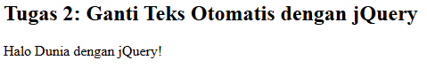

---

### Tugas 3
Di html buat paragraf dengan id 'tugas3', dan juga buat tombol dengan id 'tomboltugas3'. Lalu di .js buat sebuah perintah yang berjalan ketika tombol 'tomboltugas3' diklik. Perintah tersebut mengubah text dan dan juga warnanya menjadi merah, menargetkan elemen yang ber id 'tugas3'

#### html
```
  <h2>Tugas 3: Ubah Teks dan Warna Saat Tombol Diklik</h2>
  <p id="tugas3">Klik tombol di bawah ini</p>
  <button id="tomboltugas3">Klik saya</button>
```
#### js
```
$("#tomboltugas3").click(function () {
  $("#tugas3").text("Tombol sudah diklik!").css("color", "red");
});
```
#### Screenshot hasil:
- awal halaman dimuat:
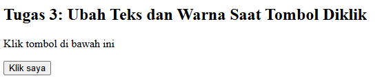
- setelah mengklik tombol
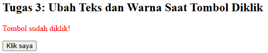

### Tugas 4
Di html buat kontainer yang berisi kotak biru, lalu dua tombol untuk sembunyikan dan tampilkan dengan id masing-masing. Untuk tombol sembunyi gunakan method .fadeOut(), sementara untuk tombol tampilkan gunakan method .fadeIn(). Arahkan kedua method tersebut ke elemen kotak, tetapi kondisi method dijalankan sesuai id tombol masing-masing.

#### html
```
  <h2>Tugas 4: Sembunyikan dan Tampilkan Kotak (Fade In/Out)</h2>
  <div id="kotak" style="width:100px; height:100px; background-color:blue; margin-bottom:10px;"></div>
  <button id="sembunyi">Sembunyikan</button>
  <button id="tampil">Tampilkan</button>
```
#### js
```
$("#sembunyi").click(function () {
  $("#kotak").fadeOut();
});

$("#tampil").click(function () {
  $("#kotak").fadeIn();
});
```

#### Hasil screenshot:
- tampilan awal
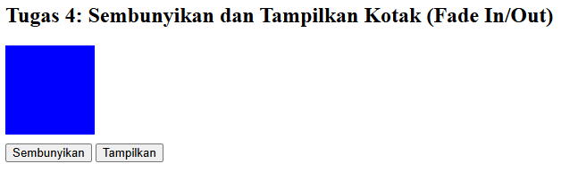
- tampilan setelah di sembunyikan
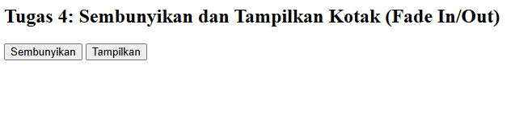
- tampilan fade
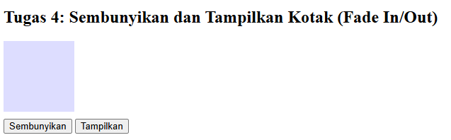
