<div align="center">

**LAPORAN PRAKTIKUM**  
**PERANCANGAN DAN PEMROGRAMAN WEB**  

<br><br>

**MODUL 7**  
**WORDPRESS**

<br><br>


<br><br>

Oleh:  
**Muhammad Samudra**  
**2211104062**

<br><br><br>

**PROGRAM STUDI S1 REKAYASA PERANGKAT LUNAK**  
**DIREKTORAT KAMPUS PURWOKERTO**  
**UNIVERSITAS TELKOM**

<br><br>

**2025**

</div>

---
## Guided
### Pengenalan php
Bahasa php diawali dengan <?php dan diakhiri dengan ?>. Program simpel ini berisi syntax `echo` yang berfungsi untuk menampilkan teks ke browser. `<br>` membuat baris baru

```php
echo "Hiiiiii~~";
echo "<br>";
echo "Nama Saya samud";
echo "<br>";
echo "kelas se06-03";
```
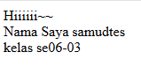

### Variabel
Variabel di php diawali dengan simbol $, dan pemanggilannya di echo adalah menggunakan simbol titik (.). Variabel masih bisa diubah, tidak seperti konstanta

```php
$nama = "samud";
$nim = "2211104062";
$hobi = "doomscrolling";
$hobi = "ngaji";

echo "Nama: " . $nama;
echo "<br>";
echo "NIM: " . $nim;
echo "<br>";
echo "Hobi: " . $hobi;
```
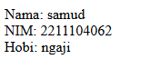

### Konstanta
Konstanta mirip seperti variabel di mana mendefinisikan sesuatu yang bisa dipakai berkali-kali, hanya saja tidak bisa diganti lagi. Terlihat ada pesan error jika definisi konstanta "Asal" kedua tidak di komen.

```php
define("Nama", "samud");
define("NIM", "2211104062");
define("Asal", "kebumen");
//define("Asal", "baturaden");

echo "Nama :" . Nama . "<br>";
echo "NIM :" . NIM . "<br>";
echo "Asal :" . Asal;
```
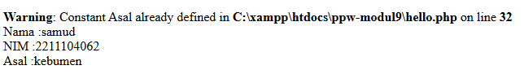

### Operator
Di sini kita mencoba operator lebih dari (>) untuk mengecek $nilai apakah lebih dari 50

```php
$nilai = 87;

if ($nilai > 50) {
    echo "Nilai anda adalah " . $nilai . ". Selamat, Anda lulus";
} else {
    echo "Nilai anda adalah " . $nilai . ". Maaf, Anda tidak lulus";
}
```
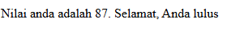

### Struktur Kondisi
Struktur kondisi pada PHP sama halnya dengan bahasa pemrograman lainnya seperti Java. Di sini kita menggunakan switch case untuk menentukan indeks nilai dari variabel $nilai

```php
$nilai = 87;

switch ($nilai) {  
    case ($nilai > 50 && $nilai <= 60): 
        echo "Nilai Anda adalah $nilai. Indeks nilai anda C"; 
        break; 
    case ($nilai > 60 && $nilai <= 70): 
        echo "Nilai Anda adalah $nilai. Indeks nilai anda BC"; 
        break; 
    case ($nilai > 70 && $nilai <= 75): 
        echo "Nilai Anda adalah $nilai. Indeks nilai anda B"; 
        break; 
    case ($nilai > 75 && $nilai <= 80): 
        echo "Nilai Anda adalah $nilai. Indeks nilai anda AB"; 
        break; 
    case ($nilai > 80 && $nilai <= 100): 
        echo "Nilai Anda adalah $nilai. Indeks nilai anda A"; 
        break; 
    default:
        echo "Nilai Anda adalah $nilai. Maaf, Anda tidak lulus"; 
        break; 
} 
```
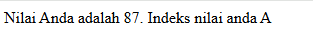

### Looping
Secara struktur penulisan, looping di php juga mirip dengan javascript, hanya tanpa perlu penulisan 'let'. berikut contoh penggunaan looping for, while, dan do-while

```php
echo "Ini adalah contoh perulangan for"; 
echo "<br>"; 
for ($i = 1; $i <= 10; $i++) { 
    echo $i . " "; 
} 
 
echo "<br>"; 
echo "<br>"; 
echo "Ini adalah contoh perulangan while"; 
echo "<br>"; 
$i = 1; 
while ($i <= 20) { 
    echo $i . " "; 
    $i += 2; 
} 
 
echo "<br>"; 
echo "<br>"; 
echo "Ini adalah contoh perulangan do-while"; 
echo "<br>"; 
$i = 28; 
do { 
    echo $i . " "; 
    $i -= 3; 
} while ($i > 0); 
```
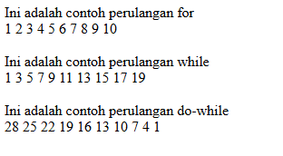

### Function
Function adalah pecahan kode yang bisa dipakai berkali-kali sehingga mengurangi pengulangan yang redundant.
- fungsi ceetakGenap1() adalah fungsi tanpa parameter dan tanpa return value
- fungsi cetakGenap2() adalah fungsi dengan parameter tanpa return value
- fungsi LuasSegitiga() adalah fungsi dengan parameter dan dengan return value

```php
7. function (1) tanpa parameter tanpa return value
function cetakGenap1() 
{ 
    for ($i = 1; $i <= 60; $i++) { 
        if ($i % 2 == 0) { 
            echo "$i "; 
        } 
    } 
} 
//pemanggilan fungsi 
cetakGenap1();

//////////////////////////////////////////////////////////////////////////////////////////////////////////////
function (2) dengan parameter tanpa return value

function cetakGenap2($awal, $akhir) 
{ 
    for ($i = $awal; $i <= $akhir; $i++) { 
        if ($i % 2 == 0) { 
            echo "$i "; 
        } 
    } 
} 
//pemanggilan fungsi 
$a = 10; 
$b = 50; 
echo "Bilangan ganjil dari $a sampai $b adalah : <br>"; 
cetakGenap2($a, $b); 

//////////////////////////////////////////////////////////////////////////////////////////////////////////////
function (3) luas segitiga dengan parameter dan return value

function luasSegitiga($alas, $tinggi) { 
    return 0.5 * $alas * $tinggi; 
} 
//pemanggilan fungsi 
$a = 5; 
$t = 35; 
echo "Luas Segitiga dengan alas $a dan tinggi $t adalah : " . luasSegitiga($a, $t);

function luasKubus($sisi) {
    return 6 * $sisi * $sisi;
}

// pemanggilan fungsi
$s = 5;

echo "Luas permukaan kubus dengan sisi $s adalah: " . luasKubus($s);
```
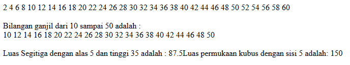

### Array
Array adalah tipe data yang menyimpan sejumlah data bertipe sama. Array menyimpan data menggunakan indeks dan indeks bisa bertipe integer atau string. Array yang menggunakan index bertipe string biasa disebut associative array
ini contoh array non-associative (indexed/numerical array). Perhatikan bahwa perhitungan indeks mulai dari 0 bukan 1.

```php
$arrKendaraan = ["Mobil", "Pesawat", "Kereta Api", "Kapal Laut"]; 
echo $arrKendaraan[0] . "<br>"; //Mobil 
echo $arrKendaraan[2] . "<br>"; //Kereta Api 
echo "<br>";

$arrKota = []; 
$arrKota[] = "Jakarta"; 
$arrKota[] = "Medan"; 
$arrKota[] = "Bandung"; 
$arrKota[] = "Malang"; 
$arrKota[] = "Sulawesi"; 

array_push($arrKota, "Padang", "Riau"); 

echo $arrKota[1] . "<br>"; //Medan 
echo $arrKota[2] . "<br>"; //Bandung 
echo $arrKota[4] . "<br>"; //Sulawesi 
echo $arrKota[0] . "<br>"; //Jakarta
```
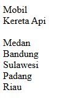

Lalu ini contoh penggunaan array asosiatif

```php
$arrAlamat = [ 
    "Rona" => "Banjarmasin", 
    "Dhiva" => "Bandung", 
    "Ilham" => "Medan", 
    "Oku" => "Hongkong", 
]; 
 
echo $arrAlamat["Dhiva"] . "<br>"; //Bandung 
echo $arrAlamat['Oku'] . "<br>"; //Hongkong 
 
$arrNim = []; 
$arrNim["Rona"] = "11011112"; 
$arrNim["Dhiva"] = "11011101"; 
$arrNim["Ilham"] = "11011309"; 
$arrNim["Oku"] = "11014765"; 
$arrNim["Fadhlan"] = "11011113"; 
 
echo $arrNim["Ilham"] . "<br>"; //11011309 
echo $arrNim['Fadhlan'] . "<br>"; //11011113 
```
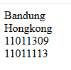

## Unguided
### 1. Konversi Suhu
Pertama buat fungsi dengan rumus konversi. Lalu buat variabel untuk suhu celcius dan farenheit. Untuk menampilkan 2 desimal dibelakang koma, gunakan `number_format([number], 2)`.

```php
echo "<h2>1. Konversi Suhu (dengan fungsi)</h2>";

// Celcius > Fahrenheit
function c_to_f($c) {
    return ($c * 9/5) + 32;
}

// Fahrenheit > Celcius
function f_to_c($f) {
    return ($f - 32) * 5/9;
}

// Celcius > Kelvin
function c_to_k($c) {
    return $c + 273.15;
}

// contoh input
$celcius = 31;
$fahrenheit = 87;

echo "Celcius ke Fahrenheit ($celcius °C) = " . number_format(c_to_f($celcius), 2) . " °F<br>";
echo "Fahrenheit ke Celcius ($fahrenheit °F) = " . number_format(f_to_c($fahrenheit), 2) . " °C<br>";
echo "Celcius ke Kelvin ($celcius °C) = " . number_format(c_to_k($celcius), 2) . " K<br><br>";
```
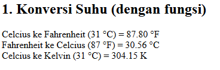

### Kalkulator Diskon
Buat struktur kondisi untuk memisahkan kasus besar diskonnya. Lalu hitung jumlah diskon dengan mengkali total belanja dengan diskonnya. Hitung total bayar dengan mengurangi total belanja dengan jumlah diskon.

```php
echo "<h2>2. Kalkulator Diskon</h2>";

// contoh input
$total_belanja = 750000; 

if ($total_belanja >= 1000000) {
    $diskon = 0.30;
} elseif ($total_belanja >= 500000) {
    $diskon = 0.20;
} elseif ($total_belanja >= 100000) {
    $diskon = 0.10;
} else {
    $diskon = 0;
}

$jumlah_diskon = $total_belanja * $diskon;
$total_bayar = $total_belanja - $jumlah_diskon;

echo "Total Belanja: Rp " . number_format($total_belanja, 0, ',', '.') . "<br>";
echo "Diskon: " . ($diskon * 100) . "%<br>";
echo "Potongan Harga: Rp " . number_format($jumlah_diskon, 0, ',', '.') . "<br>";
echo "Total Bayar: Rp " . number_format($total_bayar, 0, ',', '.') . "<br><br>";
```


### Manipulasi Array
- Mencari nilai tertinggi dengan max()
- Mencari nilai terendah dengan min()
- Mencari rata-rata nilai dengan menjumlahkan nilai (sum) dan membagi dengan banyaknya nilai (count)
- Mencari banyak mahasiswa yang lulus dengan membuat loop untuk mengecek nilai-nilai dan setiap ada nilai yang lebih dari 70, variabel `$lulus` ditambah satu
- Mengurutkan nilai dari tertinggi ke terndah menggunakan fungsi rsort()

```php
echo "<h2>3. Manipulasi Array</h2>";

$nilai = [75, 89, 65, 90, 85, 70, 98, 65, 69, 70, 12];
echo "Array awal [";
foreach ($nilai as $n) {
    echo $n . " ";
}
echo "]<br><br>";

//cari nilai
$max = max($nilai);
$min = min($nilai);
$rata = array_sum($nilai) / count($nilai);

// Banyak mahasiswa lulus 
$lulus = 0;
foreach ($nilai as $n) {
    if ($n >= 70) $lulus++;
}

// Urutkan dari tertinggi ke terendah
$sorted = $nilai;
rsort($sorted);

echo "Nilai tertinggi: $max<br>";
echo "Nilai terendah: $min<br>";
echo "Rata-rata nilai: " . number_format($rata, 2) . "<br>";
echo "Banyak yang lulus: $lulus<br>";

echo "<br>Urutan nilai (tertinggi ke terendah):<br>";
foreach ($sorted as $s) {
    echo $s . " ";
}
```
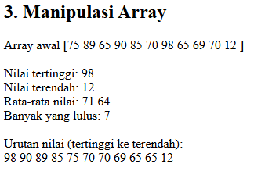
