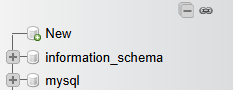
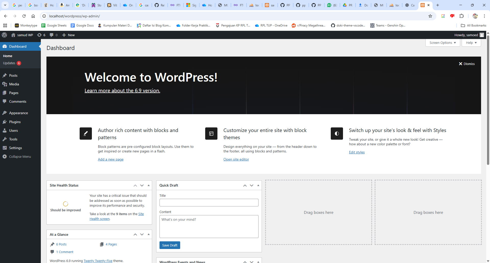
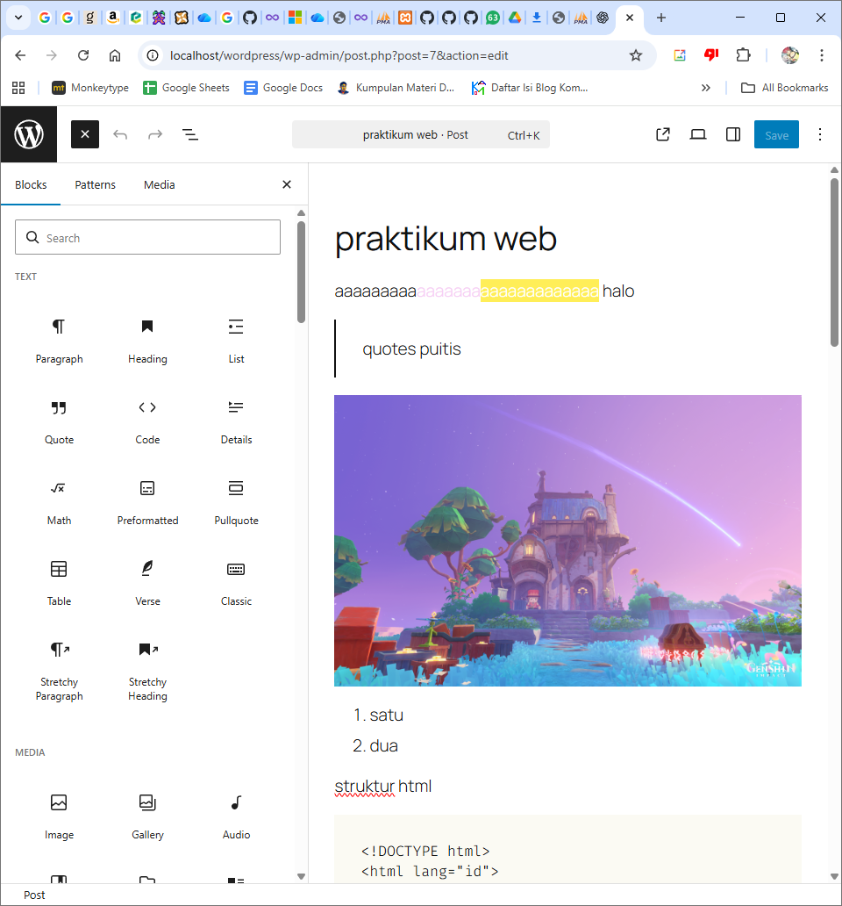
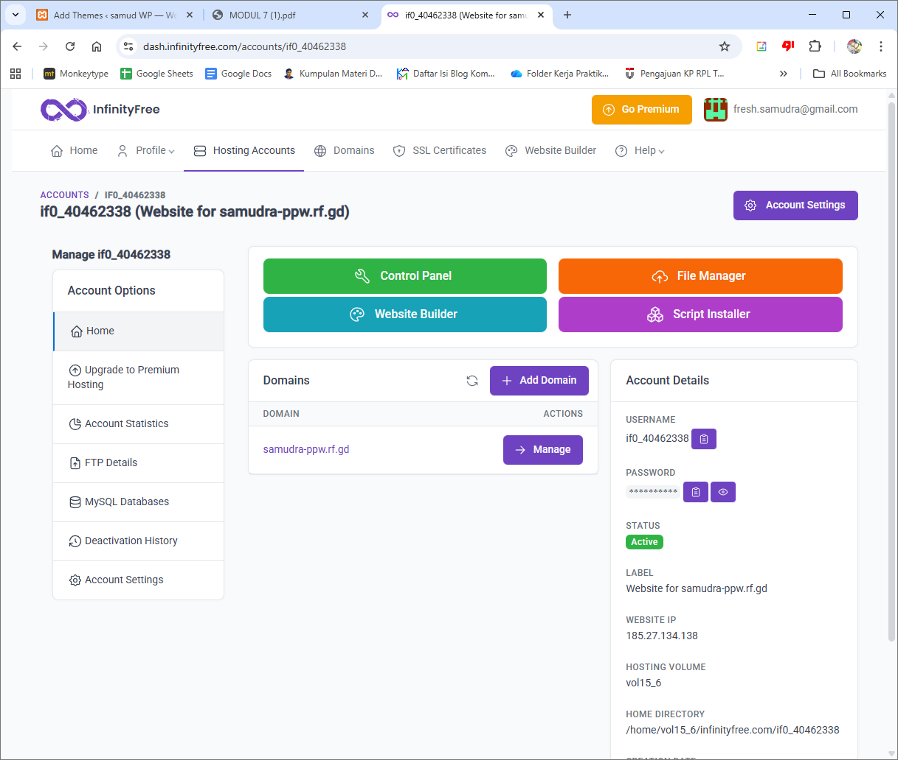
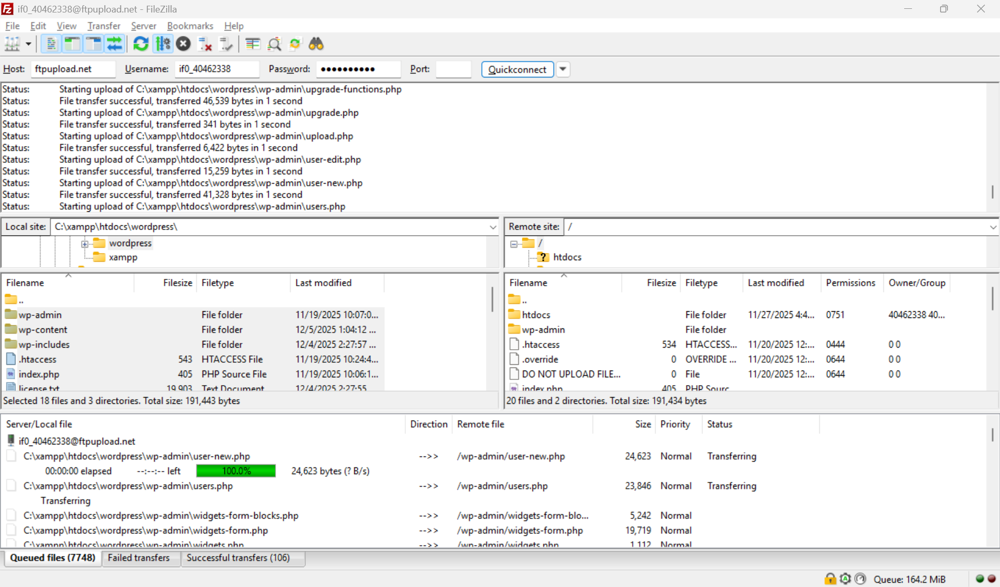
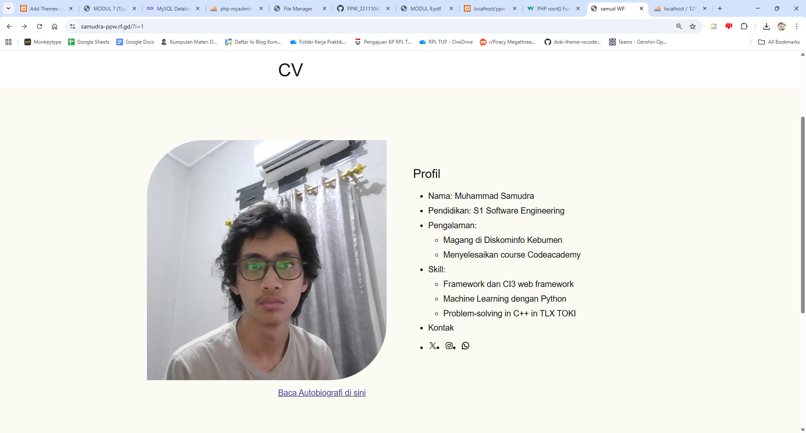
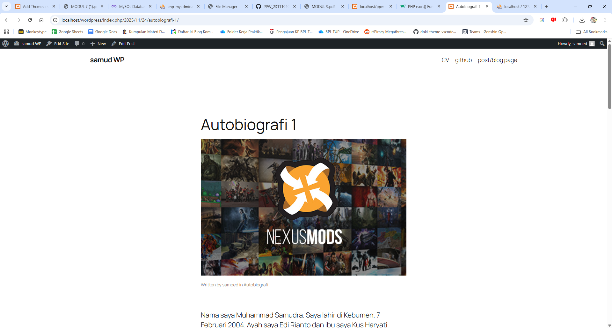
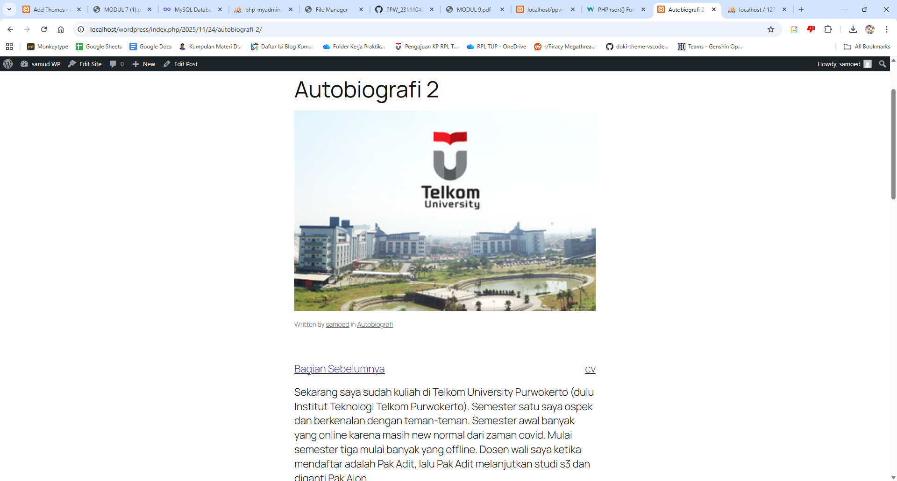

**LAPORAN PRAKTIKUM**  
**PERANCANGAN DAN PEMROGRAMAN WEB**  

  

**MODUL 7**  
**WORDPRESS**

  

  

Oleh:  
**Muhammad Samudra**  
**2211104062**

   

**PROGRAM STUDI S1 REKAYASA PERANGKAT LUNAK**  
**DIREKTORAT KAMPUS PURWOKERTO**  
**UNIVERSITAS TELKOM**

  

**2025**

---

## Wordpress (Guided)
### Instalasi
1. Download:
    - XAMPP
    - Wordpress dari wordpress.org
    - FileZilla
2. Membuat Database:
    - Buka localhost/phpmyadmin
    - Di sebelah kiri, klik new
    
    - Isi nama database lalu klik create
3. Install Wordpress
    - File yang didownload tadi di ekstrak di folder htdocs di xampp. Beri nama misal wordpress-praktikum
    - Di browser ketik http://localhost/wordpress-praktikum
    - Daftarkan diri sesuai data diri, isi nama database dengan nama yang tadi telah dibuat
    - Setelah menjalankan instalasi, buat akun wordpress
    - Setelah berhasil, login dengan akun tersebut
    - Untuk melihat dashboard admin, pergi ke http://localhost/wordpress-praktikum/wp-admin

### Mengelola Konten Wordpress
Berikut tampilan dashboard admin WordPress

Pages merupakan konten statis yang biasanya dipakai berulang, sementara posts adalah artikel yang berurutan berdasarkan waktu.
1. Membuat post:
    - Di sidebar di bagian posts, klik Add Post
    - Bagian atas merupakan judul, bagian lain adalah konten yang merupakan block
    - Di bagian kiri atas ada tombol tambah, dari situ ada sidebar yang menunjukkan jenis-jenis block yang bisa digunakan. Dari atas di sini terlihat menggunakan block paragraf dengan highlight, block quotes, block list, dan block code.
    
    - Untuk menambah gambar, klik Image pada Media, lalu ke Media Library agar gambar otomatis disesuaikan format Wordpress. Lalu upload gambar yang diinginkan. Setelah itu pilih gambarnya di Media Library
    - Setelah selesai membuat artikel, bisa dipublish dengan tombol di kanan atas. Post artikel ini bisa diberi kategori dan juga tags. Klik Publish lagi.
2. Membuat page:
    - Di bagian Pages, klik Add Page
    - Isi Page seperti Post artikel tadi
    - Publish juga page nya

### Hosting Wordpress
1. Buat akun InfinityFree:
    - Buka website https://www.infinityfree.com/ , lalu login dengan google atau github atau lainnya
2. Setup Domain
    - Klik Create Account, lalu pilih plan yang $0, dan klik tombol Create Now
    - Pilih nama domain lalu check availability, ganti nama jika tidak tersedia
    - Buat password lalu Create Account
    - Setelah itu akan diberikan username dan diarahkan ke halaman manajemen hosting
    
3. Setup Domain:
    - Pada Account Options, klik MySQL Databases. Klik Create Database
    - Isikan nama misal wp_praktikum, klik lagi Create Database
    - Klik phpMyAdmin di infinityfree di halaman tadi
    - Lalu di localhost/phpmyadmin, export database lokal dengan cara akses ke menu export di navbar setelah memilih database.
    - Lalu kembali ke phpmyadmin di infinityfree dan import dengan menu import di area navbar juga
4. Upload File Wordpress dari Lokal ke Hosting
    - Buka menu FTP Details pada Account Opstions
    - Buka aplikasi FileZila, lalu paste bagian Host, Username, Password yang didapat dari FTP Details
    - Terlihat Local site yaitu file lokal di komputer, dan Remote site yaitu file di hosting
    - Pilih semua file di Local site lalu klik kanan dan upload
    
    - Pergi ke File Manager pada Hosting Management, lalu edit file wp-config untuk mengganti informasi database (db_name, username, password, hostname) menjadi informasi database remote yang didapatkan dari menu MySQL Databases

## Hasil Hosting (Unguided)
samudra-ppw.rf.gd

